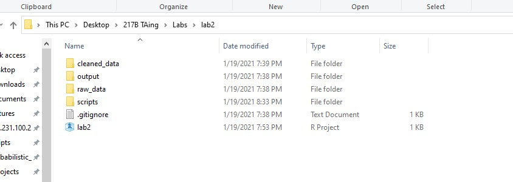
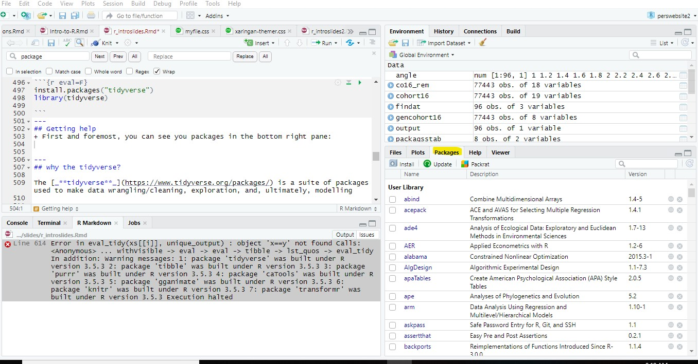
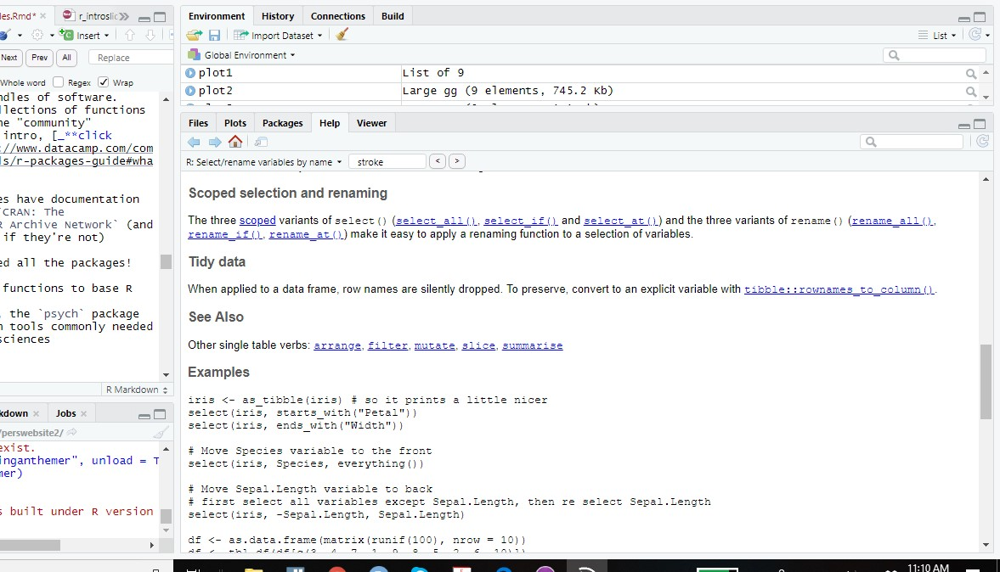

class: middle

```{r setup, include=FALSE}
options(htmltools.dir.version = FALSE)
knitr::opts_knit$set(root.dir = "C:/Users/katzd/Dropbox/My PC (LAPTOP-K7402PLE)/Desktop/Github/danielbkatz.github.io/assets/Presentations/217B_Week2")

```

```{r xaringan-themer, include = FALSE}
library(xaringanthemer)
mono_light(base_color = "#050457",
  code_highlight_color = "#686862",
  link_color = "#4C4D41",
  #code_inline_background_color = "#A6A6BA",
  code_inline_color = "#002BDC",
  code_font_google   = google_font("Droid Mono"),
  #background_image = "methodsu.jpg",
  # background_size = "15%",
  #background_position = "bottom left"
  )

```


```{r message=FALSE, warning=FALSE, include=FALSE}
library(tidyverse)
library(caTools)
library(gganimate)
library(knitr)
```


class: middle

## Working Directories
+ The notion of the <mark>working directory</mark> isn't unique to R

+ Directories are just folders on your computer with a certain `path`
  + For instance, your `desktop` is a directory
  + A folder within `Documents` is a directory

+ A `working directory` is just where you tell `R` that you'll be working
  + when you load files, it knows to look to a certain folder
  + When you export files, `R` exports automatically to the working directory

---

class: middle

## File paths (for PC)

+ A path to a Word doc on my desktop looks like: `C:/Users/katzd/Desktop/myfile.docx`

+ A path to a file in a folder called, `thesis` in the `Documents directory` looks like `C:/Users/katzd/Documents/thesis/myfile.docx`

+ But these are long!

+ Instead, we'll tell `R` where to read files from, where to export, etc, via `projects`
---

class: middle 

## File Paths: Getting the Wd...

+ To see the currect working directory, simply run the code `getwd()`

+ To set the working directory `setwd("filepath")` (the filepath has to be in quotes)

+ It's often useful to set the working directory at the top of your script

**via menu options**: Session ➡️ Set Working Directory ➡️ Choose Directory (copy and paste outputted code to the top of your script)

+ Some people don't like this practice: [**Link**](https://whattheyforgot.org/safe-paths.html)

+ Run: `getwd()`

---
class: middle

### For this class, what I might do(with various optional permutations)....

---

class: middle
## Option 1
  
**New RStudio project for each lab**:  
    
**Step 1.** Create a folder called ED_217B (no spaces)
  
**Step 2.** Create a ffolder called `labs`
  
**Step 3.** Open up `RStudio`  
  
**Step 4.** Create a new project from within R studio, creating a new directory within `labs` called `lab2`  

path to hypothetical `data.csv` file: 
The path to hypothetical data in a data folder will be
`data/data.csv`

---

class: middle

## Option 2

**One RStudio project for all labs** Do the above but...

**Step 1.** Create a folder called ED_217B (no spaces)  

**Step 2.** Open up `RStudio`  
  
**Step 3.** Create a new project from within RStudio, creating a new directory called labs.  
  
**Step 4.** Add a folder for each week's lab materials. You add one extra level to your R project.  

path to hypothetical `data.csv` file: 
`lab2/data/data.csv` 

---

# Setting up a working directory

My working directory looks like this:

```{r echo=FALSE, dpi=50}

```


---

class: middle

## R and Functions

+ R is a (mostly) functional programming language

+ instead of $f(x)$ we say things like, `mean(x)`

+ We can also have composite/multiple functions - $f(g(x))$ - `print(mean(x))`

+ R packages are bundles of these functions written by the public

+ You can also write your own personal functions to use (we can go over this, later)  

  

---

class: middle

  
# R and Packages
+ Think of `packages` as very specialized bundles of software.
  + They're collections of functions developed by the "community"
  + They're publically accessible (after passing various tests) via `CRAN` or `Bioconductor`
  + May be able to get some `development` versions on `github`

--
+ These packages have documentation if they're on `CRAN: The Comprehensive R Archive Network` (and even sometimes if they're not)

--

+ You don't need all the packages!

--
+ Packages add functions to base R

--

+ For instance, the `psych` package is built with tools commonly needed in the social sciences while the `TAM` package is specially built for IRT (with a Rasch emphasis)

---


class: middle

## Packages, cont'd
+ When you `install.packages()`, R will search for a package on `CRAN` and download it to your computer (have to be connected to the internet)

+ To see where it's downloaded, run `.libpaths()`

+ Each time you start a new R session, you have to load a package via `library()` but you don't have to install each time


---
## Getting help
+ First and foremost, you can see installed packages in the bottom-right pane:

```{r echo=FALSE, dpi=150}

```

+ Click on a package to see the documentation
---
## Other Help

+ You can also type `?packagename` such as `?dplyr`

+ To get help with a base R function, you can type ?function

+ To get help with a package function, you can type: `?packagename::function` such as `?dplyr::select` where select is a particular function in R.

+ Under the <mark>Help</mark> tab in R studio (next to `Tools` at the top), exists a few resources as well, including "cheat sheets"


---
# Run the examples in documentation, usually at the bottom of the section to see how something works!

```{r, echo = FALSE, fig.align = "center"}

```


---

### This is one of those necessary evils, so you know how R works
- To select individual elements in a vector, we use `[]` and the numeric position that you would like to extract. 

```{r}
# vector reversing from 100 to 15
vec <- c(100:15)

# select the first ten elements
vec[1:10]

```


- This is also how one may pull out individual columns, rows, or specific rows and columns in a dataframe in R using <mark>base R</mark>

- We can also get descriptives or compute across a vector, or specific vector elements

- Working with datasets or matrices, we can subset rows, columns or both
---
class: middle 

#### Rows: `df[1, ]` (gets just the first row)
#### Columnn `df[,1]` or `df[1]` (gets just the first column)
#### Both `df[1,1]`
#### Can Select multiple `df[1:5, 1:6]` or `df[c(1,3, 8), c(1, 9, 2)]`


---
class: middle
### Random, not too often needed information about `dataframes`:

1. Dataframes are a particular type, or class, of object in R. 
2. The tidyverse will return something that's also called a `tibble`.
3. It's just like a dataframe except, better printing and...
4. When you subset a dataframe with just a row or column (but not both), it'll return a vector, not a df.
5. A `tibble` won't do this.

---

## Example

```{r}
df <- data.frame(col1 = 1:10, col2 = 11:20)

# just an integer
class(df[,1])

# add drop=FALSE (or drop = F)
class(df[,1, drop=FALSE])

df_tibble <- tibble(col1 = 1:10, col2 = 21:30)

class(df_tibble[,1])

```
---


class: middle

### Arrays

+ An array is a general multidimensional data structure 
  + mindblowingly, a matrix that essentially has an x, y, and a z axis (or more!)  
  
+ One can make lists of matrices or dataframes, and lists can be [_**IN dataframes**_](https://jennybc.github.io/purrr-tutorial/ls13_list-columns.html)
  + Sometimes, you want to do the same thing to a number of dataframes [_**iteration**_](https://r4ds.had.co.nz/iteration.html).
  + In a list, you have a method for doing this very easily 
  
---

class: middle

## Getting data sets in to R with the `readr` package from the `tidyverse`

+ The first challenge: getting data into R

+ R needs a command to read in the data

+ R needs a <mark>path</mark>, where to find the data

+ We're going to use the [_**`readr`**_](https://readr.tidyverse.org/) package to handle most file types

#### However, the `foreign` package and `haven` package can handle files from SAS, SPSS, STATA

+ You don't need SPSS, SAS, or STATA to read data into R

+ We'll start today with a standard `.csv` file.


---

# Getting set up.

1. Download the R script `Intro_to_R2.R`

2. Place `Intro_to_R2.R` in your `scripts` subdirectory.

3. Download `eirt_data.csv` into your `data` or `raw_data` folder (however you have it set up)


---

# What we'll be using today:

1. `readr`  

2. `dplyr`  

3. `ggplot`

---


