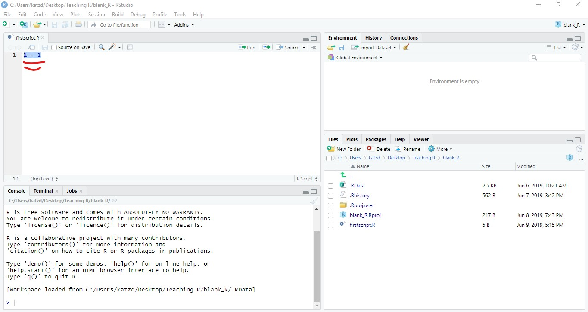
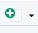
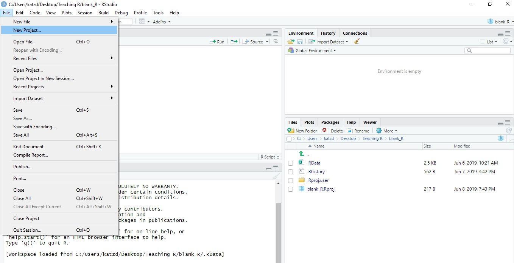
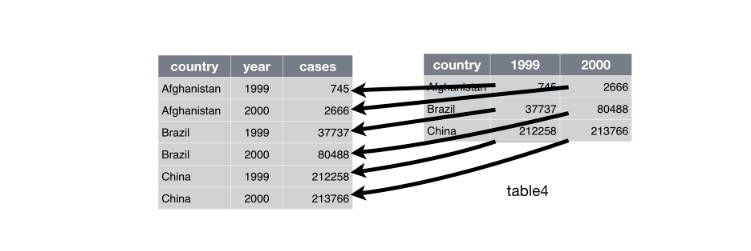
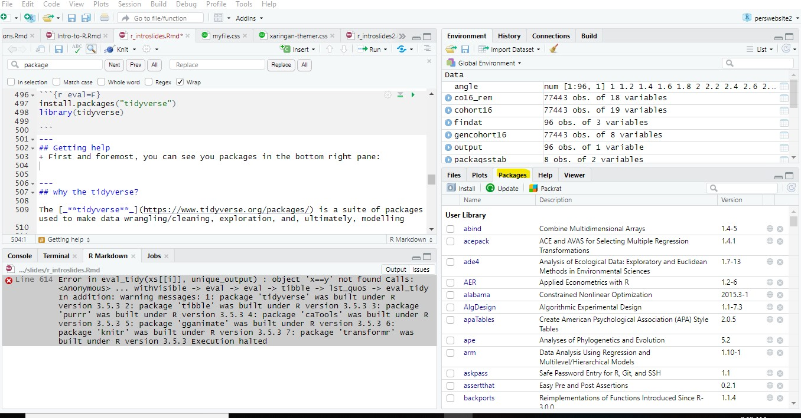
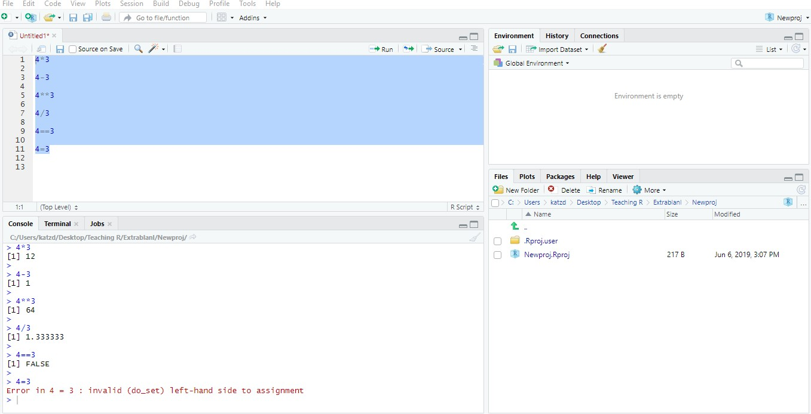

class: middle

```{r setup, include=FALSE}
options(htmltools.dir.version = FALSE)
knitr::opts_knit$set(root.dir = "C:/Users/katzd/Dropbox/My PC (LAPTOP-K7402PLE)/Desktop/Github/danielbkatz.github.io/assets/Presentations/slides")

```

```{r xaringan-themer, include = FALSE}
library(xaringanthemer)
mono_light(base_color = "#050457",
  code_highlight_color = "#686862",
  link_color = "#4C4D41",
  #code_inline_background_color = "#A6A6BA",
  code_inline_color = "#002BDC",
  code_font_google   = google_font("Droid Mono"),
  #background_image = "methodsu.jpg",
  # background_size = "15%",
  #background_position = "bottom left"
  )

```


```{r message=FALSE, warning=FALSE, include=FALSE}
library(tidyverse)
library(caTools)
library(gganimate)
library(knitr)
```


class: middle

### General Strategy


+ My goal is to get us up and running - doing is the best learning

+ Provide you with some quality resources for continuing to learn via links like [_**this**_](https://stackoverflow.com/tags/r/info)
  
+ I won't emphasize code-style best practices except in a few cases (but these will only be for cases that make life easier)

+ I think it's important to focus on ideas and functions

+ For more on style/best practices, [_**click here**_](http://adv-r.had.co.nz/Style.html)

+ Learning how to trouble shoot is important

---
class: middle
## General Outline for Today
.pull-left[

1. What is the relationship between probability, odds, and log odd (logits)?

1. Intro: How should I think about and use R and Rstudio?

1. R Basics

1. Reading in data, subsetting, intro to dplyr (and piping)
]

---
## Next few weeks

1. Next week - more on plotting, more on working with data frames.

1. Using `Rmarkdown`

1. Getting introduced to TAM


--
.pull-right[There's a **TON** to R. I don't expect expertise after this session, but I hope you know where to start!

```{r echo=FALSE, fig.align='center'}
knitr::include_graphics("poppins_bag.gif")

```
]

---

class: middle


# What is R?

+ R is a software and scripting language  
  

+ Like any other language it has syntax (for now think, "rules" of language)  
  

+ R comes with a variety of built-in functions  
  
  
+ R is desiged for statistics, but you can do lots with it 
  + build websites
  + write documents in Latex
  + Create slides for presentations, etc.
---
class: middle
  
# Why is it useful to learn R?

+ It is quickly becoming the statistical language of choice in academic and non-academic circles    

--
  
+ `R Packages` are making tasks more accessible to non-programmers like me  


--
  
+ R allows for sharing code: we won't cover Github, but please [_**check it out**_](https://happygitwithr.com/rstudio-git-github.html)  

--
  
+ Scripting forces us to slow down and think  

--

+ We can do everything in one place (data cleaning, plotting, modeling, etc)


---

# It makes really (fairly?) cool visualizations

```{r echo=FALSE, fig.align='center', fig.width=7, figh.height=7,fig.retina=3, message=FALSE, warning=FALSE}
ggplot(mpg, aes(displ, hwy)) +
  geom_point(aes(colour = class)) +
  geom_smooth(se = FALSE) +
  theme(legend.position = "bottom") +
  guides(colour = guide_legend(nrow = 1, override.aes = list(size = 4))) +
   labs(
    x = "Engine displacement (L)",
    y = "Highway fuel economy (mpg)",
    colour = "Car type"
  )
```

---
 
```{r fig.align='center', fig.retina=3, fig.width=7, message=FALSE, warning=FALSE, figh.height=7, include=FALSE, paged.print=FALSE}

cyber_colors = c(
`cyan` = "#711c91",
`orange` = "#ff6410",
`pink`=  "#fe3abc",
`teal` = "#05f9ff",
`blue` = "#133e7c",
`dark` = "#05f9ff")
cyber_cols <- function(...) {
  cols <- c(...)
  if (is.null(cols))
    return (cyber_colors)
  cyber_colors[cols]
}
cyber_palettes <- list(
  `main`  = cyber_cols("cyan", "pink", "teal", "blue", "dark"),
  `red` = cyber_cols("cyan", "pink"),
  `oranges` = cyber_cols("orange", "teal")
  )
cyber_pal <- function(palette = "main", reverse = FALSE, ...) {
  pal <- cyber_palettes[[palette]]
  
  if (reverse) pal <- rev(pal)
  colorRampPalette(colors = pal)
}
cyber_pal()
scale_color_cyber <- function(palette = "main", discrete = TRUE, reverse = FALSE, ...) {
  pal <- cyber_pal(palette = palette, reverse = reverse)
  if (discrete) {
    discrete_scale("colour", paste0("drsimonj_", palette), palette = pal, ...)
  } else {
    scale_color_gradientn(colours = pal(256), ...)
  }
}
scale_fill_cyber <- function(palette = "main", discrete = TRUE, reverse = FALSE, ...) {
  pal <- cyber_pal(palette = palette, reverse = reverse)
  if (discrete) {
    discrete_scale("fill", paste0("cyber_", palette), palette = pal, ...)
  } else {
    scale_fill_gradientn(colours = pal(256), ...)
  }
}
theme_vapor = function(base_size = 12, base_family = "") {
  
  theme_grey(base_size = base_size, base_family = base_family) %+replace%
    
    theme(
      # Specify axis options
      axis.line = element_blank(),  
      axis.text.x = element_text(size = base_size*0.8, color = "white", lineheight = 0.9),  
      axis.text.y = element_text(size = base_size*0.8, color = "white", lineheight = 0.9),  
      axis.ticks = element_line(color = "white", size  =  0.2),  
      axis.title.x = element_text(size = base_size, color = "white", margin = margin(0, 10, 0, 0)),  
      axis.title.y = element_text(size = base_size, color = "white", angle = 90, margin = margin(0, 10, 0, 0)),  
      axis.ticks.length = unit(0.3, "lines"),   
      # Specify legend options
      legend.background = element_rect(color = NA, fill = "#212747"),  
      legend.key = element_rect(color = "white",  fill = "#212747"),  
      legend.key.size = unit(1.2, "lines"),  
      legend.key.height = NULL,  
      legend.key.width = NULL,      
      legend.text = element_text(size = base_size*0.8, color = "white"),  
      legend.title = element_blank(),  
      legend.position = "bottom",  
      legend.text.align = NULL,  
      legend.title.align = NULL,  
      legend.direction = "horizontal",  
      legend.box = NULL, 
      # Specify panel options
      panel.background = element_rect(fill = "#212747", color  =  NA),  
      panel.border = element_rect(fill = NA, color = "white"),  
      panel.grid.major = element_line(color = "#2a325b"),  
      panel.grid.minor = element_line(color = "#2a325b"),  
      panel.spacing = unit(0.5, "lines"),   
      # Specify facetting options
      strip.background = element_rect(fill = "grey30", color = "grey10"),  
      strip.text.x = element_text(size = base_size*0.8, color = "white"),  
      strip.text.y = element_text(size = base_size*0.8, color = "white",angle = -90),  
      # Specify plot options
      plot.background = element_rect(color = "#212747", fill = "#212747"),  
      plot.title = element_text(hjust = 0, size = rel(1.5), face = "bold", color = "white"),
      plot.subtitle = element_text(hjust = 0, size = rel(1), face = "plain", color = "white"),
      plot.caption = element_text(hjust = 1, size = rel(1), face = "plain", color = "white"),
      plot.margin = unit(rep(1, 4), "lines")
      
    )
  
}
```


```{r fig.align='center', fig.retina=3, fig.width=9, message=FALSE, warning=FALSE, figh.height=7, include=FALSE, paged.print=FALSE}
# Absolute DIF Favoring Group 1 by 1 Logit
icc_0 <- function(ability){
 exp(ability-0)/(1+exp(ability-0))
}
p <- ggplot(data = data.frame(ability = c(-3:3)), mapping = aes(x=ability))+#ff6410
  stat_function(fun = icc_0, geom = 'area', fill="#ff6410", alpha=.1) +
  stat_function(fun = icc_0, geom = 'line', color="#ff6410", alpha=0.1,  size= 4)+
  stat_function(fun = icc_0, geom = 'line', color="#ff6410", alpha=0.1,  size= 3)+
  stat_function(fun = icc_0, geom = 'line', color="#ff6410", alpha=0.2,  size= 2)+
  stat_function(fun = icc_0, geom = 'line', color="#ff6410", alpha=0.2,  size= 1)+
  stat_function(fun = icc_0, geom = 'line', color="#ff6410", alpha= 1,  size= .5)+
  
  geom_segment(y = .5, yend=.5, x=-3, xend=.0, color = "#711c91", size = 4, alpha=.1) +
  geom_segment(y = .5, yend=.5, x=-3, xend=.0, color = "#711c91", size = 3, alpha=.1) +
  geom_segment(y = .5, yend=.5, x=-3, xend=.0, color = "#711c91", size = 2, alpha=.2) +
  geom_segment(y = .5, yend=.5, x=-3, xend=.0, color = "#711c91", size = 1, alpha=.2) +
  geom_segment(y = .5, yend=.5, x=-3, xend=.0, color = "#711c91", size =.5, alpha= 1) +
  
  geom_segment(y = 0, yend=.5, x=.0, xend=.0, color = "#711c91", size = 4, alpha=.1) +
  geom_segment(y = 0, yend=.5, x=.0, xend=.0, color = "#711c91", size = 3, alpha=.1) +
  geom_segment(y = 0, yend=.5, x=.0, xend=.0, color = "#711c91", size = 2, alpha=.2) +
  geom_segment(y = 0, yend=.5, x=.0, xend=.0, color = "#711c91", size = 1, alpha=.2) +
  geom_segment(y = 0, yend=.5, x=.0, xend=.0, color = "#711c91", size =.5, alpha= 1)   + 
  xlab("Ability (logits)") +
  ggtitle("Item Characteristic Curve for One Item") +
  ylab("Probability of Response = 1") +
  theme_vapor()
  
```

```{r fig.align='center', fig.retina=3, fig.width = 9, message=FALSE, warning=FALSE, echo=FALSE, figh.height=7, paged.print=FALSE}

p
```

---

## Open Up RStudio
---


background-image: url(introconsole.png)  
background-size: contain
background-position: center


---

background-image: url(scriptconsole.png)  
background-size: contain
background-position: center


---


class: middle


# Always Remind Yourself
  
+ The best way to learn R is to use it

+ Even when it's frustratingly slow, use R instead of something else
  
+ Errors are good! Use the error output to guide your thinking (and Googling)

+ In other words, "failing fast" is really convenient:
  + Run code, change it until it breaks, figure out why it breaks
  + Run example code, break it up into parts


---

class: middle


## Introducing "Scripts"

+ Scripts are RStudio's text editor. **Work in Scripts**. They're saved text that you _can_ edit  
  

+ Code in the console doesn't get saved and you _cannot_ edit  
  
--

+ The primary aim of working in scripts is reproducability, transparency, being able to run code from start-to-finish without intervening    


--
+ Don't rely on saving data, rely on being able to re-run your script as if you have no memory of what you had done before 

---

# Running the code in a script

```{r echo=FALSE, echo = FALSE, fig.align = "center"}

```

---

## Creating a new script in RStudio

.pull-left[
1. File > New File > R Script 
  + Or, ctrl+shft+N
  + Or, below file, hit the icon that looks like:
```{r echo=FALSE}

```

2. To run a line of code in a script
+ put your cursor on that line, 
+ run it, via ctrl/cmd + enter. 
+ Or the `run` button in the top right of the script
]

--
.pull-right[Make sure it works: 3. Type `1+1` in a script and run it.
  + What happens? Where does it output?

4. There are multiple ways to run more than one line of code at a time
  + Highlight the relevant code, run
  + Or select the various options under "Run"]
--
  
.center[Write two lines of code (such as `1+1` and `2+2`)]

--

.center[**Challenge** Figure out how to run a line of code in the console!]

---


class: middle


## Commenting

*Commenting is essential.* 

+ R will recognize any line after `#` as a comment

For instance:

```{r}
# I ran this to see what would happen

factorial(4)

```

+ I recommend taking notes in an R script for this workshop! 
---


# Vocabulary
          
| R Word   | Translation
|----------|------------------
| Script   | Document containing code to be run
| Console  | Output Window/Printer (but you can also run code here)
| Environment| The place where things you create in R, live
| Working Directory| The folder where your current R session lives, where output files go
  
---

class: middle

## Working Directory (We'll return to this in more detail later)
+ The notion of the <mark>working directory</mark> isn't unique to R

+ Directories are just folders on your computer with a certain `path`
  + For instance, your `desktop` is a directory
  + A folder within `Documents` is a directory

+ A `working directory` is just where you tell `R` that you'll be working
  + when you load files, it knows to look to a certain folder
  + When you export files, `R` exports automatically to the working directory

---

class: middle

## File paths

+ A path to a Word doc on my desktop looks like: `C:/Users/katzd/Desktop/myfile.docx`

+ A path to a file in a folder called, `thesis` in the `Documents directory` looks like `C:/Users/katzd/Documents/thesis/myfile.docx`

+ But these are long!

+ Instead, we'll tell `R` where to read files from, where to export, etc, via `projects`
---

class: middle

## File Paths Continued...Example

+ I make the folder, `thesis`, my working directory, with `analysis.csv` in it.

+ You won't need to type the whole path, just the name of the document or <mark>subdirectory</mark> plus file 

+ If I have a folder called, `analysis` in `thesis` directory the path will be <mark>analysis/filename.ext</mark>.
---
class: middle 

## File Paths: Getting the Wd...

+ To see the currect working directory, simply run the code `getwd()`

+ To set the working directory `setwd("filepath")` (the filepath has to be in quotes)

+ It's often useful to set the working directory at the top of your script

**via menu options**: Session ➡️ Set Working Directory ➡️ Choose Directory (copy and paste outputted code to the top of your script)

+ Some people don't like this practice: [**Link**](https://whattheyforgot.org/safe-paths.html)

+ Run: `getwd()`

---

.middle[### If you've made any comments or would like to save your current script, please go ahead an do-so now (file ➡️  save ➡️  where you want to save it ➡️  name)]

---

## Creating RStudio Projects
### Projects are an RStudio work unit, (but, not required)

.pull-left[1. Once open, click File (top left) ➡️  New Project

2. New Directory ➡️  New Project ➡️  Create Project as a Subdirectory of: click `browse`.
  
3. Choose where you'd like to put this session's R work (for instance, on your desktop in a folder called, `Rworkshop`). 

4. `Directory Name` ➡️  Name this R project - `IntroR` (no spaces; It'll make your life easier) ➡️ Create Project.]

.pull-right[
```{r, out.width = "800px", echo = FALSE, fig.align = "center"}


```
]
---

class: middle

## Let's get setup for the workshop!
1. In your project, create a new script to have at the ready. 

2. Save the script as `introscript`. 

3. Use a command to check your working directory. [_Hint_](http://www.dbkatz.com/slides/r_introslides.html#38).

4. Write a comment:"this is the first R work we'll do in the R workshop"

5. Find the `View` tab and change your RStudio session so it shows only the console

6. Change your R studio Session to look like it did before

7. Find the `Global Environment` (what's in there right now?)


---

class: middle, center

## What's a Function?

---


---
## What are some functions we use?
.pull-left[## How about a mean?
Let's say we have a vector, `x`, with five elements: `1,2,3,4,5`    

`x = [1,2,3,4,5]`

$mean(x)=\frac{1+2+3+4+5}{5}$ 

$mean(x) = 3$]

--
.pull-right[## `R` uses functions:
```{r echo=TRUE}
#Let's make a vector with 
#five elements

x <- c(1,2,3,4,5)

mean(x)
```
]
---

class: middle

## Some of the language

.pull-left[
1. What goes in the parentheses of a function, such as `mean(x)` is called an <mark>argument</mark>

1. R functions often take more than one argument

1. <mark>Code completion</mark>: you can see what arguments a function takes as you start typing. R is making suggestions. 

1. Hit tab to select these options!]
--

.pull-right[
1. `ggplot()` is a function, it performs some operation

1. It takes several arguments such as `ggplot(data=df, aes(x=xvar, y=yvar))`

1. Note: `df` is often R standin speak for a hypothetical `dataframe`, an R word for dataset

1. Argument type and number varies from function-to-function
]

---

class: middle

# Syntax, Continued 

+ When you see that an argument has an option with an equal sign, it usually means order doesn't matter as long as you type the argument name first

+ For instance to perform linear regression I can type `lm(data=df, outcome~var1+var2)` Or `lm(outcome~var1+var2, df)`

+ You need commas between arguments

+ Make sure your parentheses match/are closed

+ R is case sensitive. So `var1` is different from `Var1`
---

class: middle 

## There are also other forms of functions we use in computation
+ "Reading in" Data into R so we can explore or model

+ Linear Regression,`lm()` in R

+ Transforming Data in R:
```{r echo=FALSE}

```
From, [Link: _**R for Data Science by Grolemund and Wickham**_](https://r4ds.had.co.nz)


  
# R and Packages
+ Think of `packages` as very specialized bundles of software. 
  + They're collections of functions developed by the "community"
  + For a full intro, [_**click here**_](https://www.datacamp.com/community/tutorials/r-packages-guide#what)

--
+ These packages have documentation if they're on `CRAN: The Comprehensive R Archive Network` (and even sometimes if they're not)

--

+ You don't need all the packages!

--
+ Packages add functions to base R

--

+ For instance, the `psych` package is built with tools commonly needed in the social sciences

---
class: middle

## Packages, cont'd
+ When you `install.packages()`, R will search for a package on `CRAN` and download it to your computer (have to be connected to the internet)

+ To see where it's downloaded, run `.libpaths()`

+ Each time you start a new R session, you have to load a package via `library()` but you don't have to install each time
---

class: middle

# Installing and Loading Packages 
Installs the package if it's not already installed:

`install.packages("psych")`

Loads the package so I can use the functions in the `psych` package"
`library(psych)`
---

class: middle 


## Installing and loading packages looks like this (note the quotes)
```{r eval=F}
# note the quotes
install.packages("psych")  
library(psych)
```
---

class: middle

## Let's Install and Load the tidyverse

```{r eval=F}
install.packages("tidyverse")  
```
## Load the tidyverse

```{r library-tidyverse, echo=TRUE, message=TRUE, warning=TRUE}
library(tidyverse)
```

---
## Getting help
+ First and foremost, you can see installed packages in the bottom-right pane:

```{r echo=FALSE, dpi=150}

```

+ Click on a package to see the documentation
---
## Other Help

+ You can also type `?packagename` such as `?dplyr`

+ To get help with a base R function, you can type ?function

+ To get help with a package function, you can type: `?packagename::function` such as `?dplyr::select` where select is a particular function in R.

+ Under the <mark>Help</mark> tab in R studio (next to `Tools` at the top), exists a few resources as well, including "cheat sheets"

+ Also, Google (we'll talk about this more)!

---
# Run the examples in documentation, usually at the bottom of the section to see how something works!

```{r, echo = FALSE, fig.align = "center"}
knitr::include_graphics("doc_examples.jpg")
```


---
## why the tidyverse?

The [_**tidyverse**_](https://www.tidyverse.org/packages/) is a suite of packages used to make data wrangling/cleaning, exploration, and, ultimately, modelling easier
  
  
```{r echo=FALSE}
packagsstab <- tibble(Package = c("dplyr", "ggplot2", "tidyr", "readr", "purrr", "tibble", "stringr", "forcats"), Description = c("for creating common, easy to use and remember verbs for basic data handling tasks", "for data visualization",  "for creating `tidy` data",  "for reading in 'rectangular' data of different formats",  "for really working with lots of data easily (for cleaning, computing variables, etc.)", "to make dealing with dataframes even easier. Dataframes will become tibbles in R", "for working with strings and doing a bit of text mining", "for handling factors in R"))

knitr::kable(xtable::xtable(packagsstab),  format = "html")
```

---


# Operators in R
|Operation|Operator in R |Example|
|---------|------|-------|-------|
|Addition |`+` |`4+3`
|Subtraction|`-`| `4-3`
|Multiplication|`*`| `4*3`
|Exponentiation | `**`| `4**3`
|Division | `/`| `12/4`
|Matrix multiplication|`%*%`| `a %*% b`|

**Challenge: Aside from the matrix multiplication, make sure all of these work in `R`** (use a script!)

---

## Output
+ R `returns a value` in the `console`

+ It'll look like this:
```{r echo=FALSE}

```

***Challenge***: Order of operations: Run `(4+3)*(4-3)` and then `4+3*4-3` in the console (for experimentation). What happens?

---
## Variable Assignment
1. One of the most fundamental aspects of R (really any language) is assigning `variables` or `objects`, 
  + giving something a name so you can 
  + store it 
  + work with it in R.
  + R uses `<-` (you can also use for Windows: "alt" and "-" or on a Mac: "option" and "-")

2. Now, we can store objects in R and work with the objects!

3. Note, none of this requires an external package, just through `base R`. For a nice base R cheat sheet, [_**Click**_](https://paulvanderlaken.files.wordpress.com/2017/08/base-r-cheetsheat.pdf)

--

4. When we start assigning variables, note what changes in your R session (where do you see the variables go?)

---
class: middle
 
### For instance, run the code below:
```{r echo=TRUE}
x <- 2
```

```{r echo=TRUE}
#What's the value of y?
y <- x+2
```

1. What is in your Global Environment, now?  
2. What was outputted in the console?
3. Now run `x <- 3`. What is the value of x? What is the value of `x+2`
4. Just type `x` and run

---

class: middle 


## The Environment

+ In the right corner, under `Global Environment`, you should now see where R is "storing" `x` and `y` and their values.

+ The environment is also where we'll see what datasets, in R speak, `dataframes` that we have loaded or created, or other objects

+ If you don't assign something to a variable, it won't be stored
---
  

## Run the code below in a script

`x + y`

`x*y`

`x==y`

What happens?

--

```{r}
x + y

x*y

x==y
```

---
## Boolean/Logical Operators!

+ `x==y` yields, `FALSE`: `==` is a different type of operator

```{r echo=FALSE}
booleans <- tibble(Operation=c("Equality; Are they equal?", "Not Equal", "Greater then or equal", "Less than or equal", "Greater than", "Less than", "Or", "And"), Operator=c("==", "!=", ">=", "<=", ">", "<", "|", "&"), Example = c("x==y", "x!=y", "x>=y", "x<=y", "x>y", "X,y", "x|y", "x & y"))

knitr::kable(xtable::xtable(booleans),  format = "html")

```
---

## Data Structures
For individual values or vectors, R has a number of data types (not different than SPSS). We have a few ways of checking (for instance, numeric, character, factor, etc): 

`class(x)` returns the data structure (such as numeric, integer, character, factor)

Not exhaustive of all possible:
```{r}
# this will work on vectors as well. 
class(x)
str(x)
is.numeric(x)
is.character(x)

```
---
Class: Middle

## what's a Vector?
+ In R, it's basically anything that has more than one `element` in it.

+ It's just like a vector in math (row vector, column vector)

+ R does think in matrices

+ Instead of doing things one at a time, it operates on entire rows, columns, dataframes, lists, (arrays in general)
--
## **Run:**
```{r}

v1 <- c(1, 3, 8, 9, 10*8)
v1

```

---
## Check for Understanding (classes of vectors)

Run the following code:

`v2 <- c("hello", "world", 4, 5)`

`v2`

`class(v2)`

**Challenge** 
1. What do you think `c()` does?  

2. What <mark>`class`</mark> is `v2`?  

3. Strings, or in R speak, objects of class `character`, need to have double or single quotes around them. Any intuition as to why?  


---

## Check for Understanding

1. Run the following code:

`v3 <- c(1:5)`  
`v4 <- c(6:10)`    
`v5 <- v3+v4 `  
`v5`   

2. What does the `:` operator do?

3. what class is `v5`?

--
R is vectorized: it operates on entire vectors at a time
```{r}
v3 <- c(1:5)
v4 <- c(6:10)
v5 <- v3+v4
v5

class(v5)
```

---

class: middle

### This is one of those necessary evils, so you know how R works
- To select individual elements in a vector, use `[2]` and the numeric position that you would like to extract. 

- For instance, run: `v6 <- v5[c(2,3)]`

- This is also how one may pull out individual columns, rows, or specific rows and columns in a dataframe in R using <mark>base R</mark>

- We can also get descriptives or compute across a vector, or specific vector elements

- Working with datasets or matrices, we can subset rows, columns or both
---
class: middle 

#### Rows: `df[1, ]` (gets just the first row)
#### Columnn `df[,1]` or `df[1]` (gets just the first column)
#### Both `df[1,1]`
#### Can Select multiple `df[1:5, 1:6]` or `df[c(1,3, 8), c(1, 9, 2)]`

### But the `tidyvese` is going to make our lives easier

---

```{r echo=TRUE, message=FALSE, warning=FALSE}
sum(v5)
max(v5)
mean(v5)
sd(v5)
range(v5)
summary(v5)
```
---
class: middle

## Important points from part 1

1. Work in scripts.

2. R comes with a base set of functions.

3. R has data structures and types including mathematical/numerical operators and boolean/logical operators.

4. You can always use `class()` or `str()` to figure out the data-type of a <mark>vector</mark>.

5. To save variables in R, use an assignment operator.

6. Packages are external software that we can download to R.

7. Within R, there are various ways to get help.
