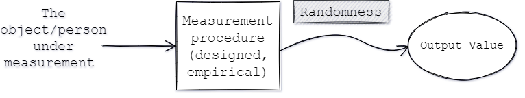
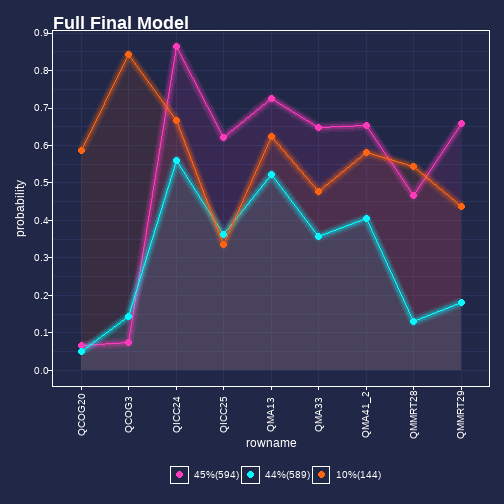

class: middle

```{r setup, include=FALSE}
options(htmltools.dir.version = FALSE)
```

```{r xaringan-themer, include = FALSE}

library(xaringanthemer)
mono_light(base_color = "#29132e",
          white_color = lighten_color("#29132e", 0.7),
          black_color = darken_color("#29132e", 0.3),
 code_highlight_color = "#686862",
 link_color = "#4C4D41",
 code_inline_background_color = "#A6A6BA",
 code_inline_color = "#02191c",
 code_font_google   = google_font("Droid Mono"),
 #background_image = "methodsu.jpg",
 background_size = "15%",
 background_position = "bottom left",
)


```


class: middle

## Outline

1. Brief Overview of Motivations and Interests 
  + construct definitions
  + ontology
  + psychometrics

2. Presenting an iterative workflow - between theoretical considerations and (statistical) modeling and back

3. Concluding thoughts


```{r message=FALSE, warning=FALSE, include=FALSE}
library(tidyverse)
library(caTools)
library(gganimate)
library(knitr)

```


---


class: middle, center

# Part 1 
## Motivations and Interests

### Trying to sort out what our definitions "do"


  
---
class: middle

# How I got here 

1. Early interests: literacy and measures of reading ability and/or text difficulty

--

2. I was starting to work on an in-progress formative measure of `Reading Strategy Use` 
  + Called the Strategy Use Measure (SUM)
  + Attempt to measure four distinct strategies hypothesized to be useful for students encountering challenging texts

--

3. It was going to start being used in the classroom (formatively) - but teachers were certainly going to compare it to higher stakes reading assessments


---

class: middle

# How I got here - Definitions of Reading


The National Assessment of Educational Progress (NAEP) - reports on student reading comprehension ability across the United States

Defines reading ability as (with descriptions of each):
+ Understanding written text. 
+ Developing and interpreting meaning. 
+ Using meaning as appropriate to type of text, purpose, and situation.


---

class: middle

# Controversy


+ What are the necessary "causal" antecedents to reading ability within NAEP?

+ Is background knowledge part of `reading comprehension` (switch in terms)? 

+ For the 2025 framework, there's been vigorous debate


---

class: middle

## Fuzzier example - Measuring resilience

+ Project with school psychologists wanting to construct a culturally sensitive measure of resilience

+ I (along with my advisor) were the "measurement folks" on the team

+ Definitional disagreements among the school psychologists and the literature


---

# Paraphrasing different positions

.pull-left[
_Resilience as life outcome:_

+ May invoke a between-person descriptive view of resilience 

+ Not specific enough to figure out if this outcome should be continuous or dichotomous
]

--

.pull-right[

_Resilience as internal:_

+ Resilience defined by attitude, belief, or propensity when encountering a challenge

+ May invoke a within-person, explanatory view of some phenomenon
]

--

But there is no **correct** definition! Resilience is a metaphor.


---

class: middle

# So I began to wonder...

1. What should a properly specified definition look like?

2. What is the role of definition in measurement activities? Who gets to do that?

3. Is defining . . . 
  + a language-based enterprise?
  + an empirical one?
  + or some combination? 
  
4. How does thinking about "what's out there?" help with our work?
  
4. Given any of these, what should count as enough for "measuring?”


---

class: middle

## Then what?


+ I wanted to create sort of a warning labels for myself (a cheat sheet if you will)

+ I figured I'd find one...

--

... but they mostly existed in philosophy of language texts (with a few exceptions)

+ At first, it was just for me

???

Since then, I've wanted to map out the ways that we (psychometricians, educational and psychological researchers) might be bewitched by our words


---

class: middle

## Defining measurable properties


+ We name (signifier) the properties we want to measure ("reading ability") - so our words refer to something (the signified)

+ Thinking this way helps us figure out what it is to be these things we'd like to measure (ontology)

+ Allows us to push and refine our definitions


---

class: center


---


class: middle, center

### Diagramming the measurement process




---

class: middle

## What are common features of measurement?

`Objectivity` or `“object-relatedness”`: the measuring instrument is “sufficiently” sensitive to the property intended to be measured 
 
--

`Intersubjectivity` or `“subject-independence”`: measurement results are understood in the same way across time, place, and persons

For more, see for example (Maul, Mari, & Wilson, 2019). 

???
Objectivity = reduction in uncertainty and also helps figure out what's uncertainty related to the instrument. But these things are never perfectly certain...

---

class: middle 

### "Measurements are full of uncertainty" 

Uncertainty as a state of incomplete knowledge
  + Uncertainty about what?
  + Why is there uncertainty?
  + How do we reduce this uncertainty?


--

I'm especially interested in the concept of `definitional uncertainty` about the property of interest ("reading ability", "math ability", temperature)

--

+ Definitional uncertainty - there's only a finite amount of detail that can describe the property of interest

---

class: middle

## Some terminology


 + The [International Vocabulary](https://jcgm.bipm.org/vim/en/2.27.html) of Metrology (VIM; metrology is the study of measurement) defines definitional uncertainty:

> "component of measurement uncertainty resulting from the finite amount of detail in the definition of a measurand"

???

The BIPM is...Bureau International des Poids et Mesures

the international organization established by the Metre Convention, through which Member States act together on matters related to measurement science and measurement standards

the home of the International System of Units (SI) and the international reference time scale (UTC).
---

class: middle 

# NAEP concludes:

>For this reason, the definition of reading presented earlier 
should be considered as a guide for the NAEP Reading Assessment, not as an inclusive definition of 
reading. The definition pertains to how NAEP defines reading for the purpose of this assessment. 

From *Reading Framework for the 2019 National Assessment of Educational Progress*, p. 4

This is a restatement of the idea of definitional uncertainty


---

class: middle

# Definitions and psychometrics

Why is this relevant to psychometrics (or validation work generally)? 
  

+ What we consider relevant to the construct of interest (or not - "construct irrelevant variance") leads to items


+ Requires delimiting - "what's not part of the construct/property of interest?"

???


We have special names in psychometrics when we're measuring something other than intended 


---

class: middle 

### Definitional uncertainty as a matter of fairness


+ What's construct relevant - might lead to different models (statistical or substantive)

--

+ Different definitions of properties may lead to different student rankings
  
--
  
+ Deciding to exclude/include certain items --> test impact

--

+ Clear definitions might be demanded by learning communities


???

Sometimes we're selecting the property to measure via definition instead of via the thing we're interested in. Construct/entity conflation.

---

class: middle

# Overall...

Understanding of measurement results requires that we **collectively** trust and agree on what’s being measured (or estimated)


---

class: middle


# Some starting recommendations:

When we define - what sort of definition are we working with?

--

+ `Stipulative definition` - I, or we, claim a specific meaning of a term. Researcher dominant

+ `Use-based definition` - Meaning comes from use; requires research into collective understandings. More democratic. 


---

class: middle

# Semantics

As Fiona Hibbard says (2019, p.31): 

> “Although we use words to propose or state what kind of thing we think it is, a definition references the what-it-is-to-be that kind of thing — its principal features or structure — in order to delimit it from other kinds and to make possible a systematic study of it and its connections.”


???

For now, this effort has been a categorization exercise - trying to figure out conceptual practice that can help us reveal some confusions

---
class: middle, center

# Part 2

#### Brief case study using latent variable models - an iterative workflow


---
class: middle

# Black boxes don't define


.pull-left[
+ Latent variables in latent variable models - don't confront the definition question. 

+ "Ability" - makes it possible to do something

+ "Ability" - Also serves as explanation for variation
]

.pull-right[

]

---


class: middle

## Opening the black box

We can take a construct modeling or construct mapping approach - (Wilson, 2005)


---

class: middle

Construct mapping and IRT and back again

.pull-left[


]

.pull-right[

#### The Rasch Model

$$P(X_{is}=1|\theta_s, \delta_i)=\frac{exp(\theta_s-\delta_i)}{1+ exp(\theta_s-\delta_i)}$$

$\theta_s$ = ability of student `s`

$\delta_i$ = difficulty of item `i`

]
---
class: middle

# But what about violations?


+ In psychometrics, we learn about differential item functioning (DIF) in sort of a causal way

--

An item is flagged for DIF when the probability of a response to an item, is not the same for people of the same ability but from different groups

--

+ We're not interested in "tipping at a restaurant" knowledge in an item about percentages. 

+ Normally differential item functioning in IRT - modeled something like a fixed effect

???

As an examplePeople from countries without tipping as common practice to those from countries with tipping as a common practice - people from countries without tipping have a lower probability of getting a math question about tipping correct than those people who are from countries with tipping as common practice EVEN AFTER matching on (estimated) math abilities. In metrology - this would be an "influence property" or "influence quantity"


---

class: middle

## The Strategy Use Measure (SUM) - Formative, used for creating reading groups in the classroom


Four correlated dimensions:

+ Morphological Awareness Items

+ Macro and Micro Relationships in Text

+ Inter-and Intra-Sentential Context Clues

+ Cognates (Spanish/English)


???
Each dimension is thought to assess the extent to which readers are able to put these strategies to use when they encounter a difficult text.


---

class: middle 

Toy example for presentation and a project that we're working on right now...

---

## Construct maps

From (Arya, Clairmont, Katz, & Maul, 2020)


---

Example items:

.pull-left[
### Morphological Awareness

The book covers were heterocoloreous. What does "heterocoloreous" mean?
+ **Different Colors** (1)
+ same colors
+ bright red colors
+ different red colors
]

--

.pull-right[
### Macro and Micro Relations in Text

Glaciers are very large layers of ice that move very slowly.
Which detail is least related to this sentence?   
 + **Glaciers have been long studied by scientists.** (1)
 + Glaciers can be as large as many countries.
 + Glaciers move an average of 200 feet per year.
 + Glaciers are able to carve out rock as they move.
]
---
class: middle

### Inter-and Intra-Sentential Context Clues

Tree frogs are about two `strimes` long, which is the size of your finger. They must move `pandery` to capture flies, their favorite food ... Tree frogs must escape from `morpes`, like snakes and bats, by moving quickly. _What could `pandery` mean?_

+	**quickly** (1)
+	slowly
+	gently


---

## Key items


???
Via IRT - these items were flagged for DIF and showed some of the largest "DIF effects" favoring heritage Spanish speakers - but is this problematic for a formative assessment?

---

class: middle

## A Graphical Method

Let's say you've found evidence of DIF but want to work through the response processes.


1. Start with a mixture model - a Latent Class Analysis, here ( we know we have different distributions)

--

2. Use multinomial logistic regression to regress class (or cluster membership) on observed group membership (for the full model)

 + Which class/cluster/profile does each group have the highest chance of being in?

3. Compare to individual cluster analyses/mixture models of each group individually

Abduce to response process theories derived from definitions.

???

3. Compare item response profiles of clusters (do they resemble the response probabilities of observed groups given DIF)
 + An LCA with all students
 + An LCA with just heritage Spanish Speakers
 + An LCA with just non-heritage Spanish Speakers


A mixture model in this setting is exploratory. A colloquial way of thinking about this process is seeking to find underlying, distributions, or clusters of people. Here it involves a process that goes between different numbers of classes. 

---
## Settle on a full sample model and Predict into Classes (Step 1 and 2)


```{r echo=FALSE, fig.align='center', out.width="50%", fig.cap="Prediction-based: Heritage Spanish Speakers had a much higher chance of being in the Orange Class"}


```


---


## What about just Spanish Speakers, though?


```{r echo=FALSE, fig.align='center', out.width="50%", fig.cap="Predicted Probabilities of Just Spanish Speakers on Items – Most heritage Spanish Speakers aren’t likely to get cognate questions correct "}


```


---
.pull-left[

```{r echo=FALSE, fig.align='left', out.width="99%", fig.cap = "Despite having a high probability (or higher probability) of being in the class most likely to get the cognate items correct - most students who identified as heritage Spanish speakers were not likely to get those items correct"}


```

]

--

.pull-right[


```{r echo=FALSE, fig.align='right', out.width="99%", fig.cap = "Response Probabilities for non-heritage Spanish Speakers"}

knitr::include_graphics("Just non-Spanish.png")
```

]


---

class: middle

# Key point

**For this to process to be informative, I need to have a response process theory in mind**
  

- Should "cognate knowledge" include more consideration for bilingualism?

--

- Normall, items that favor bilinguals might be filtered out for DIF

???
But bilingualism is a strength, here, in strategy use - should it feature in larger assessments? Perhaps formatively or in-classroom settings, this might be useful for knowledge for a teacher.

---


class: middle 

## Conclusions and steps forward

+ What I'm hoping is that this process might tell us something about bilingualism and cognate knowledge interacting - for whom should the items be difficult? 

+ Iterate on construct definitions - What aspect of bilingualism is/n't part of the measurand?


+ How would this work for many groups or many more items? (would it scale?)


+ Next steps: Try to "explain" DIF with LLTM/explanatory IRT models? Random Item Models? DIF not as fixed quantity?


???

 (moving from tests of invariance 🡪 understanding responses in terms of mixtures of populations)

---


class: middle

## Brief Discussion of Fairness

+ For items showing evidence of DIF, the influence quantity seems to be something else behind the veil of group membership then just "speaks Spanish"


+ But this uses an old conception of fairness - treat like cases alike


+ What if we take a dynamic assessment perspective? E.g. - assessment mediates between student and instruction, helping student master material - then utilizing response processes will be useful

???

The more multilingual learners are encouraged to use their home language in reading contexts, the more connections they are able to make across English and other linguistic systems, and the greater their ability to pick up lexical clues for comprehending (Rodríguez, 2001).

---

# Part 3

## Concluding thoughts and discussions

---

class: middle 

## Conclusions more broadly

+ It's hard to interpret psychometric models without clarifying definitions

+ But definitions are never "complete"

+ Never forget that language can fool us but it's also a very helpful tool

+ Definitional work paired with response process work may help with impasses in psychometric modeling 
  + Is IRT probabilistic because of sampling from persons or because of within person processes?
  + Random sampling vs Stochastic subjects (Holland, 1990)

???
Work through metaphors and use them to our advantage


---

class: middle

## Thanks!

Special thanks to Dr. Diana Arya, UCSB Gevirtz Graduate School of Education, Associate Professor and director of the Mcenroe Reading and Language Arts Clinic, creator of the Strategy Use Measure (SUM) – data from which I have interrogated against best use recommendations


If you'd like to get in touch...

Daniel Katz: dkatz@ucsb.edu


---

# References

Arya, D., Clairmont, A., Katz, D., & Maul, A. (2020). Measuring Reading Strategy Use. *Educational Assessment*, 25(1), 5-30.

Hibberd, F. (2019). What is Scientific Definition? *Journal of Mind and Behavior*, 40(1), 29-52.


Holland, P. W. (1990). On the sampling theory foundations of item response theory models. *Psychometrika*, 55(4), 577-601.

Maul, A., Mari, L., & Wilson, M. (2019). Intersubjectivity of measurement across the sciences. *Measurement: Journal of the International Measurement Confederation*, 131, 764–770. https://doi.org/10.1016/j.measurement.2018.08.068


Wilson, M. (2005). *Constructing measures: an item response modeling approach.* Lawrence Erlbaum Associates.


---
# References


Borsboom, D., Mellenbergh, G. J., & Van Heerden, J. (2002). Different Kinds of DIF: A Distinction Between Absolute and Relative Forms of Measurement Invariance and Bias. *Applied Psychological Measurement*, 26(4), 433–450. [https://doi.org/10.1177/014662102237798](https://doi.org/10.1177/014662102237798) 


Slaney, K. L., & Garcia, D. A. (2015). Constructing psychological objects: The rhetoric of constructs. *Journal of Theoretical and Philosophical Psychology*, 35(4), 244–259. https://doi.org/10.1037/teo0000025


Paek, I., & Wilson, M. (2011). Formulating the Rasch Differential Item Functioning Model Under the Marginal Maximum Likelihood Estimation Context and Its Comparison With Mantel–Haenszel Procedure in Short Test and Small Sample Conditions. *Educational and Psychological Measurement*, 71(6), 1023–1046. [https://doi.org/10.1177/0013164411400734](https://doi.org/10.1177/0013164411400734)
---

## Why do we worry about DIF?


.pull-left[
### Fairness:

1. We want to treat like cases alike

2. High stakes assessment: no test taker (or group) has undo (dis)advantage

3. The AERA, APA, NCME *Standards* denote fairness as a validity issue (focusing not just on DIF)
]

--
 
.pull-right[
### Measurement, ontology
1. Make sure score interpretations are same across groups (equating, if you will)

2. Limit the extent to which instrument is sensitive to sources not related to the construct

3. Finding DIF is important for examining construct of interest
]

Of course, also legal ramifications 


---
class: middle

# Or what about empty or contingent references?


---

class: middle

## The IRT step:

Using similar notation to Paek & Wilson (2011)

$$P(X_{is}=1|\theta_s, g_s)=\frac{exp(\theta_s-\delta_i + \Delta G + \gamma_i*G_)}{1+ exp(\theta_s-\delta_i +\Delta G + \gamma_i*G)}$$

$\theta_s$ = ability of student `s`

$\delta_i$ = difficulty of item `i`

$\Delta$ = "Group effect" or "impact factor"

$\gamma_i$ = DIF parameter value (e.g. item*group interaction)


---

## Latent Class Analysis

.pull-left[

+ Highly exploratory use case here

+ Enumerate several possible potential classes (e.g. - 1 class, 2 class, 3 class)

+ Classes are categorical latent variables with reflective latent variable model interpretations

]

.pull-right[

$$P(X=(x_1..x_k)) = \Sigma_{c=1}^{G*}\pi_cP(x_1..x_k)|c)$$
+ `c` is class indicator

+ `G*` denotes total classes

+ $\pi_c$ = mixing proportions/class sizes (estimated)

+ Item responses conditionally indpendent within class

]


---


