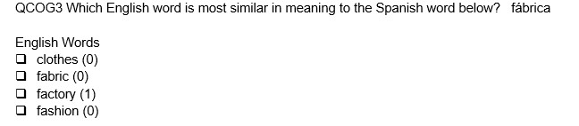

class: middle

```{r setup, include=FALSE}
options(htmltools.dir.version = FALSE)
```

```{r xaringan-themer, include = FALSE}
<<<<<<< HEAD
=======
library(xaringanthemer)
>>>>>>> 19bdb9ffa4f78b31e460bde0aaae9e85ef799363

mono_light(base_color = "#29132e",
          white_color = lighten_color("#29132e", 0.7),
          black_color=darken_color("#29132e", 0.3),
 code_highlight_color = "#686862",
 link_color = "#4C4D41",
 #code_inline_background_color = "#A6A6BA",
 code_inline_color = "#02191c",
 code_font_google   = google_font("Droid Mono"),
 #background_image = "methodsu.jpg",
 background_size = "15%",
 background_position = "bottom left")
```


# Introduction


```{r message=FALSE, warning=FALSE, include=FALSE}
library(tidyverse)
library(caTools)
library(gganimate)
library(knitr)
```

+ "Group" assignment is a Catch-22 in statistics/measurement  


+ Often need to assign people to groups for various reasons 

+ Often have to run the statistical model to make our classifications

+ Finding important aspects of group membership is a way for us to compare (age-grading, diagnoses, regression modelling)

+ But what can we do to ensure our group membership, for DIF testing is meaningful?


---

class: middle

# "Fixed Effects" models

+ What constitutes a meaningful group?

  + Consequence - may ignore heterogeneity in treatment effects even within groups
  
  + May inflate or a deflate the causual estimate (plus, can you interpret them within group?)
  
+ General lesson: A group indicator can induce more problems if not thought through

+ Problems...


---

class: middle
<<<<<<< HEAD
=======
# What about relative DIF?
 + In classroom settings, diagnostic assessment may be of interest and we'd like to compare similar groups
 
 + How should we identify groups
 
 + we have "observed" groups (or at least we think we do...)
 
 + But what happens when the observed groupings (i.e. don't match the goupings we're actually interested in - in the case of DIF)?
 

---

class: middle
>>>>>>> 19bdb9ffa4f78b31e460bde0aaae9e85ef799363

# Differential Item Functioning (DIF)

+ Invariance/DIF analysis starts with the premise that items are invariant, when one can, 

1. Match respondents on "ability" or a sum score, or the like, 
  
2. Model the responses probabilities to certain items or item categories 
  
3. Note whether the probability of that response to a given item for respondents is the same regardless of group membership


---

class: middle

# Formalizing
Given, participant `i`, item `j`, value on latent trait, `t`, selection variable (or group), `v` 

$F(X_{ij}=x_{ij}|T=t_i, V_i=v_i) = F(X_{ij}=x_{ij}|T=t_i)$


Non Invariance Occurs when: 

$F(X_{ij}=x_{ij}|T=t_i, V_i=v_i) \neq F(X_{ij}=x_{ij}|T=t_i)$
---
class: middle
# Strategies
  
+ Typically, items are removed when measurement non-invariance is found

+ There are various philosophies:
  + DIF found: Item removal (no questions asked - testing agencies)
  + DIF found: Item removal if DIF can be explained
  + DIF found: Items removed/altered/some parameters are allowed to change


---
class: middle

# But...An alternative

+ Absolute and Relative Measurement Invariance

+ We typically look at absolute invariance

+ In some cases when absolute non-invariance is found, relative invariance might still hold


---

```{r fig.align='center', fig.retina=3, fig.width=7, message=FALSE, warning=FALSE, figh.height=7, include=FALSE, paged.print=FALSE}

library(tidyverse)

cyber_colors = c(
`cyan` = "#711c91",
`orange` = "#ff6410",
`pink`=  "#fe3abc",
`teal` = "#05f9ff",
`blue` = "#133e7c",
`dark` = "#05f9ff")


cyber_cols <- function(...) {
  cols <- c(...)

  if (is.null(cols))
    return (cyber_colors)

  cyber_colors[cols]
}


cyber_palettes <- list(
  `main`  = cyber_cols("cyan", "pink", "teal", "blue", "dark"),
  `red` = cyber_cols("cyan", "pink"),
  `oranges` = cyber_cols("orange", "teal")
  )


cyber_pal <- function(palette = "main", reverse = FALSE, ...) {
  pal <- cyber_palettes[[palette]]
  

  if (reverse) pal <- rev(pal)

  colorRampPalette(colors = pal)
}
cyber_pal()


scale_color_cyber <- function(palette = "main", discrete = TRUE, reverse = FALSE, ...) {
  pal <- cyber_pal(palette = palette, reverse = reverse)

  if (discrete) {
    discrete_scale("colour", paste0("drsimonj_", palette), palette = pal, ...)
  } else {
    scale_color_gradientn(colours = pal(256), ...)
  }
}

scale_fill_cyber <- function(palette = "main", discrete = TRUE, reverse = FALSE, ...) {
  pal <- cyber_pal(palette = palette, reverse = reverse)

  if (discrete) {
    discrete_scale("fill", paste0("cyber_", palette), palette = pal, ...)
  } else {
    scale_fill_gradientn(colours = pal(256), ...)
  }
}
theme_vapor = function(base_size = 12, base_family = "") {
  
  theme_grey(base_size = base_size, base_family = base_family) %+replace%
    
    theme(
      # Specify axis options
      axis.line = element_blank(),  
      axis.text.x = element_text(size = base_size*0.8, color = "white", lineheight = 0.9),  
      axis.text.y = element_text(size = base_size*0.8, color = "white", lineheight = 0.9),  
      axis.ticks = element_line(color = "white", size  =  0.2),  
      axis.title.x = element_text(size = base_size, color = "white", margin = margin(0, 10, 0, 0)),  
      axis.title.y = element_text(size = base_size, color = "white", angle = 90, margin = margin(0, 10, 0, 0)),  
      axis.ticks.length = unit(0.3, "lines"),   
      # Specify legend options
      legend.background = element_rect(color = NA, fill = "#212747"),  
      legend.key = element_rect(color = "white",  fill = "#212747"),  
      legend.key.size = unit(1.2, "lines"),  
      legend.key.height = NULL,  
      legend.key.width = NULL,      
      legend.text = element_text(size = base_size*0.8, color = "white"),  
      legend.title = element_blank(),  
      legend.position = "bottom",  
      legend.text.align = NULL,  
      legend.title.align = NULL,  
      legend.direction = "horizontal",  
      legend.box = NULL, 
      # Specify panel options
      panel.background = element_rect(fill = "#212747", color  =  NA),  
      panel.border = element_rect(fill = NA, color = "white"),  
      panel.grid.major = element_line(color = "#2a325b"),  
      panel.grid.minor = element_line(color = "#2a325b"),  
      panel.spacing = unit(0.5, "lines"),   
      # Specify facetting options
      strip.background = element_rect(fill = "grey30", color = "grey10"),  
      strip.text.x = element_text(size = base_size*0.8, color = "white"),  
      strip.text.y = element_text(size = base_size*0.8, color = "white",angle = -90),  
      # Specify plot options
      plot.background = element_rect(color = "#212747", fill = "#212747"),  
      plot.title = element_text(hjust = 0, size = rel(1.5), face = "bold", color = "white"),
      plot.subtitle = element_text(hjust = 0, size = rel(1), face = "plain", color = "white"),
      plot.caption = element_text(hjust = 1, size = rel(1), face = "plain", color = "white"),
      plot.margin = unit(rep(1, 4), "lines")
      
    )
  
}

set.seed(346)

n <- 10
mu <- 0
sd <- 1.5


# create item difficulties.
delta <- rnorm(n, mu, sd)
summary(delta)
sd(delta)


# create person groups and persons with abilities
table_pers <- tibble(persons = rbernoulli(1000)) %>%
  mutate(persons = if_else(persons==T, 1, 0),
         ability = rnorm(1000, mean=persons, sd=1),
         persons = as.factor(persons)) %>%
  group_by(persons) %>%
  # get relative abilities
  mutate(rel_abil=scale(ability)) %>% ungroup()

table_pers %>%
  group_by(persons) %>%
  summarise(group_mean = mean(ability))

plot <- ggplot(data = table_pers, aes(x=ability)) + 
  geom_density(aes(fill=persons, color=persons), alpha=.6) +
  xlab("ability (logits)") +
  ggtitle("Ability Distributon") +
  scale_color_cyber(palette="oranges") +
  scale_fill_cyber(palette="oranges")+
  theme_vapor()

```
```{r fig.align='center', fig.retina=3, fig.width = 9, message=FALSE, warning=FALSE, echo=FALSE, figh.height=7, paged.print=FALSE}
plot

```

---
Absolute DIF
$$P(X_{is}=1|\theta_s, \delta_i, \gamma_i, G_s)=\frac{exp(\theta_s-\delta_i + \gamma_i*G_)}{1+ exp(\theta_s-\delta_i +\gamma_i*G)}$$

```{r fig.align='center', fig.retina=3, fig.width=9, message=FALSE, warning=FALSE, figh.height=7, include=FALSE, paged.print=FALSE}

# Absolute DIF Favoring Group 1 by 1 Logit
icc_0 <- function(ability){
 exp(ability-delta[2])/(1+exp(ability-delta[2]))
}

icc_0(-2)

icc_2 <- function(ability){
  exp(ability-delta[2] + 1)/(1+exp(ability-delta[2]+1))
}

p <- ggplot(data = data.frame(ability = c(-3:3)), mapping = aes(x=ability))+#ff6410
  stat_function(fun = icc_0, geom = 'area', fill="#ff6410", alpha=.1) +
  stat_function(fun = icc_0, geom = 'line', color="#ff6410", alpha=0.1,  size= 4)+
  stat_function(fun = icc_0, geom = 'line', color="#ff6410", alpha=0.1,  size= 3)+
  stat_function(fun = icc_0, geom = 'line', color="#ff6410", alpha=0.2,  size= 2)+
  stat_function(fun = icc_0, geom = 'line', color="#ff6410", alpha=0.2,  size= 1)+
  stat_function(fun = icc_0, geom = 'line', color="#ff6410", alpha= 1,  size= .5)+
  
  stat_function(fun = icc_2, geom = 'area', fill= "#05f9ff",  alpha=.1) +
  stat_function(fun = icc_2, geom = 'line', color="#05f9ff", alpha=0.1,  size= 4)+
  stat_function(fun = icc_2, geom = 'line', color="#05f9ff", alpha=0.1,  size= 3)+
  stat_function(fun = icc_2, geom = 'line', color="#05f9ff", alpha=0.2,  size= 2)+
  stat_function(fun = icc_2, geom = 'line', color="#05f9ff", alpha=0.2,  size= 1)+
  stat_function(fun = icc_2, geom = 'line', color="#05f9ff", alpha= 1,  size= .5)+
  scale_colour_manual(name = "Group", values = c("icc_0"="#ff6410","icc_2"="#05f9ff"), labels = c("Group 0", "Group 1")) +

  geom_segment(y = .5, yend=.5, x=-3, xend=.2, color = "#711c91", size = 4, alpha=.1) +
  geom_segment(y = .5, yend=.5, x=-3, xend=.2, color = "#711c91", size = 3, alpha=.1) +
  geom_segment(y = .5, yend=.5, x=-3, xend=.2, color = "#711c91", size = 2, alpha=.2) +
  geom_segment(y = .5, yend=.5, x=-3, xend=.2, color = "#711c91", size = 1, alpha=.2) +
  geom_segment(y = .5, yend=.5, x=-3, xend=.2, color = "#711c91", size =.5, alpha= 1) +
  
  geom_segment(y = 0, yend=.5, x=.2, xend=.2, color = "#711c91", size = 4, alpha=.1) +
  geom_segment(y = 0, yend=.5, x=.2, xend=.2, color = "#711c91", size = 3, alpha=.1) +
  geom_segment(y = 0, yend=.5, x=.2, xend=.2, color = "#711c91", size = 2, alpha=.2) +
  geom_segment(y = 0, yend=.5, x=.2, xend=.2, color = "#711c91", size = 1, alpha=.2) +
  geom_segment(y = 0, yend=.5, x=.2, xend=.2, color = "#711c91", size =.5, alpha= 1) +
  
  geom_segment(y = 0, yend=.5, x=-.8, xend=-.8, color = "#711c91", size = 4, alpha=.1) +
  geom_segment(y = 0, yend=.5, x=-.8, xend=-.8, color = "#711c91", size = 3, alpha=.1) +
  geom_segment(y = 0, yend=.5, x=-.8, xend=-.8, color = "#711c91", size = 2, alpha=.2) +
  geom_segment(y = 0, yend=.5, x=-.8, xend=-.8, color = "#711c91", size = 1, alpha=.2) +
  geom_segment(y = 0, yend=.5, x=-.8, xend=-.8, color = "#711c91", size =.5, alpha= 1)  + 
  xlab("absolute ability (logits)") +
  ggtitle("Item Characteristic Curve for One Item") +
  ylab("Probability of Response = 1") +
  theme_vapor()
  


```

```{r fig.align='center', fig.retina=3, fig.width = 9, message=FALSE, warning=FALSE, echo=FALSE, figh.height=7, paged.print=FALSE}
p
```

---

```{r fig.align='center', fig.retina=3, fig.width=9, message=FALSE, warning=FALSE, figh.height=7, include=FALSE, paged.print=FALSE}

# Absolute DIF Favoring Group 1 by 1 Logit
icc_0 <- function(ability){
 exp(ability-delta[2])/(1+exp(ability-delta[2]))
}


icc_2 <- function(ability){
  exp(ability-delta[2] + .1)/(1+exp(ability-delta[2]+.1))
}

p_rel <- ggplot(data = data.frame(ability = c(-3:3)), mapping = aes(x=ability))+
  stat_function(fun = icc_0, geom = 'area', fill="#ff6410", alpha=.1) +
  stat_function(fun = icc_0, geom = 'line', color="#ff6410", alpha=0.1,  size= 4)+
  stat_function(fun = icc_0, geom = 'line', color="#ff6410", alpha=0.1,  size= 3)+
  stat_function(fun = icc_0, geom = 'line', color="#ff6410", alpha=0.2,  size= 2)+
  stat_function(fun = icc_0, geom = 'line', color="#ff6410", alpha=0.2,  size= 1)+
  stat_function(fun = icc_0, geom = 'line', color="#ff6410", alpha= 1,  size= .5)+
  

  stat_function(fun = icc_2, geom = 'area', fill= "#05f9ff",  alpha=.1) +
  stat_function(fun = icc_2, geom = 'line', color="#05f9ff", alpha=0.1,  size= 4)+
  stat_function(fun = icc_2, geom = 'line', color="#05f9ff", alpha=0.1,  size= 3)+
  stat_function(fun = icc_2, geom = 'line', color="#05f9ff", alpha=0.2,  size= 2)+
  stat_function(fun = icc_2, geom = 'line', color="#05f9ff", alpha=0.2,  size= 1)+
  stat_function(fun = icc_2, geom = 'line', color="#05f9ff", alpha= 1,  size= .5)+
  scale_colour_manual(name = "Group", values = c("icc_0"="#ff6410","icc_2"="#05f9ff"), labels = c("Group 0", "Group 1")) +
  xlab("relative ability (logits)") + 
  ylab("probability ") +
  ggtitle("Item Characteristic Curve for One Item") +
  geom_segment(y = .5, yend=.5, x=-3, xend=.2, color = "#711c91", size = 4, alpha=.1) +
  geom_segment(y = .5, yend=.5, x=-3, xend=.2, color = "#711c91", size = 3, alpha=.1) +
  geom_segment(y = .5, yend=.5, x=-3, xend=.2, color = "#711c91", size = 2, alpha=.2) +
  geom_segment(y = .5, yend=.5, x=-3, xend=.2, color = "#711c91", size = 1, alpha=.2) +
  geom_segment(y = .5, yend=.5, x=-3, xend=.2, color = "#711c91", size =.5, alpha= 1) +
  
  geom_segment(y = 0, yend=.5, x=.2, xend=.2, color = "#711c91", size = 4, alpha=.1) +
  geom_segment(y = 0, yend=.5, x=.2, xend=.2, color = "#711c91", size = 3, alpha=.1) +
  geom_segment(y = 0, yend=.5, x=.2, xend=.2, color = "#711c91", size = 2, alpha=.2) +
  geom_segment(y = 0, yend=.5, x=.2, xend=.2, color = "#711c91", size = 1, alpha=.2) +
  geom_segment(y = 0, yend=.5, x=.2, xend=.2, color = "#711c91", size =.5, alpha= 1)   + theme_vapor()
  


```

---
class: middle 
# Relative Invariance
<<<<<<< HEAD
$P(X_{ij}=x_{ij}|W=w_i, V_i=v_i) = P(X_{ij}=x_{ij}|W=w_i)$
=======
$F(X_{ij}=x_{ij}|W=w_i, V_i=v_i) = F(X_{ij}=x_{ij}|W=w_i)$
>>>>>>> 19bdb9ffa4f78b31e460bde0aaae9e85ef799363


Non Invariance Occurs when: 

<<<<<<< HEAD
$P(X_{ij}=x_{ij}|W=w_i, V_i=v_i) \neq P(X_{ij}=x_{ij}|W=w_i)$
=======
$F(X_{ij}=x_{ij}|W=w_i, V_i=v_i) \neq F(X_{ij}=x_{ij}|W=w_i)$
>>>>>>> 19bdb9ffa4f78b31e460bde0aaae9e85ef799363

Where `W` is the within group, relative, position

## We've effectively switched units 
 

---


class: middle
# A reading measure example

+ Let's say there's an assessment of reading strategy use, we'll call it the SUM (strategy Use Measure)
  

--
+ Intended to be multidimensional but treated unidimensionally  
  

--
+ The assessment has a section testing knowledge of English-Spanish Cognates 
  
--

+ While the assessment has 157 items, I've cherry picked a set of items that exhibit DIF (for didactic purposes)  
  
--

+ Note - this is NOT a fair characterization of the assessment  
---

# I run a Rasch model and find evidence that some items have DIF

(I've selected 9 items, some of which show absolute DIF)

+ Relative measurement not ruled out

+ I need to test whether I can measure within my "identified" groups

+ Heritage Spanish Speakers vs. Not heritage Spanish Speakers
  
---

# strategy - trialing a method

+ Use a clustering method (for instance, latent class analysis)  
  
--
+ Predict cluster/class membership by subgroup 
  
--

+ Is there a cluster/class group members are most likely to be part of? Is it as expected based on theory?
  
--

+ Compare the cluster/distribution/class shape most like my view of a "group" to what the observed item response proportions
  

--
+ Re-estimate the cluster with just the heritage Spanish speakers and just the non-heritage Spanish speakers (English speakers)  
  
---
class: middle

# Key point

**For this to work, I need to have a response process theory in mind**
  

- "Those who read like Spanish Speakers" and "Those who do not"
  
---

## Key items



---

class: middle
# Data and Methods Description

+ 328 heritage Spanish Speakers

+ 999 non-heritage Spanish Speakers

+ Used Latent Class Analysis
  + Exploratory Method
  + Effectively "finds" groups in the data - distributions that are alike
  + Accept or reject based on fit criteria

+ Categorical Latent Variable 
---

```{r echo=FALSE, fig.align='center', fig.width=10, figh.height=8,fig.retina=3, message=FALSE, warning=FALSE}
<<<<<<< HEAD
library(tidyverse)

=======
>>>>>>> 19bdb9ffa4f78b31e460bde0aaae9e85ef799363
all_mix <- read_rds("C:/Users/katzd/Dropbox/My PC (LAPTOP-K7402PLE)/Desktop/Github/danielbkatz.github.io/assets/Presentations/Reminar_DIF/mixture_all.rds")
all_mix
```
---
```{r echo=FALSE, fig.align='center', fig.width=10, figh.height=8,fig.retina=3, message=FALSE, warning=FALSE}

final_mix <- read_rds("C:/Users/katzd/Dropbox/My PC (LAPTOP-K7402PLE)/Desktop/Github/danielbkatz.github.io/assets/Presentations/Reminar_DIF/final_mix.rds")
final_mix


```

---

class: middle, center
# Structural Model


---
class: middle

## Methods
+ Probability of being in a given class given self-identified heritage language

+ Multinomial logistic regression

+ Reference Outcome: Class 3 - the "Spanish reading profile"

+ Reference of the Language Predictor: non-heritage Spanish Speakers
---
class: middle
## Results

+ Compared to non-heritage Spanish Speakers, those who identify as heritage Spanish Speakers are 3 logits less likely to be in  the class 1 and class 2.

+ Flipping the reference classes and language groups around:
  + Students who are Spanish at home Speakers are 3 logits more likely to be in reference class 3 (Spanish at home) than any other class relative to non-Spanish at home speakers
  
+ 3 logits ~ 95%
+ -3 logits ~ 5%
---
class: middle
## That's promising for relative measurement
+ But let's think about that - it's not 100%  
  
--
+ What do the profiles look like when I run an LCA without each group?
  + Model without heritage Spanish speakers
  + Model with heritage Spanish speakers

---
```{r echo=FALSE, fig.align='center', fig.width=10, figh.height=10,fig.retina=3, message=FALSE, warning=FALSE}
span_mix <- read_rds("C:/Users/katzd/Dropbox/My PC (LAPTOP-K7402PLE)/Desktop/Github/danielbkatz.github.io/assets/Presentations/Reminar_DIF/just_span_mix.rds")
span_mix
```
---
```{r echo=FALSE, fig.align='center', fig.width=10, figh.height=10,fig.retina=3, message=FALSE, warning=FALSE}
not_span_mix <- read_rds("C:/Users/katzd/Dropbox/My PC (LAPTOP-K7402PLE)/Desktop/Github/danielbkatz.github.io/assets/Presentations/Reminar_DIF/not_span_mix.rds")
not_span_mix
```
---
# Final Not Spanish Speakers Compared to full final model
.pull-left[
```{r echo=FALSE, message=FALSE, warning=FALSE}

not_span_finmod <- read_rds("C:/Users/katzd/Dropbox/My PC (LAPTOP-K7402PLE)/Desktop/Github/danielbkatz.github.io/assets/Presentations/Reminar_DIF/notspan_finmod.rds")
not_span_finmod
```
]

.pull-right[
```{r echo=FALSE, message=FALSE, warning=FALSE}

final_mix

```
  ]
---

## Just Spanish Compared to Final Model
.pull-left[
```{r echo=FALSE, message=FALSE, warning=FALSE}

span_finmod <- read_rds("C:/Users/katzd/Dropbox/My PC (LAPTOP-K7402PLE)/Desktop/Github/danielbkatz.github.io/assets/Presentations/Reminar_DIF/span_finmod.rds")
span_finmod
```
]

.pull-right[
```{r echo=FALSE, message=FALSE, warning=FALSE}

final_mix

```
  ]
