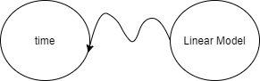
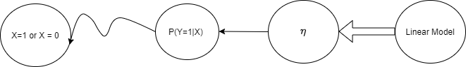
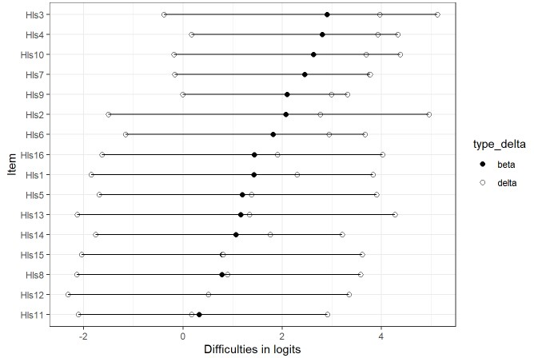
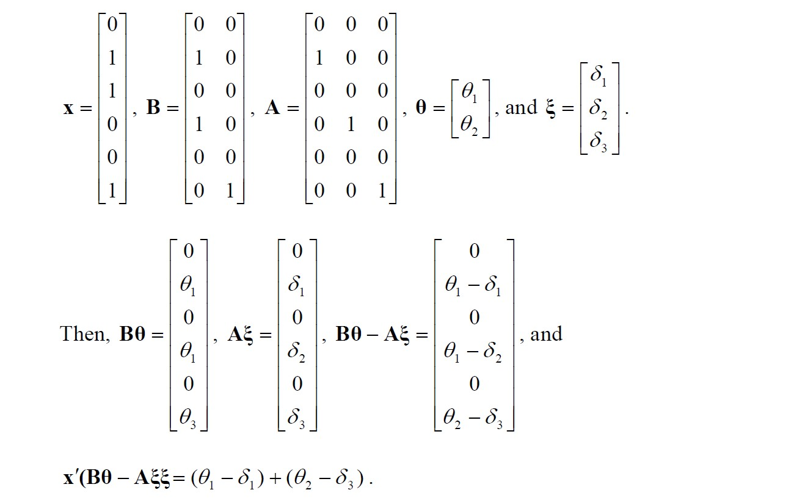
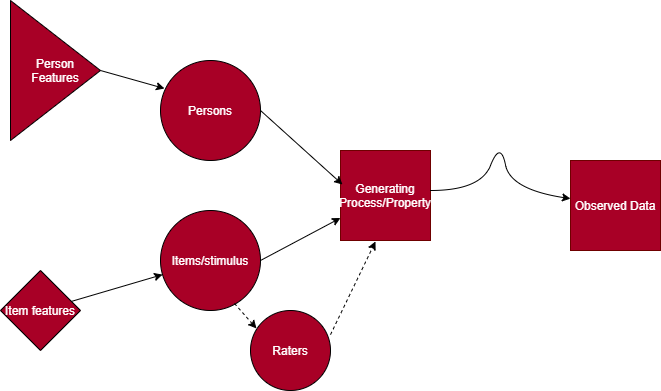
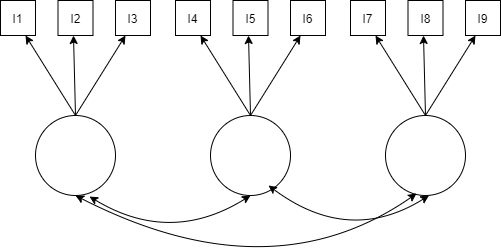

<style>
pre {
  white-space: pre !important;
  overflow-y: scroll !important;
  max-height: 50vh !important;
}
</style>

```{r setup, include=FALSE}
options(htmltools.dir.version = FALSE)

```

```{r xaringan-themer, include = FALSE}
library(xaringanthemer)
library(RefManageR)

mono_light(base_color = "#29132e",
          white_color = lighten_color("#29132e", 0.7),
          black_color=darken_color("#29132e", 0.3),
 code_highlight_color = "#686862",
 link_color = "#4C4D41",
 #code_inline_background_color = "#A6A6BA",
 code_inline_color = "#02191c",
 code_font_google   = google_font("Droid Mono"),
 #background_image = "methodsu.jpg",
 background_size = "15%",
 background_position = "bottom left")
```

```{r, include = FALSE}

library(tidyverse)
```


```{r, load_refs, include=FALSE, cache=FALSE}

library(RefManageR)


BibOptions(check.entries = FALSE,
           bib.style = "authoryear",
           cite.style = "alphabetic",
           style = "markdown",
           hyperlink = FALSE,
           dashed = FALSE)
myBib <- ReadBib("ref.bib", check = FALSE)
```


# What we'll be doing...

+ Why?  
  

--
+ Review of the Linear Model (GLM) with "normal" assumptions to introduce design matrices in the GLM

--
+ An introduction to MRCML - the Multidimensional Random Coefficients Multinomial Logit Model

+ An introduction to arrays in R

+ Working with design matrices in TAM

--

+ Next time - the depths of MRCML and design matrices for different model types

+ Linear Logistic Test Model (item side)

+ Alternative to TAM (Random Item IRT, Continuous predictors, controlling priors, etc...)

---

class: middle

# The Rasch model

+ We use the Rasch model for checking various properties of our items as evidence for having measured (or other hypotheses)  
  

--
+ We also may have designs that include raters (essays, observation protocols, etc) - so you have participants, items, & raters  
  
--

+ We may have multidimensionality  
  
--

+ We may want to include the effect of item type or format, person properties, or their interactions
  
--

+ We may want to include item dependencies, item covariates, or test form covariates (is including a specific property in item or item category reducing or increasing the probability of category or item endorsement)

---
class: middle 


# The Generalized Linear Model

Classic example, borrowing from Andy...

.pull-left[

+ Let's say I tell you that the average time it takes to get to the store from UCSB is 20 minutes. That's all I tell you.

+ When you go to the store (any store), how long would you guess your journey is about to take?


--


+ We can write, $\mathbb{E}[Time] = 20$ minutes
]

--

.pull-right[

+ Now, let's say you're on some sort of schedule...


+ You might also be worried about the variance of these trips (you might want to know about the probability of the trip taking more than 30 minutes)

]

---

class: middle 


# The GLM, cont'd

+ To account for this, you request I describe your trip times with a distribution, namely, a normal distribution

+ These trip times now have a mean and variance to describe expectations and uncertainty

+ $Time \sim  \mathcal N(\mu = 20, \sigma^2 = 25)$

+ We can plot this
---

```{r fig.align='center', fig.retina=3, fig.width = 9, message=FALSE, warning=FALSE, echo=FALSE, figh.height=7, paged.print=FALSE}

p1 <- ggplot(data = data.frame(x = c(0, 40)), aes(x)) +
  stat_function(fun = dnorm, n = 101, args = list(mean = 20, sd = 5)) + ylab("Density") +
  xlab("Time in minutes") +
  scale_y_continuous(breaks = NULL)

p1

```
---

class: middle 


# Let's write this as a linear model now,

 $$y = \beta_0*X_0 + \epsilon$$
--

$X_0$ is just defined to equal 1

+ $\epsilon$ is normally, independently, and identically distributed with mean 0 and variance - let's say the mean is also 20 minutes

---

class: middle

# Running this model

In R this model looks like
```{r eval=FALSE}

lm(data = df, y ~ 1)

```

+ The model now has a "linear" or deterministic part, and a "random" part - that the outcome will never exactly equal the mean ("the error distribution")
---

class: middle

# The GLM cont'd

Rewritten in matrix form - this model looks like:

$$\hat{y} = X\beta$$
or...

$$\mathbb{E}[Time] = X\beta$$
---

class: middle

# Representing this model


.pull-left[
+ Using the notation of `r Citet(myBib, 1, .opts=list(cite.style = "authoryear"))`


 

]
--
.pull-right[
+ The squiggly line I tried to draw (sorry...) represents the random component of the model - the distribution

+ Observed time is not the same as the linear model predicted time - there's some uncertainty 

]
---

# In Matrix Form

If you have data from 5 trips your model looks like this

$$
\begin{bmatrix}
20 \\
20 \\
20 \\
20 \\
20 \\
\end{bmatrix} =
\begin{bmatrix} 
1  \\
1  \\
1  \\
1  \\
1  \\
\end{bmatrix} * \begin{bmatrix}20\\
\end{bmatrix}
\quad
$$


---

class: middle

# The GLM continued

.pull-left[

+ What I didn't tell you is that the average trip takes 20 minutes by bike ... 

+ But it actually takes 5 minutes less time by car (on average)

+ Now we have additional information - but still need a distribution for modeling each mode of transportation!

$$\mathbb{E}[Time|Mode] = X\beta$$


]

--

.pull-right[

+ The distribution is now relative to each mode of transport - the conditional distribution

  + Normally distributed error, mean 0.
  
  + Two normally distributed populations - mean 20, and mean 15.
  
  + Could fit the same variance or different variances
  
]
  


---

class: middle

# The GLM continued

+ Given the description above, in non matrix notation, with bikes as reference group

$E[Time|Mode] = 20 * X_0 + (-5*X_1)$

+ Finally in matrix form, if two trips were by bike, and three by car, bike coded as 0, is the second column of the matrix. 

+ We also have a new vector, the beta vector, which holds the values of our coefficients.

+ The matrix with 1s and 0s is called the design matrix

$$
\begin{bmatrix}
20 \\
15 \\
20 \\
15 \\
15 \\
\end{bmatrix} =
\begin{bmatrix} 
1 & 0 \\
1 & 1 \\
1 & 0 \\
1 & 1\\
1 & 1 \\
\end{bmatrix} * \begin{bmatrix}20\\
-5
\end{bmatrix}
\quad
$$

---
```{r fig.align='center', fig.retina=3, fig.width = 9, message=FALSE, warning=FALSE, echo=FALSE, figh.height=7, paged.print=FALSE}

df <- data.frame(x = sample(c(0, 1), size = 1000, replace = T))

df$y <- 20 + df$x*-5 + rnorm(100, 0, 5)

lm_fit <- lm(data=df, y ~ x)

# x <- x - mean(x)
# y <- y - mean(y)


# For every row in `df`, compute a rotated normal density centered at `y` and shifted by `x`
k <- 2.5
sigma <- sigma(lm_fit)
ab <- coef(lm_fit); a <- ab[1]; b <- ab[2]

x <- seq(-k*sigma, k*sigma, length.out = 100)
y <- dnorm(x, 0, sigma)/dnorm(0, 0, sigma) * 2

x0 <- 0
y0 <- a+b*x0
path1 <- data.frame(x = y + x0, y = x + y0)
segment1 <- data.frame(x = x0, y = y0 - k*sigma, xend = x0, yend = y0 + k*sigma)
x0 <- 1
y0 <- a+b*x0
path2 <- data.frame(x = y + x0, y = x + y0)
segment2 <- data.frame(x = x0, y = y0 - k*sigma, xend = x0, yend = y0 + k*sigma)


ggplot(df, mapping = aes(x=x, y=y)) + geom_jitter(color="#b50c1140") + 
  geom_smooth(method='lm', se=FALSE, color="black") + 
  geom_path(aes(x,y), data = path1, color = "#a52a2a") + 
  geom_segment(aes(x=x,y=y,xend=xend,yend=yend), data = segment1) +
  geom_path(aes(x,y), data = path2, color = "#b50c11") + 
  geom_segment(aes(x=x,y=y,xend=xend,yend=yend), data = segment2)


```


---

class: middle

# Binary or categorical outcomes? 

+ Our conditional distribtions aren't really Normal anymore  - but... 

+ The outcome data data might have a bernoulli, binomial, poisson, exponential distribution which are all part of the same family of distribution

+ This common family of distributions is known as the exponential family of distributions - the lifeblood of the GLM.

---

class: middle

# Aside: The common family for the GLM - The exponential family

+ When you write these conditional distributions in this exponential family form:
  + Given a linear function, $\eta = B_0 + B_1*X_1..$ 
  
  + There is a function $g(\mu) = \eta$ 
  
  + A function can be inverted so $g^{-1}(\eta) = \mu$
  
--

When this parameter/function comes directly from the distribution written in the common exponential family form, this is called the "cannonical parameter" such that

--

$\eta \equiv\theta$ & $g^{-1}(\theta)$ will get you $\mu$

---

# For logistic regression

The outcome is defined as being drawn from a Bernoulli (or Binomial): [Click Here for my Derivation](https://dbkatz.com/assets/Presentations/Reminar_MRCML/linkfun.pdf)

.pull-left[
$X_i \sim Bern(p)$.

The mean of the Bernoulli distribution is the probability of one of the two outcomes (coded as 1 or 0) which we'll call `p`.

Conditional expectation is:

$$P(y=1|x)$$
]
--
.pull-right[
$$g(\mu)=\eta =\theta = log(\frac{p}{1-p})$$


The inverse ...

$$p = \frac{exp(\eta)}{1+exp(\eta)}$$
]


---

class: middle 

# Ok, enough of this...

+ The point isn't to memorize this - it's to see the similarities in item response models 

+ What else can we add to the Rasch model?

+ Item response data is comprised of categorical data 

+ Pet peeve - calling categorical data "normally distributed" because the middle categories have the highest frequencies 

---

class: middle

# Symbolizing our model

We add a straight line between the linear model and eta (they're equivalent) and now we add a link function which is symbolized by the straight arrow between $\eta$ and the probability.

+ We still have the random component (of course)

.center[


]

---

## The Rasch model

From De Boeck & Wilson (2004):

.pull-left[


+ $Y_{pi}$: response of person p on item i (categorical)
]

.pull-right[

+ $\beta_i$: item or item category difficulty - it'll be a vector

+ $X_{ik}$: design matrix containing 1s and 0s pertaining to if the particular $\beta$ corresponds to item i in category k

+ $\theta_p$: the person ability - it is a random effect (next slide)

+ $Z_{p0}$ is a constant (here) but later a set of predictors - basically showing that $\theta_p$ is sampled from a distribution - a random effect

]

---
class: middle

# Formally:

1. $$\pi_{pi} = P(Y_{ik}=y|\theta_p, \beta_{ik})$$
--

1. $$\pi_{pi} = \frac{exp(\theta_p-\beta_{ik})}{1 + exp(\theta_p-\beta_{ik})}$$
--

1. $$\theta_p \sim N(0, \sigma^2_\theta)$$
--

This is a version of the Random Coefficient Multinomial Logit Model (RCML)

---
class: middle

### Writing the Rasch model as a linear model

+ $\eta_{pi} = \sum_{p=1}^n\theta_pZ_{pij} + \sum_{k=1}^K\beta_{ik}X_{pik}$

+ Not pretty, but we just wrote this out as a linear model like you're used to. But $\beta$ is now reversed sign - this is the item "easiness" instead of difficulty.

+ $X$ is a design matrix of item predictors - this is the A matrix in `TAM`

+ $Z$ is a design matrix of person predictors.


---
class: middle

# Predictors in the Rasch model? Why?


+ You want to know about the influence of item property Y (word problem vs non-word problem, specific word use on a self-report survey) 

--

+ Differential item functioning - is an item (category) relatively harder (to endorse) for certain student groups even after matching on the level of the property of interest?

--

+ There are person properties that you want to account for or know about (being in a specific classroom or not) - what is the effect of this property on the same logit scale as the items?


---

# It would be great if...

We could have some form of the model so it looks the same regardless of ...

--

+ Item type (dichotomous, polytomous)

+ Item covariates

--
+ Dimensionality (single or multidimensional, within or between item dimensionality)

+ Person covariates included (get person abilities or person property effects on abilities)

--

+ Rater effects included
--

+ That is the Multidimensional Random Coefficients Multinomial Logit Model (MRCML)

---

class: middle

# Rasch Model revisited using the design matrices

+ We can now use design matrices with dummy variables, effectively, like we did in our earlier regression

$$P(X_{ik} = 1; A, B | \delta, \theta) = \frac{exp(b_{ik}\theta + a'_{ik}\delta)}{\sum_{k=1}^{K_i}exp(b_{ik}\theta + a'_{ik}\delta)}$$

+ a and b are elements of the design matrices `A` and `B`

+ this form of the model allows for all sorts of item types...

---
class: middle

## Partial Credit Model - Three Response Options


1. $$P(x_i =0) = \frac{1}{1 + exp(\theta-\beta_{i1}) + exp(2\theta-(\beta_{i1}+\beta_{i2})}$$

1. $$P(x_i=1) = \frac{ exp(\theta-\beta_{i1}) }{1 + exp(\theta-\beta_{i1}) + exp(2\theta-(\beta_{i1}+\beta_{i2})}$$

1. $$P(x_i=2) = \frac{ exp(2\theta-(\beta_{i1}+\beta_{i2}))}{1 + exp(\theta-\beta_{i1}) + exp(2\theta-(\beta_{i1}+\beta_{i2}))}$$


---

## Design Matrices

$$P(X_{ik} = 1; A, B | \delta, \theta) = \frac{exp(x'(b_{ik}\theta + a'_{ik}\delta)}{\sum_{k=1}^{K_i}exp(z'(b_{ik}\theta + a'_{ik}\delta))}$$
.pull-left[
B = 
$$
\begin{bmatrix}
0 \\
1 \\
2 \\
\end{bmatrix}
$$
A = 
$$
\begin{bmatrix}
0 & 0 \\
1 & 0 \\
1 & 1 \\
\end{bmatrix}
$$

]

.pull-right[
+ Person responds in category 2 (the highest category - they get a dummy variable of 1 for the third category/row of the item in the x matrix)

+ Numerator - invokes the 2 in the B design matrix - so we start with $2\theta$

+ Numerator - invokes the third row of the A matrix - the 1 and 1, so we get $\beta_{i1} + \beta_{i2}$
]

---
# Yielding...




---

### Multidimensional Rasch example

+ Using $\delta$ for item difficulty instead of $\beta$; Items 1 and 2 indicator for first dim, items 1 & 3 correct. (from `r Citet(myBib, 5, .opts=list(cite.style = "authoryear"))` , p. 17) .

.center[
```{r out.height= "10%", echo=F}

```
]

---

### First covariate, or facet in the Rasch model - DIF

+ Checking to see if items or item categories are relatively harder (or easier) for students of different subgroups at the same "level" of the property


We can express the model: 

$$\eta_{ip} = \theta_p + \delta_ik + \beta_1*group_p + \gamma_i(item*group_p)$$

And we introduce pseudo items in the design matrix, A, for two dichotmous items and one group with two categories

I1_G1 = Pseudo Item


```{r, echo = F}

df <- data.frame(I1 = c(1,1, 0, 0), I2= c(0,0, 1, 1), G1 = c(0, 1, 0, 1), I1xG1 = c(0,1, 0, 0))

rownames(df) <- c("I1_G1", "I1_G2", "I2_G1", "I2_G2")
                 
head(df)

```


---

class: middle

## Thinking about attempts to measure (could make this more generic)

.center[

]


---

# Arrays

+ Unfortunately, the package `TAM` uses arrays instead of matrices

--

+ Well, they use matrices - just multidimensional matrices

--

+ Matrices in R have two dimensions

+ Arrays have more than two dimensions - they're like multiple dimensions


---

# Arrays, cont'd

+ An array with dimensions [4, 4, 2] has 2 matrices, with 4 rows and 4 columns.

```{r}

# Create two vectors of different lengths.
v <- c(1:16)

# Make it an array
ary <- array(c(v),dim = c(4,4,2))


ary

#If you wanted to select only the second matrix
#ary[ , , 2]

```

---

Get only the second columns - turn it into one matrix
```{r}
ary[,2,]

```
--
Get only the first rows
```{r}
ary[1, , ]
```

--
get the first rows and second columns

```{r}

ary[1, 2, ]


```

---

### Thank Dog, some TAM code

+  We'll use some simulated data to understand the different models

+ `TAM` is a package for running versions of the MRCML model

+ For dichotomous and polytomous data


```{r message=F, warning=F}

#install.packages(TAM)
#install.packages

library(TAM)

# ?tam.mml

```

---
# Data for running the model

```{r}
# Load data

items <- read.csv("https://raw.githubusercontent.com/danielbkatz/danielbkatz.github.io/master/assets/Presentations/Reminar_MRCML/sim_data.csv")

# remove id column and 
resp <- items[-c(1,42)]

head(resp)

```
---

# Running the Rasch Model (first ten items)
```{r message=FALSE, warning=FALSE, results='hide'}

# Get first ten items 

df <- resp[,1:10]

# Run the model
mod1 <- tam.mml(resp = df)

```

```{r}

# item difficulties
head(mod1$xsi)

```

---

# Extract Design Matrices

+ TAM uses contrast coding - so items get a -1 instead of a 1.

```{r}

A_mat <- mod1$A

B_mat <- mod1$B

# array with 10 rows, 2 columns, and 10 matrices
dim(A_mat)

# array with 10 rows, 2 columns, 1 matrix
dim(B_mat)
```


---

# A mat

```{r}

# First 5 rows, First two matrices
A_mat[, , 1:2]


```


---

# A matrix continued - 

```{r}

A_mat[,2,]

```

---

Transform to get item "easiness" params - multiply by -1
```{r}

A_mat1 <- A_mat

A_mat1[,2,] <- A_mat[,2,] *-1

A_mat1[,, 1:2]

```

```{r results='hide', warning=F, message=F}
# model with new A matrix
mod2 <- tam.mml(df, A=A_mat1)

```
---

# Compare the item parameters
```{r}
# model with default design matrices
head(mod1$xsi)

#model with transformed A matrix
head(mod2$xsi)


```

---

# B Matrix

Note the name of the matrix here is Dim 1 - hold that thought

```{r}
B_mat

```

---

class: middle

# The linear logistic test model (LLTM) - base of many models

+ Note the data we have here has four "dimensions"

+ What if we wanted to know the overall difficulty of item type?  
  
--
+ We'll use the design matrices  
  
--
+ Note - this is not really a "multidimensional model" in the sense of multiple factors - this models each type of item as a fixed effect


---

# The item side base for 

+ For dichotomous or polytomous items

$$P(Y=y|\theta_s, \delta_i) = \frac{exp(\theta_s-\delta_i)}{1+exp(\theta_s-\delta_i)}$$

$$log\biggl[P/(1-P)\biggr] = \eta = \theta_p-\delta_i$$
$$\delta_i = \sum(q_{ij}\nu_j)$$
  
+ q = "weights" for item i and item effect j  
--

+ $\nu_j$ = item effect/variable/indicator if item i is related to some effect

--
+ In our data, whether an item is a math item or not.

---
# How do we indicate this? A matrix

For 4 items, treat the first two items as the same and second two items as the same

```{r}

A2 <- matrix(data = 0, nrow = 4, ncol = 2)
A2[1:2,1] <- 1
A2[3:4,2] <- 1

A2

```

---
## Doing this in TAM

+ work with the full `resp` data frame

--
+ Code all item types together so that all math items, all ela items...used for generating area specific (fixed) difficulties

```{r}
#use TAM to generate the design matrices for us

des_lltm <- designMatrices(resp = resp)

# we want the A matrix

A <- des_lltm$A

```

---
### Looking at the design matrix

+ Let's look at the matrices for the first four items


+ We'll keep only the first four matrices since we're going to have only four parameters (math difficulty, ela difficulty, science difficuly, word problem)
```{r}

A[ , , 1:4]
```
--

# We'll keep only the first 4 matrices
```{r}
A4 <- A[ , , 1:4]

# rename the dimensions 
dimnames(A4)[[3]] <- c("Math", "Science", "ELA", "Word_Prob")

A4
```

---
# Recode

+ All items of the same type get dummy coded the same, zero otherwise

+ We do this by assigning -1 to the pertinent dimensions

+ For instance, two items, two facets

A =  
$$
\begin{bmatrix}
0 & -1 \\
0 & -1 \\
-1 & 0 \\
-1 & 0 \\
\end{bmatrix}
$$
---

### Let's do this in TAM
```{r}
# zero it all out
A4[,,] <- 0

A4[1:10,2, 1] <- -1

A4[11:20,2,2] <- -1

A4[21:30,2,3] <- -1

A4[31:40,2,4] <- -1

A4

```

---

## Run the model

```{r results='hide'}
mod_l <- tam.mml(resp=resp, A = A4)

# get "model"item" fit
itfit <- tam.fit(mod_l)
```

+ Get item difficulties (you may get slightly different values)

```{r}
mod_l$xsi
```
--
```{r}

itfit$itemfit
```

+ This is a strange model but describes the "difficulty effect" of item type

---
class: middle 

#### What about individual item difficulties plus overall effect of item type?

+ I'm still trying to figure out if I'm doing this correctly (need to simulate)  

--  

+ I want the item difficulty of the item "adjusting for" the item type effect (this is relevant to differential bundle functioning or testlets as well `r Citet(myBib, 4, .opts=list(cite.style = "authoryear"))`)  

--

+ Start with design matrix A and add item types to the matrix - four columns to each matrix - these are pseudo items - not sure if I need to leave one as all zeros for identification or code as `-1` and `1` instead

---

# Setting up design matrices

```{r}
# create a new array with 40 rows, 2 columns, and 4 matrices

# 40 items to get coded, still two categories, 4 matrices
A_type <- array(data=0, dim = c(40, 2, 4))

A_type[1:10, 2, 1] <-  -1

A_type[11:20, 2, 2] <- -1

A_type[21:30, 2, 3] <- -1

A_type[31:40, 2, 4] <- -1

dimnames(A_type)[[3]] <- c("Math", "Science", "ELA", "Word_Prob")

A_ex <- abind::abind(A, A_type)

```

---
# Check out the array
```{r}

A_ex[ , 2, ]
```

---
# Final Array 

```{r}
A_ex[, , 41:44]

```


---
### Testing this LLTM (may be easier with the eRm package)

+ Might want to use do in long data form (easier to include facets this way)

+ Can include more categories that `-1` and `1` in `TAM` - could take on ordinal values

+ Can add now covariates for things like individual categories for polytomous items 

+ Item or category position effects

+ "Severity" or wording

---

# Run the new model

```{r, results='hide', warning=FALSE, message=FALSE}

test_run <- tam.mml(resp=resp, A = A_ex)


```

```{r}

# Item difficulties

test_run$xsi
```

---
#Compare the model fits

```{r}

fit_comp <- CDM::IRT.compareModels(test_run, mod_l)

fit_comp$IC

fit_comp$LRtest

```

---

## Learning from differential item functioning

+ Another way to do this is to use differential item functioning A matrices 
+ We can use the design matrices again

 $$\eta_{ip} = \theta_p + \delta_ik + \beta_1*group_p + \gamma_i(item*group_p)$$
 
+ We use `formulaA` because it creates the `A matrix` for us in TAM

```{r}

treat <- items[42]

treat$treat <- ifelse(treat == "treat", 1, 0)

formA <- ~ item*treat

# Restrict items to 5 items to make output shorter
dif_des_A <- designMatrices.mfr(resp = resp[1:5], facets = treat, formulaA = formA)
```

---
# DIF Design Matrix

```{r}
dif_des_A$A$A.3d

```
---
# Polytomous Data

+ Just so you can see the A design matrix for polytomous data

+ We'll use the partial credit model (by convention, the Rating Scale Model uses a different parameterization)

+ The item category difficulties - item step difficulties - are allowed to differ across items 

```{r }
data(data.sim.mfr)

# 100 people 5 items
dim(data.sim.mfr)

head(data.sim.mfr)


apply(as.data.frame(data.sim.mfr), 2, table)

```

---

## Get design matrices for polytomous data

+ Reversed design matrices because of contrast coding...
```{r, results="hide", message= F, warning= F}
polyt_des <- designMatrices(resp = data.sim.mfr, modeltype = "PCM")

# Creat or have the model create
A_poly <- polyt_des$A

#
poly_mod <- tam.mml(data.sim.mfr)

# Different parameterization (item + item*step)
poly_mod2 <- tam.mml(data.sim.mfr, irtmodel = "PCM2")


```
---

# In case of curiosity

For more see `r Citet(myBib, 7, .opts = list(cite.style = "authoryear"))`
```{r}
poly_mod$A[1:4, , ]

```

---
# Multidimensional Model 

+ "MIRT"

+ Closest thing to factor analysis in the Rasch world

+ Items load onto dimensions - we use a Q matrix

+ In the case of our `resp` data ...

+ Correlated factors

+ Compensatory

---

class: center

# MIRT Model




---

## Setting up the multidimensional model

```{r}

# set up the Q matrix - dimensionality assignment
Q <- matrix(0, nrow = 40, ncol = 4)

Q[1:10 , 1] <- Q[11:20, 2] <- Q[21:30, 3]<- Q[31:40, 4] <- 1 

# If you want to run the model
# tam.mml(resp, Q = Q, control=list(snodes=500, maxiter=10))


multi_des <- designMatrices(resp = resp, Q = Q, ndim = 4)
```
---

# Design Matrix B

```{r}
# The person side matrix is changed
multi_des$B
```

---

## Alternative to TAM

+ `eRm` is a conditional maximum likelihood based package that has special functions devoted to the LLTM

+ Random Item or Random Item covariate models can be run in `lme4` `r Citet(myBib, c(2,6), .opts=list(cite.style = "authoryear"))`

+ I think multilevel models can be run in TAM but definitely `lme4`

+ We can use Bayesian approaches (`MCMCpack` or `mirt`) - `brms` uses `lme4` modeling language to translate code into `Stan` files and uses Stan to model and estimate

+ Check out papers around `r Citet(myBib, c(3), .opts=list(cite.style = "authoryear"))`

---

## `Stan`

+ Stan allows ultimate flexibility but is complicated to use 
--

+ Fully Bayesian -  takes a while but you can really express models as you'd like  
  
--  

+ There is a large and growing R eco system being built around Stan  

--

+ A package called `edStan` built by Daniel Furr (a student of Sophia Rabe-Hasketh)  

--

+ There are case studies in the Stan manual for IRT models in R

--

+ Can express any model so long as its probabilistically sound - `Stan is a probabilistic programming language`

---

## Example - express the Rasch model in a Bayesian way

"hyperprior for persons"
$$\theta \sim N(0, \sigma^2)$$

"hyperprior for items"
$$\delta \sim N(0, 1)$$

"prior for $\sigma$"
$$sigma \sim exp(.1)$$


"Likelihood"
$${Pr}[y_n = 1] = {logit}^{-1}(\theta - \delta)$$

$$ y \sim bernoulli(Pr[y_n=1])$$
---


# References

```{r refs, echo=FALSE, results="asis"}
PrintBibliography(myBib, start = 1, end = 6)

```

---

```{r refs2, echo=FALSE, results="asis"}
PrintBibliography(myBib, start = 7, end = 7)

```

