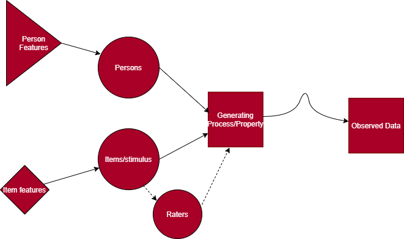
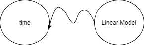
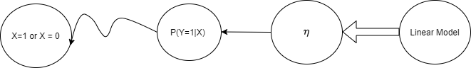
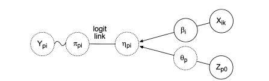
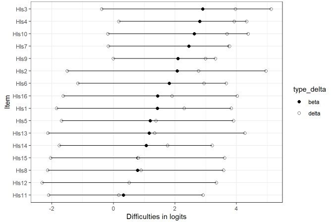
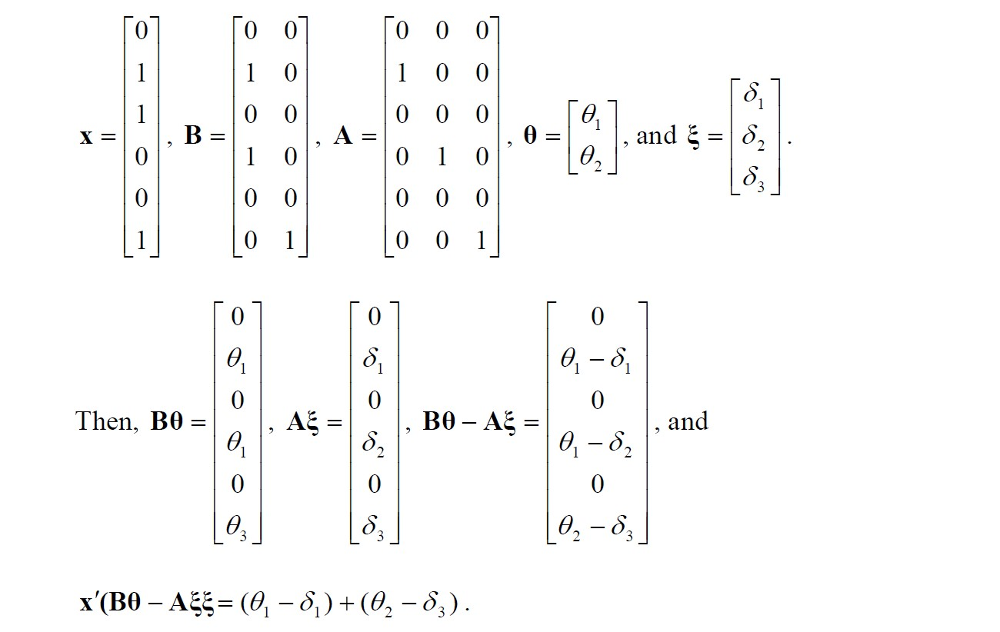
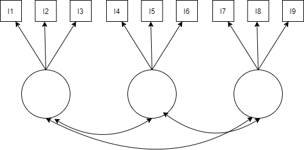

<style>
pre {
  white-space: pre !important;
  overflow-y: scroll !important;
  max-height: 50vh !important;
}
</style>

```{r setup, include=FALSE}
options(htmltools.dir.version = FALSE)
knitr::opts_knit$set(root.dir = "C:/Users/katzd/Dropbox/My PC (LAPTOP-K7402PLE)/Desktop/Github/danielbkatz.github.io/assets/Presentations/Reminar_MRCML")
                       

```

```{r xaringan-themer, include = FALSE}
library(xaringanthemer)
library(RefManageR)

mono_light(base_color = "#29132e",
          white_color = lighten_color("#29132e", 0.7),
          black_color=darken_color("#29132e", 0.3),
 code_highlight_color = "#686862",
 link_color = "#4C4D41",
 #code_inline_background_color = "#A6A6BA",
 code_inline_color = "#02191c",
 code_font_google   = google_font("Droid Mono"),
 #background_image = "methodsu.jpg",
 background_size = "15%",
 background_position = "bottom left")
```

```{r, include = FALSE}

library(tidyverse)
```


```{r, load_refs, include=FALSE, cache=FALSE}

library(RefManageR)

BibOptions(check.entries = FALSE,
           bib.style = "authoryear",
           cite.style = "alphabetic",
           style = "markdown",
           hyperlink = FALSE,
           dashed = FALSE)

myBib <- ReadBib("ref.bib", check = FALSE)
```
---
class: middle 

# What I'll be trying to do here

+ Discuss my interests in the way we talk about uncertainty in statistics (esp. in social science)
  
--
  
+ We talk about a lot of different types of "error" that are actually very different
  
--

+ We present and handle this error as a unified concept - I think doesn't help us advance

--
  
+ Can we generate a framework to make it easier to talk about different types of uncertainty?


---

class: middle 
  
# Moving forward

#### Motivating Examples 

+ How different types of uncertainty rears their ugly heads in ways we don't treat as measurement error but is uncertainty (Factor score indeterminacy and scale indeterminacy)

--

+ Review of the Generalized Linear Model (GLM) with "normal" assumptions to introduce IRT (we'll stick with the 1PL model for now)

--
  
+ DIF detection in IRT history and problems - what's uncertainty got to do with it?

--
  
+ Proposed Solutions to the DIF detection problems

--

+ what role this may all play in my dissertation (maybe)


---

class: middle

## Thinking about attempts to measure (could make this more generic or more specific)

.center[

]


---

class: middle

# Lots of sources of uncertainty 


+ What are we measuring? What's the estimand/measurand? (is our instrumnet only measuring this?)

--

+ What person features (knowledge, skills, abilities, atttitudes) are relevant and irrelevant?

--

+ What is the variance of the results due to instrumental reasons (i.e. particular item used)?

--

+ Sampling distribution and the variance of the estimator?

--

+ Where is measurement taking place? Responses to items? Or in the transformation/mapping of (categorical) item responses to a continuous (or just different) space?

--

These sources of uncertainty add up and we have no great way of updating this uncertainty (i.e. - "I figured out that this instrument reduces").

  
---
class: middle
We're pretty good at making sure we do not differentiate among different distributions (distributions of what?)

Example: As cited in  `r Citet(myBib, c(9), .opts=list(cite.style = "authoryear"))`

> "In a subsequent figure (Lord & Novick, 1968, Figure
16.11.1, p. 380) they plot a second kind of normal density
that is the distribution of q in the population (that Lazarsfeld
had referred to as f(x)); that distribution is shown as
the dashed curve in the lower panel of Figure 1. This representation
transforms Thurstone’s (1925) story into a fullyfledged
statistical model, distinguishing between the population
distribution and the response process variable, both of
which, confusingly, are Gaussian."

---
class: middle

## How does definitional uncertainty effect our typical measurement models? (I think...)

+ First general case: Factor score indeterminacy

Factor model (for one person): $y_p = \lambda_{pk}f_k + u_p$ 
  
  
Where $y_p$ is the observed response for item $p$ (could add a subscript for person), $\lambda$ is (a vector or matrix of) factor loadings for item $p$ and factor $k$ and $f_k$ is a factor or factor score. $U_p$ unique factors. 

--
  
+ We get a model implied var/covar matrix  

+ We get parameters (slopes/loadings, observed and latent var/covar, that are not affected by score indeterinacy).

However...

---
class: middle

# Factor Score indeterminacy

As cited in  `r Citet(myBib, c(8), .opts=list(cite.style = "authoryear"))`

> In simplest terms, “[f]actor indeterminacy is the inability to determine uniquely the common and unique factor variables of the common factor model from the uniquely defined ‘observed variables’ because the number of observed variables is smaller than the number of common and unique factors” (Mulaik & McDonald, 1978, p. 177). 

An infinite number of factor scores may be used to generate the stated parameters on the previous slide.
---
class: middle

# Scale indeterminacy

+ In IRT, we imagine "person abilities" (intercepts) and "item difficulties" (thresholds in the factor model) (in the 2pl, we'd have slope or discrimination parameters equivalent to the factor model).

--

+ The values of person abilities and item difficulties are in an arbitrary unit - let's say logit or probit.

--

+ No unit of measurement in logit or probit (think of odds as a ratio - the same ratio can be achieved with an infinite set of values)
  
--
  
+ To detect differential item functioning (to be defined) - we need some scale so we can compare item response probabilities, matched on abilities


+ However, to figure out which items have DIF, you need to know which items do not have DIF for comparison - but you need to know which items do have DIF! A problem! Again, definitional problems


---

class: middle 

## Why is this the case?

+ Definitional uncertainty: We are working with "latent variables" - if we had more confidence in what we were measuring - we'd probably not work with latent variables. 

--

+ It makes it harder to define scale anchors (i.e. freezing or boiling point of water)

--

+ Hence, creating units and identifying our models is quite hard. 

--

+ Can statistics helps us out? Let's back track and run through the IRT model.


---
class: middle 


# The Basics and the Generalized Linear Model

Classic example, borrowing from Andy...

.pull-left[

+ Let's say I tell you that the average time it takes to get to the store from UCSB is 20 minutes. That's all I tell you.

+ When you go to the store (any store), how long would you guess your journey is about to take?


]
--

.pull-right[

+ We can write, $\mathbb{E}[Time] = 20$ minutes


+ Now, let's say you're on some sort of schedule...


+ You might also be worried about the variance of these trips (you might want to know about the probability of the trip taking more than 30 minutes)

]

---

class: middle 


# The GLM, cont'd

+ To account for this, you request I describe your trip times with a distribution, namely, a normal distribution(this would have to be some special forms of the gaussian distribution constrained to positive values but let's ignore)

+ These trip times now have a mean and variance to describe expectations and uncertainty

+ $Time \sim  \mathcal N(\mu = 20, \sigma^2 = 25)$

+ We can plot this


---

```{r fig.align='center', fig.retina=3, fig.width = 9, message=FALSE, warning=FALSE, echo=FALSE, figh.height=7, paged.print=FALSE}

p1 <- ggplot(data = data.frame(x = c(0, 40)), aes(x)) +
  stat_function(fun = dnorm, n = 101, args = list(mean = 20, sd = 5)) + ylab("Density") +
  xlab("Time in minutes") +
  scale_y_continuous(breaks = NULL)

p1

```

Note, again, this would have to be truncated at zero. And presumably - trip time to Trader Joe's or whatever is finite unless you leave UCSB at 5PM.


---

class: middle 


# Let's write this as a linear model now (note, this is a "theoretical model" no data collected)

 $$y = \beta_0*X_0 + \epsilon$$
--

$X_0$ is just defined to equal 1

+ $\epsilon$ is normally, independently, and identically distributed with mean 0 and variance - let's say the mean is also 20 minutes

--

+ $\mathbb{E}[Time] = \mu = \beta_0 = 20$ minutes

+ (remember that an arithmetic mean, in this case, minimizes the squared error or $argmin\{(\hat{\beta}_0-y)^2\} = \bar{y}$)
---

class: middle

# Running this model

In R this model looks like
```{r eval=FALSE}

lm(data = df, y ~ 1)

```

+ The model now has a "linear" or deterministic part, and a "random" part - that the outcome will never exactly equal the mean ("the error distribution")
---

class: middle

# The GLM cont'd

Rewritten in matrix form - this model looks like:

$$\hat{y} = X\beta$$
or...

$$\mathbb{E}[Time] = X\beta$$
---

class: middle

# Representing this model


.pull-left[
+ Using the notation of `r Citet(myBib, 1, .opts=list(cite.style = "authoryear"))`


 

]
--
.pull-right[
+ The squiggly line I tried to draw (sorry...) represents the random component of the model - the uncertainty, our error or (un)conditional distribution

+ Observed time is not the same as the linear model predicted time - there's some uncertainty 

]

---

class: middle

# The GLM continued

.pull-left[

+ What I didn't tell you is that the average trip takes 20 minutes by bike ... 

+ But it actually takes 5 minutes less time by car (on average)

+ Now we have additional information - but still need a distribution for modeling each mode of transportation!

$$\mathbb{E}[Time|Mode] = X\beta$$


]

--

.pull-right[

+ The distribution is now _conditioned on_ each mode of transport - the conditional distribution

  + Normally distributed error, mean 0.
  
  + Two normally distributed populations - mean 20, and mean 15, but same variance. 
  
  + Special model to fit different variances but no longer in the OLS realm.
  
]
  


---

class: middle

# The GLM continued

+ Given the description above, in non matrix notation, with bikes as reference group

$E[Time|Mode] = 20 * X_0 + (-5*X_1)$

 + Note - I've done something pernicious - I've switched between the empirical/frequency distribution of the observed data and the abstract/ideal distribution (namely, the Normal)
---
```{r fig.align='center', fig.retina=3, fig.width = 9, message=FALSE, warning=FALSE, echo=FALSE, figh.height=7, paged.print=FALSE}

df <- data.frame(x = sample(c(0, 1), size = 1000, replace = T))

df$y <- 20 + df$x*-5 + rnorm(100, 0, 5)

lm_fit <- lm(data=df, y ~ x)

# x <- x - mean(x)
# y <- y - mean(y)


# For every row in `df`, compute a rotated normal density centered at `y` and shifted by `x`
k <- 2.5
sigma <- sigma(lm_fit)
ab <- coef(lm_fit); a <- ab[1]; b <- ab[2]

x <- seq(-k*sigma, k*sigma, length.out = 100)
y <- dnorm(x, 0, sigma)/dnorm(0, 0, sigma) * 2

x0 <- 0
y0 <- a+b*x0
path1 <- data.frame(x = y + x0, y = x + y0)
segment1 <- data.frame(x = x0, y = y0 - k*sigma, xend = x0, yend = y0 + k*sigma)
x0 <- 1
y0 <- a+b*x0
path2 <- data.frame(x = y + x0, y = x + y0)
segment2 <- data.frame(x = x0, y = y0 - k*sigma, xend = x0, yend = y0 + k*sigma)


ggplot(df, mapping = aes(x=x, y=y)) + geom_jitter(color="#b50c1140") + 
  geom_smooth(method='lm', se=FALSE, color="black") + 
  geom_path(aes(x,y), data = path1, color = "#a52a2a") + 
  geom_segment(aes(x=x,y=y,xend=xend,yend=yend), data = segment1) +
  geom_path(aes(x,y), data = path2, color = "#b50c11") + 
  geom_segment(aes(x=x,y=y,xend=xend,yend=yend), data = segment2)


```


---

class: middle

# Binary or categorical outcomes? 

+ We can't assume our conditional distribtions are Normal anymore  - but... 

+ The outcome data might have a bernoulli, binomial, poisson, exponential distribution which are all part of the same family of distribution

+ This common family of distributions is known as the exponential family of distributions - the lifeblood of the GLM.

---

class: middle

# The common family for the GLM - The exponential family

+ When you write these conditional distributions in this exponential family form:
  + Given a linear function/expectation - such that, $\eta = B_0 + B_1*X_1..$ 
  
  + There is a function $g(\mu) = \eta$ (a function links our expectation to the linear portion of the model)
  
  + A function can be inverted so $g^{-1}(\eta) = \mu$
  
--

When this parameter/function comes directly from the distribution written in the common exponential family form, this is called the "cannonical parameter" such that

--

$\eta \equiv\theta$ & $g^{-1}(\theta)$ will get you $\mu$

--

For a linear regression, with normal assumptions, g() is the identity (like multiplying by 1)

---

# For logistic regression

The outcome is defined as being drawn from a Bernoulli (or Binomial): [Click Here for my Derivation](https://dbkatz.com/assets/Presentations/Reminar_MRCML/linkfun.pdf)

.pull-left[
$Y_i \sim Bern(p)$.

The mean of the Bernoulli distribution, or the expectation, is the probability of one of the two outcomes (coded as 1 or 0) which we'll call `p`.

Conditional expectation is:

$$P(y=1|x)$$
]
--
.pull-right[
$$g(\mu) = log(\frac{p}{1-p})$$


The inverse ...

$$p = \frac{exp(\eta)}{1+exp(\eta)}$$
]


---

class: middle 

# Ok, enough of this...

+ The point isn't to memorize this - it's to see the similarities in item response models 

+ Item response data is comprised of categorical data 

+ While avoiding calling categorical data "normally distributed" because the middle categories have the highest frequencies 

---

class: middle

# Symbolizing our model

We add a straight line between the linear model and eta (they're equivalent) and now we add a link function which is symbolized by the straight arrow between $\eta$ and the probability.

+ We still have the random component (of course)

.center[


]

---

## The Rasch or 1PL model

From De Boeck & Wilson (2004):

.pull-left[

$P(Y = 1 | \theta, \delta) = \frac{exp(\theta-\beta)}{1+exp(\theta-\beta)}$ or   

$P(Y = 1 | \theta, \delta) = \frac{1}{1 + e^{-(\theta-\beta)}}$



+ $Y_{pi}$: response of person p on item i (categorical)
]

.pull-right[

+ $\beta_i$: item or item category difficulty - it'll be a vector

+ $X_{ik}$: design matrix containing 1s and 0s pertaining to if the particular $\beta$ corresponds to item i in category k

+ $\theta_p$: the person ability - it is a random effect (next slide)

+ $Z_{p0}$ is a constant (here) but later a set of predictors - basically showing that $\theta_p$ is sampled from a distribution - a random effect

]

---
class: middle

# Formally:
Since item responses are now not independent, we need to deal with the clustering within person...

One way - 

1. $$\pi_{pi} = P(Y_{ik}=y|\theta_p, \beta_{ik})$$
--

1. $$\pi_{pi} = \frac{exp(\theta_p-\beta_{ik})}{1 + exp(\theta_p-\beta_{ik})}$$
--

1. $\theta_p \sim N(0, \sigma^2_\theta)$ - but other functional form of $g(\theta)$ could be used.
  
This last line identifies the model and anchors the scale - first source of uncertainty. Less scale indeterminacy than a 2PL+ model with extra parameters. 

- Known as th Multidimensional Random Coefficient Multinomial Logit model (MRCML)


---
class: middle

### Writing the Rasch model as a linear model

+ $\eta_{pi} = \sum_{p=1}^n\theta_pZ_{pj} + \sum_{k=1}^K\beta_{ik}X_{pik}$

+ Not pretty, but we just wrote this out as a linear model like you're used to. But $\beta$ is now reversed sign - this is the item "easiness" instead of difficulty.

+ $X$ is a design matrix of item predictors

+ $Z$ is a design matrix of person predictors - $\theta$ and sometimes its predictors might be modeled as random effects.

Matrix notation: 
$$Y = Z\theta_p + X\beta + \epsilon_p$$
---
class: middle
# GLMM Cont'd

Matrix notation: 
$$Y = Z\theta_p + X\beta + \epsilon_p$$


+ We can now use design matrices with dummy variables, effectively, in the Rasch model

$$P(Y_{ik} = 1; Z , X | \beta, \theta) = \frac{exp(z_{ik}\theta + x_{ik}\beta)}{\sum_{k=1}^{K_i}exp(z_{ik}\theta + x_{ik}\beta)}$$

+ z and x are person and item specific elements of the design matrices `Z` and `X`

+ this form of the model allows for all sorts of item types...

Item difficulties are defined as the point along the ability continuum a person has a 50% chance of getting item correct.


---
class: middle


```{r  fig.align='center', fig.width = 9, message=FALSE, warning=FALSE, echo=FALSE, figh.height=4, paged.print=FALSE}
library(ggplot2)

f_x <- function(x){plogis(x-2)}


ggplot(data = data.frame(x=-4:4), aes(x = x)) +
  geom_function(fun=f_x) +
  labs(x = "Person Ability inLogits", 
       y = "Probability of response in category k",
       title = "Item Characteristic Curve for Item with Difficulty of 2 logits ")

```


---

class: middle

# In lme4

I'd recommend using IRT-specific packages/software for basic models - much faster

Data would be in "long form" - 
```{r eval = F}
library(lme4)

mod1 <- glmer(response ~ -1 + item_id + (1|person_id), 
              family = binomial, data = df)

```

---

class: middle

# Predictors in the Rasch model? Why?


+ You want to know about the influence of item property Y (word problem vs non-word problem, specific word use on a self-report survey) 

--

+ Differential item functioning - is an item (category) relatively harder (to endorse) for certain student groups even after matching on the level of the property of interest?


$$P(Y=1 |\theta_p, \beta_i, group_p)) != P(Y=1|\theta_p, \beta_i)$$

--

+ There are person properties that you want to account for or know about (being in a specific classroom or not)?

--

+ Some people would reject the MRCML as a Rasch model due to distributional assumptions about the person parameter (ussing MML estimation instead of CML)

--

+ As you can see, the concept of DIF gets really complicated pretty quickly
---

class: middle

# DIF 

+ DIF can be conceptualized as unintended, group specific multidimensionality  
  
--
  
+ Uncertainty related to group membership - often grouping variables are really proxies for things we care about but maybe cannot specify - hinting at the need for either multidim models or mixture models
  
--
  
+ DIF is an interaction between each item and each person group - a lot of tests! 
  
--

+ Need to have some items that do not have DIF 
  

--

+ Observed variable approaches (based on matching on sum scores, for instance - more like prediction invariance)

--

+ Latent variable approaches - matching on the latent variable or similar
--

---
class: middle

# IRT traditions of DIF
+ Estimate models seperately in each group - plot item parameters against each other from each group. Deviation from 45 degree line is evidence of DIF

(skipping Mantel Haenzel methods)
--

+ Note - if we split up people into high and low ability - and do the above
  + If we find that people of lower ability have a higher probability of answering an item correctly than they should relative to people of a higher group then Rasch tradition will flag for DIF while 2PL will fit!
  
  + We're in a really fuzzy area now! 
  
---
class: middle

# DIF cont'd

+ Another subset of approaches constrains the parameters of items in one group, and frees in another (this gets messy with many groups)

+ But since we have scale intdeterminacy, not clear which should be constrained

+ Iteratively treat items as if they do not have DIF

---
class: middle
# The interaction approach - item "purification"

+ The interaction approach: Checking to see if items or item categories are relatively harder (or easier) for students of different subgroups at the same "level" of the property via interaction between person and item


We can express the model: 

$$\eta_{ip} = \theta_p + \beta_{ik} + \beta_1*group_p + \gamma_i(item*group_p)$$


```{r eval = F}
library(lme4)

mod1 <- glmer(response ~ -1 + item_id*group + (1|person_id), 
              family = binomial, data = df)

```

---
# Finally some new territory

+ It is typical to have items as fixed. But that's not necessary.

+ Random Items, Random Persons, random groups for instance, is also plausible:

```{r eval = F}
library(lme4)

# Random Item and Persons - treat items as random samples
mod1 <- glmer(response ~ -1 + (1|item_id) + (1|person_id), 
              family = binomial, data = df)


# DIF random across persons - individual differences of DIF
random_DIF <- glmer(response ~ -1 + item + (1 + group*item_id|person_id), 
              family = binomial, data = df)

```

+ DIF is somewhat "regularized" now - shrunk to zero - hinting at the necessity for mixture models?

+ For all DIF models - DIF is somewhat exploratory - stat. significant interactions considered to be DIF items favoring one group or another.

---
## Building on this model ... 

+ Random Item Mixture model approach - Instead of looking for or providing anchor items...
--

+ A mixture model of item difficulties is used:
 + A DIF class of items - items that have different difficulties across groups
 + A non-DIF class of items - items that have the same difficulties - anchor items
 
 
 --
   
+ Mixture model is probabilistic - provide a starting point for the iterative procedures discussed

--

This is the Random Item Mixture model (RIM)


---
class: middle
# RIM model:

 `r Citet(myBib, c(10), .opts=list(cite.style = "authoryear"))`:
> "For the DIF class distribution on the other
hand, a G-dimensional distribution (where G equals the number of person groups)
is used such that each person group can have its own item parameter."

For two groups:
$$
\begin{equation}
    C_j =
    \left\{
        \begin{array}{cc}
                0 & \mathrm{if\ item\ j\ shows\ no \ DIF}\\
                1 & \mathrm{if\ item\ j\ shows \ DIF} \\
        \end{array} 
    \right.
\end{equation}
$$
---

class: middle
## How does this manifest?


For non - DIF
$$logit[Pr(Y_{ijg} = 1 |C_j = 0)] = \theta_{ig} - \beta_j$$
$$B_j|C_j \sim N(\mu_{\beta}, \sigma^2_\beta)$$

--

FOR DIF...oi vei  
$logit[Pr(Y_{ijg} = 1 |C_j = 1)] = \theta_{ig} - \beta_{jg}$

item difficulty sampled from G-Variate normal distribution:

$$
\begin{align}
  \begin{bmatrix}
  \beta_{j1}\\
  . \\
  . \\
  \beta_{jG}
  \end{bmatrix}\ \Bigg\vert C_j = 1 
  \sim N(\begin{bmatrix}
  \mu_{\beta_1} \\
  . \\
  . \\
  . \\
  \mu_{\beta_G}
  
  
 \end{bmatrix}\, \Sigma_\beta)
\end{align}
$$

---
class: middle 

## Potential Applications of Random Item/Person DIF

+ A scenario where observed groups are languages spoken at home
--

+ A test of reading strategy uses (for instance) - formative - used for making readig groups

--

+ We have students who read like "Spanish speakers" to varying degrees who are both in the observed Spanish speaking group and observed Spanish speaking group

--

+ Use RI DIF to characterize the extent to which items have varying DIF effects for different students - characterizing their "level" on the DIF dimension

--

+ When selecting among items and choosing who to give them to...would a RE version of DIF be more informative?

--
+ Can we combine the RI and RIM model to some extent more? 


---
class: middle

# Different approaches: Regularization/Lasso

+ To handle the multiple testing and anchor item problems - shrink coefficients toward zero.

--

+ Add a tuning/penalty parameter to the model such that $$\eta_{ip} = \theta_p + \beta_{ik} + \beta_1*group_p + \gamma_i(item*group_p)$$ 
 + shrink $\gamma_i$ toward zero
 + for instance -penalize the DIF parameters via a tuning parameter $\tau$ - $\tau\Sigma_{i=1}^n |\gamma_i|$ (or something)

--

+ But is this more informative than RI approach to DIF or only an error control type thing?


---


# It would be great if...

We could have some form of the model so it looks the same regardless of ...

--

+ Item type (dichotomous, polytomous)

+ Item covariates

--
+ Dimensionality (single or multidimensional, within or between item dimensionality)

--

+ Person covariates included (get person abilities or person property effects on abilities)

--

+ Rater effects included
--

+ That is the Multidimensional Random Coefficients Multinomial Logit Model (MRCML)

---

class: middle

# Rasch Model revisited using the design matrices


---
class: middle

## Partial Credit Model - Three Response Options


1. $$P(x_i =0) = \frac{1}{1 + exp(\theta-\beta_{i1}) + exp(2\theta-(\beta_{i1}+\beta_{i2})}$$

1. $$P(x_i=1) = \frac{ exp(\theta-\beta_{i1}) }{1 + exp(\theta-\beta_{i1}) + exp(2\theta-(\beta_{i1}+\beta_{i2})}$$

1. $$P(x_i=2) = \frac{ exp(2\theta-(\beta_{i1}+\beta_{i2}))}{1 + exp(\theta-\beta_{i1}) + exp(2\theta-(\beta_{i1}+\beta_{i2}))}$$


---

## Design Matrices

$$P(X_{ik} = 1; A, B | \delta, \theta) = \frac{exp(x'(b_{ik}\theta + a'_{ik}\delta)}{\sum_{k=1}^{K_i}exp(z'(b_{ik}\theta + a'_{ik}\delta))}$$
.pull-left[
B = 
$$
\begin{bmatrix}
0 \\
1 \\
2 \\
\end{bmatrix}
$$
A = 
$$
\begin{bmatrix}
0 & 0 \\
1 & 0 \\
1 & 1 \\
\end{bmatrix}
$$

]

.pull-right[
+ Person responds in category 2 (the highest category - they get a dummy variable of 1 for the third category/row of the item in the x matrix)

+ Numerator - invokes the 2 in the B design matrix - so we start with $2\theta$

+ Numerator - invokes the third row of the A matrix - the 1 and 1, so we get $\beta_{i1} + \beta_{i2}$
]

---
# Yielding...




---

### Multidimensional Rasch example

+ Using $\delta$ for item difficulty instead of $\beta$; Items 1 and 2 indicator for first dim, items 1 & 3 correct. (from `r Citet(myBib, 5, .opts=list(cite.style = "authoryear"))` , p. 17) .

.center[
```{r out.height= "10%", echo=F}

```
]

---

### First covariate, or facet in the Rasch model - DIF

+ Checking to see if items or item categories are relatively harder (or easier) for students of different subgroups at the same "level" of the property


We can express the model: 

$$\eta_{ip} = \theta_p + \delta_ik + \beta_1*group_p + \gamma_i(item*group_p)$$


---

# Arrays

+ Unfortunately, the package `TAM` uses arrays instead of matrices

--

+ Well, they use matrices - just multidimensional matrices

--

+ Matrices in R have two dimensions

+ Arrays have more than two dimensions - they're like multiple dimensions


---

# Arrays, cont'd

+ An array with dimensions [4, 4, 2] has 2 matrices, with 4 rows and 4 columns.

```{r}

# Create two vectors of different lengths.
v <- c(1:16)

# Make it an array
ary <- array(c(v),dim = c(4,4,2))


ary

#If you wanted to select only the second matrix
#ary[ , , 2]

```

---

Get only the second columns - turn it into one matrix
```{r}
ary[,2,]

```
--
Get only the first rows
```{r}
ary[1, , ]
```

--
get the first rows and second columns

```{r}

ary[1, 2, ]


```

---

### Thank Dog, some TAM code

+  We'll use some simulated data to understand the different models

+ `TAM` is a package for running versions of the MRCML model

+  For dichotomous and polytomous data


```{r message=F, warning=F}

#install.packages(TAM)
#install.packages

library(TAM)

# ?tam.mml

```

---
# Data for running the model

```{r}
# Load data

items <- read.csv("https://raw.githubusercontent.com/danielbkatz/danielbkatz.github.io/master/assets/Presentations/Reminar_MRCML/sim_data.csv")

# remove id column and 
resp <- items[-c(1,42)]

head(resp)

```
---

# Running the Rasch Model (first ten items)
```{r message=FALSE, warning=FALSE, results='hide'}

# Get first ten items 

df <- resp[,1:10]

# Run the model
mod1 <- tam.mml(resp = df)

```

```{r}

# item difficulties
head(mod1$xsi)

```

---

# Extract Design Matrices

+ TAM uses contrast coding - so items get a -1 instead of a 1.

```{r}

A_mat <- mod1$A

B_mat <- mod1$B

# array with 10 rows, 2 columns, and 10 matrices
dim(A_mat)

# array with 10 rows, 2 columns, 1 matrix
dim(B_mat)
```


---

# A mat

```{r}

# First 5 rows, First two matrices
A_mat[, , 1:2]


```


---

# A matrix continued - 

```{r}

A_mat[,2,]

```

---

Transform to get item "easiness" params - multiply by -1
```{r}

A_mat1 <- A_mat

A_mat1[,2,] <- A_mat[,2,] *-1

A_mat1[,, 1:2]

```

```{r results='hide', warning=F, message=F}
# model with new A matrix
mod2 <- tam.mml(df, A=A_mat1)

```
---

# Compare the item parameters
```{r}
# model with default design matrices
head(mod1$xsi)

#model with transformed A matrix
head(mod2$xsi)


```

---

# B Matrix

Note the name of the matrix here is Dim 1 - hold that thought

```{r}
B_mat

```

---

class: middle

# The linear logistic test model (LLTM) - base of many models

+ Note the data we have here has four "dimensions"

+ What if we wanted to know the overall difficulty of item type?  
  
--
+ We'll use the design matrices  
  
--
+ Note - this is not really a "multidimensional model" in the sense of multiple factors - this models each type of item as a fixed effect


---

# The item side base for 

+ For dichotomous or polytomous items

$$P(Y=y|\theta_s, \delta_i) = \frac{exp(\theta_s-\delta_i)}{1+exp(\theta_s-\delta_i)}$$

$$log\biggl[P/(1-P)\biggr] = \eta = \theta_p-\delta_i$$
$$\delta_i = \sum(q_{ij}\nu_j)$$
  
+ q = "weights" for item i and item effect j  
--

+ $\nu_j$ = item effect/variable/indicator if item i is related to some effect

--
+ In our data, whether an item is a math item or not.

---
# How do we indicate this? A matrix

For 4 items, treat the first two items as the same and second two items as the same

```{r}

A2 <- matrix(data = 0, nrow = 4, ncol = 2)
A2[1:2,1] <- 1
A2[3:4,2] <- 1

A2

```

---
## Doing this in TAM

+ work with the full `resp` data frame

--
+ Code all item types together so that all math items, all ela items...used for generating area specific (fixed) difficulties

```{r}
#use TAM to generate the design matrices for us

des_lltm <- designMatrices(resp = resp)

# we want the A matrix

A <- des_lltm$A

```

---
### Looking at the design matrix

+ Let's look at the matrices for the first four items


+ We'll keep only the first four matrices since we're going to have only four parameters (math difficulty, ela difficulty, science difficuly, word problem)
```{r}

A[ , , 1:4]
```
--

# We'll keep only the first 4 matrices
```{r}
A4 <- A[ , , 1:4]

# rename the dimensions 
dimnames(A4)[[3]] <- c("Math", "Science", "ELA", "Word_Prob")

A4
```

---
# Recode

+ All items of the same type get dummy coded the same, zero otherwise

+ We do this by assigning -1 to the pertinent dimensions

+ For instance, two items, two facets

A =  
$$
\begin{bmatrix}
0 & -1 \\
0 & -1 \\
-1 & 0 \\
-1 & 0 \\
\end{bmatrix}
$$
---

### Let's do this in TAM
```{r}
# zero it all out
A4[,,] <- 0

A4[1:10,2, 1] <- -1

A4[11:20,2,2] <- -1

A4[21:30,2,3] <- -1

A4[31:40,2,4] <- -1

A4

```

---

## Run the model

```{r results='hide'}
mod_l <- tam.mml(resp=resp, A = A4)

# get "model"item" fit
itfit <- tam.fit(mod_l)
```

+ Get item difficulties (you may get slightly different values)

```{r}
mod_l$xsi
```
--
```{r}

itfit$itemfit
```

+ This is a strange model but describes the "difficulty effect" of item type

---
class: middle 

#### What about individual item difficulties plus overall effect of item type?

+ I'm still trying to figure out if I'm doing this correctly (need to simulate)  

--  

+ I want the item difficulty of the item "adjusting for" the item type effect (this is relevant to differential bundle functioning or testlets as well `r Citet(myBib, 4, .opts=list(cite.style = "authoryear"))`)  

--

+ Start with design matrix A and add item types to the matrix - four columns to each matrix - these are pseudo items - not sure if I need to leave one as all zeros for identification or code as `-1` and `1` instead

---

# Setting up design matrices

```{r}
# create a new array with 40 rows, 2 columns, and 4 matrices

# 40 items to get coded, still two categories, 4 matrices
A_type <- array(data=0, dim = c(40, 2, 4))

A_type[1:10, 2, 1] <-  -1

A_type[11:20, 2, 2] <- -1

A_type[21:30, 2, 3] <- -1

A_type[31:40, 2, 4] <- -1

dimnames(A_type)[[3]] <- c("Math", "Science", "ELA", "Word_Prob")

A_ex <- abind::abind(A, A_type)

```

---
# Check out the array
```{r}

A_ex[ , 2, ]
```

---
# Final Array 

```{r}
A_ex[, , 41:44]

```


---
### Testing this LLTM (may be easier with the eRm package)

+ Might want to use do in long data form (easier to include facets this way)

+ Can include more categories that `-1` and `1` in `TAM` - could take on ordinal values

+ Can add now covariates for things like individual categories for polytomous items 

+ Item or category position effects

+ "Severity" or wording

---

# Run the new model

```{r, results='hide', warning=FALSE, message=FALSE}

test_run <- tam.mml(resp=resp, A = A_ex)


```

```{r}

# Item difficulties

test_run$xsi
```

---
#Compare the model fits

```{r}

fit_comp <- CDM::IRT.compareModels(test_run, mod_l)

fit_comp$IC

fit_comp$LRtest

```

---

## Learning from differential item functioning

+ Another way to do this is to use differential item functioning A matrices 
+ We can use the design matrices again

 $$\eta_{ip} = \theta_p + \delta_ik + \beta_1*group_p + \gamma_i(item*group_p)$$
 
+ We use `formulaA` because it creates the `A matrix` for us in TAM

```{r}

treat <- items[42]

treat$treat <- ifelse(treat == "treat", 1, 0)

formA <- ~ item*treat

# Restrict items to 5 items to make output shorter
dif_des_A <- designMatrices.mfr(resp = resp[1:5], facets = treat, formulaA = formA)
```

---
# DIF Design Matrix

```{r}
dif_des_A$A$A.3d

```
---
# Polytomous Data

+ Just so you can see the A design matrix for polytomous data

+ We'll use the partial credit model (by convention, the Rating Scale Model uses a different parameterization)

+ The item category difficulties - item step difficulties - are allowed to differ across items 

```{r }
data(data.sim.mfr)

# 100 people 5 items
dim(data.sim.mfr)

head(data.sim.mfr)


apply(as.data.frame(data.sim.mfr), 2, table)

```

---

## Get design matrices for polytomous data

+ Reversed design matrices because of contrast coding...
```{r, results="hide", message= F, warning= F}
polyt_des <- designMatrices(resp = data.sim.mfr, modeltype = "PCM")

# Creat or have the model create
A_poly <- polyt_des$A

#
poly_mod <- tam.mml(data.sim.mfr)

# Different parameterization (item + item*step)
poly_mod2 <- tam.mml(data.sim.mfr, irtmodel = "PCM2")


```
---

# In case of curiosity

For more see `r Citet(myBib, 7, .opts = list(cite.style = "authoryear"))`
```{r}
poly_mod$A[1:4, , ]

```

---
# Multidimensional Model 

+ "MIRT"

+ Closest thing to factor analysis in the Rasch world

+ Items load onto dimensions - we use a Q matrix

+ In the case of our `resp` data ...

+ Correlated factors

+ Compensatory

---

class: center

# MIRT Model




---

## Setting up the multidimensional model

```{r}

# set up the Q matrix - dimensionality assignment
Q <- matrix(0, nrow = 40, ncol = 4)

Q[1:10 , 1] <- Q[11:20, 2] <- Q[21:30, 3]<- Q[31:40, 4] <- 1 

# If you want to run the model
# tam.mml(resp, Q = Q, control=list(snodes=500, maxiter=10))


multi_des <- designMatrices(resp = resp, Q = Q, ndim = 4)
```
---

# Design Matrix B

```{r}
# The person side matrix is changed
multi_des$B
```

---

## Alternative to TAM

+ `eRm` is a conditional maximum likelihood based package that has special functions devoted to the LLTM

+ Random Item or Random Item covariate models can be run in `lme4` `r Citet(myBib, c(2,6), .opts=list(cite.style = "authoryear"))`

+ I think multilevel models can be run in TAM but definitely `lme4`

+ We can use Bayesian approaches (`MCMCpack` or `mirt`) - `brms` uses `lme4` modeling language to translate code into `Stan` files and uses Stan to model and estimate

+ Check out papers around `r Citet(myBib, c(3), .opts=list(cite.style = "authoryear"))`

---

## `Stan`

+ Stan allows ultimate flexibility but is complicated to use 
--

+ Fully Bayesian -  takes a while but you can really express models as you'd like  
  
--  

+ There is a large and growing R eco system being built around Stan  

--

+ A package called `edStan` built by Daniel Furr (a student of Sophia Rabe-Hasketh)  

--

+ There are case studies in the Stan manual for IRT models in R

--

+ Can express any model so long as its probabilistically sound - `Stan is a probabilistic programming language`

---

## Example - express the Rasch model in a Bayesian way

"hyperprior for persons"
$$\theta \sim N(0, \sigma^2)$$

"hyperprior for items"
$$\delta \sim N(0, 1)$$

"prior for $\sigma$"
$$sigma \sim exp(.1)$$


"Likelihood"
$${Pr}[y_n = 1] = {logit}^{-1}(\theta - \delta)$$

$$ y \sim bernoulli(Pr[y_n=1])$$
---


# References

```{r refs, echo=FALSE, results="asis"}
PrintBibliography(myBib, start = 1, end = 6)

```

---

```{r refs2, echo=FALSE, results="asis"}
PrintBibliography(myBib, start = 7, end = 10)

```

