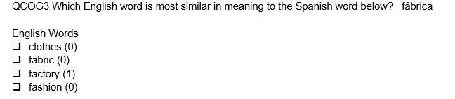
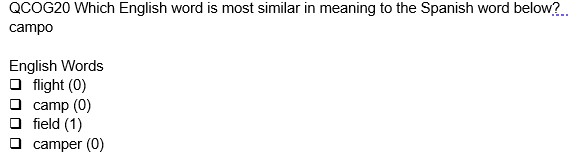
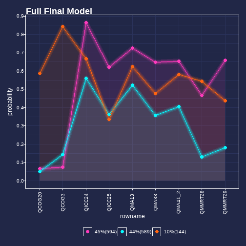

class: middle

```{r setup, include=FALSE}
options(htmltools.dir.version = FALSE)
```

```{r xaringan-themer, include = FALSE}

library(xaringanthemer)
mono_light(base_color = "#29132e",
          white_color = lighten_color("#29132e", 0.7),
          black_color = darken_color("#29132e", 0.3),
 code_highlight_color = "#686862",
 link_color = "#4C4D41",
 code_inline_background_color = "#A6A6BA",
 code_inline_color = "#02191c",
 code_font_google   = google_font("Droid Mono"),
 #background_image = "methodsu.jpg",
 background_size = "15%",
 background_position = "bottom left",
)


```


class: middle

## Outline

1. Brief Overview of Interests

2. Introduction to an example reading test that motivated the project

2. Considering differential item functioning and group homogeneity

3. Presenting a workflow: Is there homogeneous group membership? Can we use this group membership to transform item response functions to equality?

4. Concluding thoughts

---
class: middle 

# Introduction


```{r message=FALSE, warning=FALSE, include=FALSE}
library(tidyverse)
library(caTools)
library(gganimate)
library(knitr)

```

+ My interests are centered around different concepts of uncertainty - that don't neatly align with "true" vs "estimated" values


+ The definition of the construct of interest influences what we may consider construct irrelevant variance
  + What is/isn't the estimand or measurand?
  + Motivation for avoiding method effects, DIF, etc...

---
class: middle

## Some terminology

 + The International Vocabulary of Metrology (VIM; metrology is the study of measurement) defines definitional uncertainty:

> "component of measurement uncertainty resulting from the finite amount of detail in the definition of a measurand" [link to VIM](https://jcgm.bipm.org/vim/en/2.27.html)

--

class: middle

+ In psychometrics: try to detect sources of construct irrelevant variance - differential item functioning (DIF) may be an indication

+ From metrology - sources of DIF or non-invariance might be called "influence properties" or "influence quantities"


---

## Why do we worry about DIF?


.pull-left[
### Fairness:

1. We want to treat like cases alike

2. High stakes/summative assessment: no test taker (or group) has undo (dis)advantage

3. The AERA, APA, NCME *Standards* denote fairness as a validity issue (focusing not just on DIF)
]

--
 
.pull-right[
### Measurement, ontology
1. Make sure score interpretations are same across groups (equating, if you will)

2. Limit the extent to which the instrument is sensitive to sources not related to the construct

3. Finding DIF is important for examining construct of interest
]

Of course, also legal ramifications 

---


## The Strategy Use Measure (SUM) - Formative, used for creating reading groups in the classroom

.pull-left[
Four dimensions:

+ Morphological Awareness Items

+ Macro and Micro Relationships in Text

+ Inter-and Intra-Sentential Context Clues

+ Cognates (Spanish/English)
]

--

.pull-right[

+ Given that there would be some DIF - how to interpret?


+ Eliminating items due to DIF is costly, but also want to investigate DIF (help explain/understand response process)


+ Using language spoken at home as an indicator/group membership for potential DIF testing- why?


]

---

Example items:

.pull-left[
### Morphological Awareness

The book covers were heterocoloreous. What does "heterocoloreous" mean?
+ **Different Colors** (1)
+ same colors
+ bright red colors
+ different red colors
]

--

.pull-right[
### Macro and Micro Relations in Text

Glaciers are very large layers of ice that move very slowly.
Which detail is least related to this sentence?   
 + **Glaciers have been long studied by scientists.** (1)
 + Glaciers can be as large as many countries.
 + Glaciers move an average of 200 feet per year.
 + Glaciers are able to carve out rock as they move.
]
---
class: middle

### Inter-and Intra-Sentential Context Clues

Tree frogs are about two `strimes` long, which is the size of your finger. They must move `pandery` to capture flies, their favorite food. The `norkle` of tree frogs is not definitive because they move around too quickly for people to observe how long they will survive. Tree frogs must escape from `morpes`, like snakes and bats, by moving quickly. _What could `pandery` mean?_

+	**quickly** (1)
+	slowly
+	gently


---


## Key items




---
class: middle

## Formalizing Measurement Invariance and Differential Item Functioning (DIF)

Given, participant `i`, item `j`, value on latent trait `t`, selection variable (or group) `v` 


## Measurement Invariance
$P(X_{ij}=x_{ij}|T=t_i, V_i=v_i) = P(X_{ij}=x_{ij}|T=t_i)$
  

--

## Non Invariance Occurs when: 

$P(X_{ij}=x_{ij}|T=t_i, V_i=v_i) \neq P(X_{ij}=x_{ij}|T=t_i)$


---

## Definitional uncertainty as a matter of fairness


+ What we consider construct relevant and construct irrelevant - might lead to different measurement models

--

+ Different definitions/identifications of properties may lead to different student rankings (e.g. should the definition of "reading ability" include requisite background knowledge?)
  
--

  
+ Deciding to exclude/include certain items: test impact

--

+ Defining the property of interest for which group membership is supposed to serve as proxy

---
class: middle
# Strategies
  

--

+ There are various philosophies:
  + DIF found: Item removal (no questions asked)
  + DIF found: Item removal if DIF can be explained
  + DIF found: Items removed/altered/some parameters are allowed to change
  
--
  
Removing items can be costly - investigating reasons or sources of DIF may save money 

---

class: middle

# But...An alternative

Using the language of Borsboom, Mellenbergh, Van Heerden (2002)

+ Absolute and relative measurement invariance

+ We typically look at absolute invariance

+ In some cases when absolute non-invariance is found, relative invariance might still hold

What's relative measurement invariance?

---

```{r fig.align='center', fig.retina=3, fig.width=7, message=FALSE, warning=FALSE, figh.height=7, include=FALSE, paged.print=FALSE}

library(tidyverse)

cyber_colors = c(
`cyan` = "#711c91",
`orange` = "#ff6410",
`pink`=  "#fe3abc",
`teal` = "#05f9ff",
`blue` = "#133e7c",
`dark` = "#05f9ff")


cyber_cols <- function(...) {
  cols <- c(...)

  if (is.null(cols))
    return (cyber_colors)

  cyber_colors[cols]
}


cyber_palettes <- list(
  `main`  = cyber_cols("cyan", "pink", "teal", "blue", "dark"),
  `red` = cyber_cols("cyan", "pink"),
  `oranges` = cyber_cols("orange", "teal")
  )


cyber_pal <- function(palette = "main", reverse = FALSE, ...) {
  pal <- cyber_palettes[[palette]]
  

  if (reverse) pal <- rev(pal)

  colorRampPalette(colors = pal)
}
cyber_pal()


scale_color_cyber <- function(palette = "main", discrete = TRUE, reverse = FALSE, ...) {
  pal <- cyber_pal(palette = palette, reverse = reverse)

  if (discrete) {
    discrete_scale("colour", paste0("drsimonj_", palette), palette = pal, ...)
  } else {
    scale_color_gradientn(colours = pal(256), ...)
  }
}

scale_fill_cyber <- function(palette = "main", discrete = TRUE, reverse = FALSE, ...) {
  pal <- cyber_pal(palette = palette, reverse = reverse)

  if (discrete) {
    discrete_scale("fill", paste0("cyber_", palette), palette = pal, ...)
  } else {
    scale_fill_gradientn(colours = pal(256), ...)
  }
}
theme_vapor = function(base_size = 12, base_family = "") {
  
  theme_grey(base_size = base_size, base_family = base_family) %+replace%
    
    theme(
      # Specify axis options
      axis.line = element_blank(),  
      axis.text.x = element_text(size = base_size*0.8, color = "white", lineheight = 0.9),  
      axis.text.y = element_text(size = base_size*0.8, color = "white", lineheight = 0.9),  
      axis.ticks = element_line(color = "white", size  =  0.2),  
      axis.title.x = element_text(size = base_size, color = "white", margin = margin(0, 10, 0, 0)),  
      axis.title.y = element_text(size = base_size, color = "white", angle = 90, margin = margin(0, 10, 0, 0)),  
      axis.ticks.length = unit(0.3, "lines"),   
      # Specify legend options
      legend.background = element_rect(color = NA, fill = "#212747"),  
      legend.key = element_rect(color = "white",  fill = "#212747"),  
      legend.key.size = unit(1.2, "lines"),  
      legend.key.height = NULL,  
      legend.key.width = NULL,      
      legend.text = element_text(size = base_size*0.8, color = "white"),  
      legend.title = element_blank(),  
      legend.position = "bottom",  
      legend.text.align = NULL,  
      legend.title.align = NULL,  
      legend.direction = "horizontal",  
      legend.box = NULL, 
      # Specify panel options
      panel.background = element_rect(fill = "#212747", color  =  NA),  
      panel.border = element_rect(fill = NA, color = "white"),  
      panel.grid.major = element_line(color = "#2a325b"),  
      panel.grid.minor = element_line(color = "#2a325b"),  
      panel.spacing = unit(0.5, "lines"),   
      # Specify facetting options
      strip.background = element_rect(fill = "grey30", color = "grey10"),  
      strip.text.x = element_text(size = base_size*0.8, color = "white"),  
      strip.text.y = element_text(size = base_size*0.8, color = "white",angle = -90),  
      # Specify plot options
      plot.background = element_rect(color = "#212747", fill = "#212747"),  
      plot.title = element_text(hjust = 0, size = rel(1.5), face = "bold", color = "white"),
      plot.subtitle = element_text(hjust = 0, size = rel(1), face = "plain", color = "white"),
      plot.caption = element_text(hjust = 1, size = rel(1), face = "plain", color = "white"),
      plot.margin = unit(rep(1, 4), "lines")
      
    )
  
}

set.seed(346)

n <- 10
mu <- 0
sd <- 1.5


# create item difficulties.
delta <- rnorm(n, mu, sd)
summary(delta)
sd(delta)


# create person groups and persons with abilities
table_pers <- tibble(persons = rbernoulli(1000)) %>%
  mutate(persons = if_else(persons==T, 1, 0),
         ability = rnorm(1000, mean=persons, sd=1),
         persons = as.factor(persons)) %>%
  group_by(persons) %>%
  # get relative abilities
  mutate(rel_abil=scale(ability)) %>% ungroup()

table_pers %>%
  group_by(persons) %>%
  summarise(group_mean = mean(ability))

plot <- ggplot(data = table_pers, aes(x=ability)) + 
  geom_density(aes(fill=persons, color=persons), alpha=.6) +
  xlab("ability (logits)") +
  ggtitle("Ability Distribution") +
  scale_color_cyber(palette="oranges") +
  scale_fill_cyber(palette="oranges")+
  theme_vapor()

```

```{r fig.align='center', fig.retina=3, fig.width = 9, message=FALSE, warning=FALSE, echo=FALSE, figh.height=7, paged.print=FALSE}
plot

```


---
## Absolute DIF


```{r fig.align='center', fig.retina=3, fig.width=9, message=FALSE, warning=FALSE, figh.height=7, include=FALSE, paged.print=FALSE}

# Absolute DIF Favoring Group 1 by 1 Logit
icc_0 <- function(ability){
 exp(ability-delta[2])/(1+exp(ability-delta[2]))
}

icc_0(-2)

icc_2 <- function(ability){
  exp(ability-delta[2] + 1)/(1+exp(ability-delta[2]+1))
}

p <- ggplot(data = data.frame(ability = c(-3:3)), mapping = aes(x=ability))+#ff6410
  stat_function(fun = icc_0, geom = 'area', fill="#ff6410", alpha=.1) +
  stat_function(fun = icc_0, geom = 'line', color="#ff6410", alpha=0.1,  size= 4)+
  stat_function(fun = icc_0, geom = 'line', color="#ff6410", alpha=0.1,  size= 3)+
  stat_function(fun = icc_0, geom = 'line', color="#ff6410", alpha=0.2,  size= 2)+
  stat_function(fun = icc_0, geom = 'line', color="#ff6410", alpha=0.2,  size= 1)+
  stat_function(fun = icc_0, geom = 'line', color="#ff6410", alpha= 1,  size= .5)+
  
  stat_function(fun = icc_2, geom = 'area', fill= "#05f9ff",  alpha=.1) +
  stat_function(fun = icc_2, geom = 'line', color="#05f9ff", alpha=0.1,  size= 4)+
  stat_function(fun = icc_2, geom = 'line', color="#05f9ff", alpha=0.1,  size= 3)+
  stat_function(fun = icc_2, geom = 'line', color="#05f9ff", alpha=0.2,  size= 2)+
  stat_function(fun = icc_2, geom = 'line', color="#05f9ff", alpha=0.2,  size= 1)+
  stat_function(fun = icc_2, geom = 'line', color="#05f9ff", alpha= 1,  size= .5)+
  scale_colour_manual(name = "Group", values = c("icc_0"="#ff6410","icc_2"="#05f9ff"), labels = c("Group 0", "Group 1")) +

  geom_segment(y = .5, yend=.5, x=-3, xend=.2, color = "#711c91", size = 4, alpha=.1) +
  geom_segment(y = .5, yend=.5, x=-3, xend=.2, color = "#711c91", size = 3, alpha=.1) +
  geom_segment(y = .5, yend=.5, x=-3, xend=.2, color = "#711c91", size = 2, alpha=.2) +
  geom_segment(y = .5, yend=.5, x=-3, xend=.2, color = "#711c91", size = 1, alpha=.2) +
  geom_segment(y = .5, yend=.5, x=-3, xend=.2, color = "#711c91", size =.5, alpha= 1) +
  
  geom_segment(y = 0, yend=.5, x=.2, xend=.2, color = "#711c91", size = 4, alpha=.1) +
  geom_segment(y = 0, yend=.5, x=.2, xend=.2, color = "#711c91", size = 3, alpha=.1) +
  geom_segment(y = 0, yend=.5, x=.2, xend=.2, color = "#711c91", size = 2, alpha=.2) +
  geom_segment(y = 0, yend=.5, x=.2, xend=.2, color = "#711c91", size = 1, alpha=.2) +
  geom_segment(y = 0, yend=.5, x=.2, xend=.2, color = "#711c91", size =.5, alpha= 1) +
  
  geom_segment(y = 0, yend=.5, x=-.8, xend=-.8, color = "#711c91", size = 4, alpha=.1) +
  geom_segment(y = 0, yend=.5, x=-.8, xend=-.8, color = "#711c91", size = 3, alpha=.1) +
  geom_segment(y = 0, yend=.5, x=-.8, xend=-.8, color = "#711c91", size = 2, alpha=.2) +
  geom_segment(y = 0, yend=.5, x=-.8, xend=-.8, color = "#711c91", size = 1, alpha=.2) +
  geom_segment(y = 0, yend=.5, x=-.8, xend=-.8, color = "#711c91", size =.5, alpha= 1)  + 
  xlab("absolute ability (logits)") +
  ggtitle("Item Characteristic Curve for One Item") +
  ylab("Probability of Response = 1") +
  theme_vapor()
  


```

```{r fig.align='center', fig.retina=3, fig.width = 9, message=FALSE, warning=FALSE, echo=FALSE, figh.height=7, paged.print=FALSE}
p
```

---

```{r fig.align='center', fig.retina=3, fig.width=9, message=FALSE, warning=FALSE, figh.height=7, include=FALSE, paged.print=FALSE}

# Absolute DIF Favoring Group 1 by 1 Logit
icc_0 <- function(ability){
 exp(ability-delta[2])/(1+exp(ability-delta[2]))
}


icc_2 <- function(ability){
  exp(ability-delta[2] + .1)/(1+exp(ability-delta[2]+.1))
}

p_rel <- ggplot(data = data.frame(ability = c(-3:3)), mapping = aes(x=ability))+
  stat_function(fun = icc_0, geom = 'area', fill="#ff6410", alpha=.1) +
  stat_function(fun = icc_0, geom = 'line', color="#ff6410", alpha=0.1,  size= 4)+
  stat_function(fun = icc_0, geom = 'line', color="#ff6410", alpha=0.1,  size= 3)+
  stat_function(fun = icc_0, geom = 'line', color="#ff6410", alpha=0.2,  size= 2)+
  stat_function(fun = icc_0, geom = 'line', color="#ff6410", alpha=0.2,  size= 1)+
  stat_function(fun = icc_0, geom = 'line', color="#ff6410", alpha= 1,  size= .5)+
  

  stat_function(fun = icc_2, geom = 'area', fill= "#05f9ff",  alpha=.1) +
  stat_function(fun = icc_2, geom = 'line', color="#05f9ff", alpha=0.1,  size= 4)+
  stat_function(fun = icc_2, geom = 'line', color="#05f9ff", alpha=0.1,  size= 3)+
  stat_function(fun = icc_2, geom = 'line', color="#05f9ff", alpha=0.2,  size= 2)+
  stat_function(fun = icc_2, geom = 'line', color="#05f9ff", alpha=0.2,  size= 1)+
  stat_function(fun = icc_2, geom = 'line', color="#05f9ff", alpha= 1,  size= .5)+
  scale_colour_manual(name = "Group", values = c("icc_0"="#ff6410","icc_2"="#05f9ff"), labels = c("Group 0", "Group 1")) +
  xlab("relative ability (logits)") + 
  ylab("probability ") +
  ggtitle("Item Characteristic Curve for One Item") +
  geom_segment(y = .5, yend=.5, x=-3, xend=.2, color = "#711c91", size = 4, alpha=.1) +
  geom_segment(y = .5, yend=.5, x=-3, xend=.2, color = "#711c91", size = 3, alpha=.1) +
  geom_segment(y = .5, yend=.5, x=-3, xend=.2, color = "#711c91", size = 2, alpha=.2) +
  geom_segment(y = .5, yend=.5, x=-3, xend=.2, color = "#711c91", size = 1, alpha=.2) +
  geom_segment(y = .5, yend=.5, x=-3, xend=.2, color = "#711c91", size =.5, alpha= 1) +
  
  geom_segment(y = 0, yend=.5, x=.2, xend=.2, color = "#711c91", size = 4, alpha=.1) +
  geom_segment(y = 0, yend=.5, x=.2, xend=.2, color = "#711c91", size = 3, alpha=.1) +
  geom_segment(y = 0, yend=.5, x=.2, xend=.2, color = "#711c91", size = 2, alpha=.2) +
  geom_segment(y = 0, yend=.5, x=.2, xend=.2, color = "#711c91", size = 1, alpha=.2) +
  geom_segment(y = 0, yend=.5, x=.2, xend=.2, color = "#711c91", size =.5, alpha= 1)   + theme_vapor()
  


```


###  Relative Invariance


$P(X_{ij}=x_{ij}|W=w_i, V_i=v_i) = P(X_{ij}=x_{ij}|W=w_i)$


### Non Relative Invariance Occurs when: 

$P(X_{ij}=x_{ij}|W=w_i, V_i=v_i) \neq P(X_{ij}=x_{ij}|W=w_i)$

Where `W` is the within group, relative, position

## We've effectively switched units


---

## Relative Invariance

```{r fig.align='center', fig.retina=3, fig.width = 9, message=FALSE, warning=FALSE, echo=FALSE, figh.height=7, paged.print=FALSE}
p_rel
```


---

class: middle


## Why? What does this get us?

1. Usefully: Well, maybe don't have to get rid of items

2. Descriptively: Figuring out the appropriate transformation requires investigations related to group membership (an influence quantity/property?)

Group Membership indicators are often used as proxies - (DIF as Multidimensionality)


---

class: middle 

But… 


+ Assuming we’ve found evidence of DIF, how might we statistically investigate whether reported/observed groups are homogenous enough for a transformation?


+ How meaningful is our DIF analysis?

---

class: middle

## The IRT step:

Using similar notation to Paek & Wilson (2011)

$$P(X_{is}=1|\theta_s, g_s)=\frac{exp(\theta_s-\delta_i + \Delta G + \gamma_i*G_)}{1+ exp(\theta_s-\delta_i +\Delta G + \gamma_i*G)}$$

$\theta_s$ = ability of student `s`

$\delta_i$ = difficulty of item `i`

$\Delta$ = "Group effect" or "impact factor"

$\gamma_i$ = DIF parameter value (e.g. item*group interaction)

---

class: middle

## A Graphical Method

Let's say you've found evidence of DIF:


1. Start with a mixture model - a Latent Class Analysis, here ( we know we have different distributions)

--

2. Use multinomial logistic regression to regress class (or cluster membership) on observed group membership (for the full model)

 + Which class/cluster/profile does each group have the highest chance of being in?
 + Compare to individual cluster analyses/mixture models of each group individually
 
--

3. Compare item response profiles of clusters (do they resemble the response probabilities of observed groups given DIF)
 + An LCA with all students
 + An LCA with just heritage Spanish Speakers
 + An LCA with just non-heritage Spanish Speakers

---

## Brief Aside - Latent Class Analysis

.pull-left[

+ Highly exploratory use case here

+ Enumerate several possible potential classes (e.g. - 1 class, 2 class, 3 class)

+ Classes are categorical latent variables with reflective latent variable model interpretations

]

.pull-right[

$$P(X=(x_1..x_k)) = \Sigma_{c=1}^{G*}\pi_cP(x_1..x_k)|c)$$
+ `c` is class indicator

+ `G*` denotes total classes

+ $\pi_c$ = mixing proportions/class sizes (estimated)

+ Item responses conditionally indpendent within class

]


---
class: middle

## How did I use this process?

+ Data from a multidimensional reading test (N ~ 1000)
   + Items cherry-picked to have those that show evidence of DIF (for presentation)

+ Two primary observed groups of interest (“heritage Spanish speakers”, “non-heritage Spanish Speakers”)

+ One dimension of the test used Spanish-English cognates (in effect, a test of bilingualism)

+ Would be unfair to compare non-Spanish speakers to Spanish speakers


---
class: middle
## Question of ultimate interest:

1. Is group membership homogenous enough to perform a within group transformation of item score to equate scores across groups?

2. If so, how?

3. If not, explore potential "latent" groupings and hypothesize influence properties/sources of DIF

---

## Key items


---
class: middle

# Key point

**For this to work, I need to have a response process theory in mind**
  

- "Those who read like Spanish Speakers" and "Those who do not"

- Another way: Those who show evidence of bilingualism (those who do not)
  

---
## Settle on a full sample model and Predict into Classes (Step 1 and 2)


```{r echo=FALSE, fig.align='center', out.width="50%", fig.cap="Prediction-based: Heritage Spanish Speakers had a much higher chance of being in the Orange Class"}


```


---

## What about just Spanish Speakers, though?


```{r echo=FALSE, fig.align='center', out.width="50%", fig.cap="Predicted Probabilities of Just Spanish Speakers on Items – Most heritage Spanish Speakers aren’t likely to get this question correct "}

knitr::include_graphics("Just Spanish.png")


```


---
.pull-left[

```{r echo=FALSE, fig.align='left', out.width="99%", fig.cap = "Despite having a high probability (or higher probability) of being in the class most likely to get the cognate items correct - most students who identified as heritage Spanish speakers were not likely to get those items correct"}

knitr::include_graphics("Just Spanish.png")


```

]

--

.pull-right[


```{r echo=FALSE, fig.align='right', out.width="99%", fig.cap = "Response Probabilities for non-heritage Spanish Speakers"}

knitr::include_graphics("Just non-Spanish.png")
```

]

---

class: middle 

## Conclusions

+ However, this finding might tell us something about bilingualism  (moving from tests of invariance 🡪 understanding responses in terms of mixtures of populations)


+ Iterate on construct definitions - What aspect of bilingualism is/n't part of the measurand?


+ Depending on what perspective on fairness we take, how might we act in a fair way with this sort of observed grouping?


+ What about fairness?


+ How would this work for many groups or many more items? (would it scale?)


+ Next steps: Try to "explain" DIF with LLTM/explanatory IRT models? Random Item Models? DIF not as fixed quantity?


---

class: middle

## Brief Discussion of Fairness

+ For items showing evidence of DIF, the influence quantity seems to be something else behind the veil of group membership - bilingualism? Should we be using that?


+ But this uses an old conception of fairness - treat like cases alike, everybody should have equal opportunities to learn


+ What if we take a dynamic assessment perspective? E.g. - assessment mediates between student and instruction, helping student master material (a Vygotzky-esque perspective)?

---


## Thanks!

Special thanks to…


Dr. Diana Arya, UCSB Gevirtz Graduate School of Education, Associate Professor and director of the Mcenroe Reading and Language Arts Clinic for creating the Strategy Use Measure (SUM) – data from which I have interrogated against best use recommendations

As well as other committee members:

Dr. Andy Maul

Dr. Karen Nylund-Gibson

---
## References

Arya, D., Clairmont, A., Katz, D., & Maul, A. (2020). Measuring Reading Strategy Use. _Educational Assessment_, 25(1), 5-30.

Borsboom, D., Mellenbergh, G. J., & Van Heerden, J. (2002). Different Kinds of DIF: A Distinction Between Absolute and Relative Forms of Measurement Invariance and Bias. _Applied Psychological Measurement_, 26(4), 433–450. [https://doi.org/10.1177/014662102237798](https://doi.org/10.1177/014662102237798)  

Paek, I., & Wilson, M. (2011). Formulating the Rasch Differential Item Functioning Model Under the Marginal Maximum Likelihood Estimation Context and Its Comparison With Mantel–Haenszel Procedure in Short Test and Small Sample Conditions. _Educational and Psychological Measurement_, 71(6), 1023–1046. [https://doi.org/10.1177/0013164411400734](https://doi.org/10.1177/0013164411400734)


---


