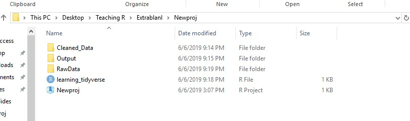
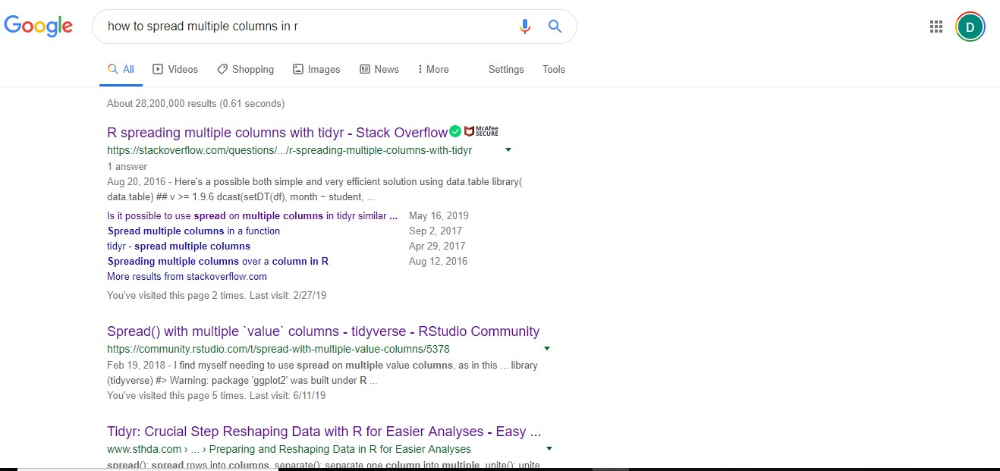
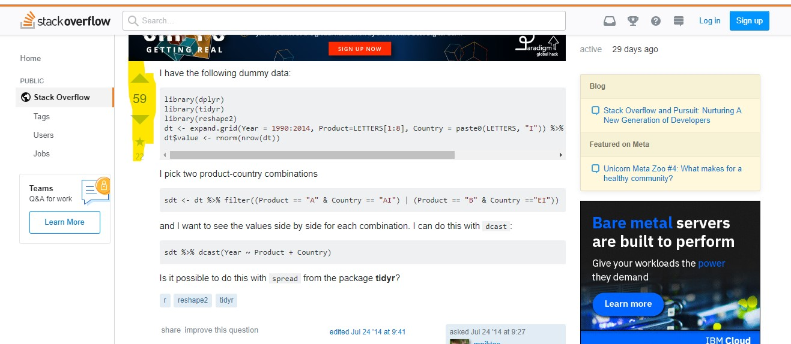
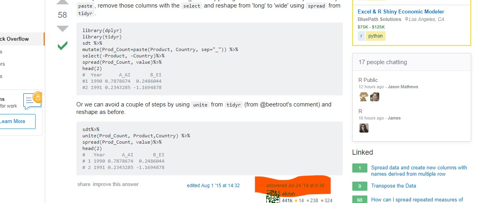
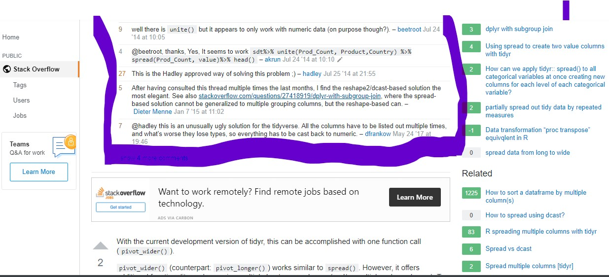
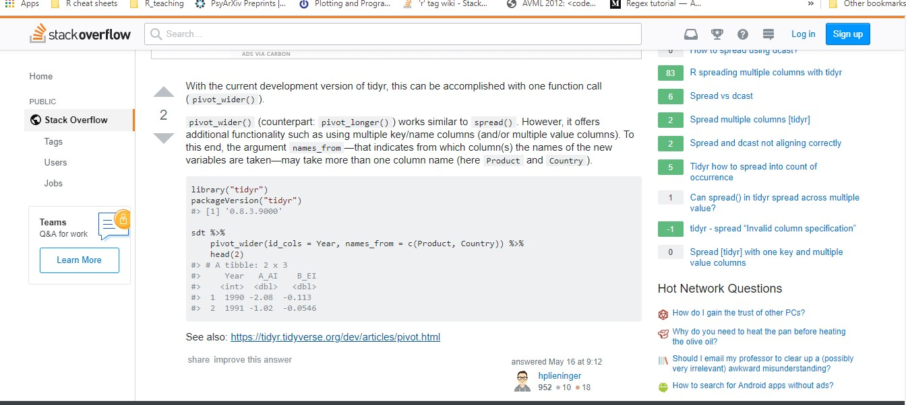

class: middle
```{r setup, include=FALSE}
options(htmltools.dir.version = FALSE)
knitr::opts_chunk$set(warning = FALSE, message = FALSE, fig.height = 5)

```
```{r xaringan-themer, include = FALSE}
library(xaringanthemer)
library(xaringanthemer)
mono_light(base_color = "#050457",
  code_highlight_color = "#B8BE3F",
  link_color = "#4C4D41",
  code_inline_background_color = "#A6A6BA",
  code_inline_color = "#09090A",
  code_font_google   = google_font("Droid Mono"),
  background_image = "methodsu.jpg",
  background_size = "15%",
  background_position = "bottom left")
```

```{r include=FALSE}
library(tidyverse)
co16 <- read_csv("C:/Users/katzd/Desktop/Github/perswebsite2/static/CDRPdata/cohort16.csv")

co16_rem <- select(co16, -X1)

state16 <- co16_rem %>% select(CDS:NumGraduates, NumDropouts,
                      gradrate = `Cohort Graduation Rate`,
                      droprate = `Cohort Dropout Rate`,
                      GEDrate = `GED Rate`)

state16d <- co16_rem %>% select(CDS:NumGraduates, NumDropouts,
                      gradrate = `Cohort Graduation Rate`,
                      droprate = `Cohort Dropout Rate`,
                      GEDrate = `GED Rate`) %>% 
  filter(AggLevel=="D", DFC=="N", Subgroup=="All", 
         Subgrouptype=="All")
```


## Tidy data principles
#### The notion of tidy data comes from Hadley Wickham, the author of the tidyverse
+ The philosophy of tidy data shapes the tidyverse

1. Each variable has its own column
2. Each observation has its own row
3. Each value has its own cell
--

Because...
1. Uniformity makes everything easier and you know how your data is stored
1. It makes vectorization easier

However, sometimes we need both tidy forms, and non-tidyforms of data 

---
Tidy (long data):
```{r echo=FALSE}
head(table1) %>% 
  knitr::kable(format = "html")
```

Not tidy (wide data):
```{r echo=FALSE}
head(table4a) %>% 
  knitr::kable(format = "html")
```
Years, here, are actually a value in their own right, thus values in a variable. Read more on the spread and gather functions, [here](https://r4ds.had.co.nz/tidy-data.html#spreading-and-gathering)

---
## Next functions go together, they're `group_by()` and `summarize()`

+ They do exactly what you think, but it's one of the more powerful tools in dplyr.

+ Let's use our `co16_rem` data.frame again

```{r}
names(co16_rem)
```
---
## The details
+ `group_by()` groups data together by some factor (such as class participation)

+ `summarize` performs some operation on the grouped data, using summary statistics. 

+ This is often useful for carrying out summary statistics-type analysis

---
## Let's get the average cohort size for males and females in a district

```{r}
mvf <- co16_rem %>% 
  select(CDS, DFC, AggLevel, Subgroup, Subgrouptype,
         NumCohort) %>% 
  filter(AggLevel=="D", 
         DFC=="N",
         Subgroup=="FEM"| Subgroup=="MAL",  
         Subgrouptype=="All") 

## Sorry, this gets a little long.
## Can create as many vars as you want in summarize()
mvf <-mvf %>% group_by(Subgroup) %>% #<<
      summarize(mean_co = mean(NumCohort, na.rm = T), #<< 
            se = sd(NumCohort, na.rm = T)) #<<
```
```{r echo=FALSE}
head(mvf) %>% 
  knitr::kable(format = "html")

```

---

class: middle

## Challenge, `group_by()` and `summarize()`

1. Edit the code above so you're grouping by `Subgroup` AND `Subgrouptype` (feel free to use help). 

2. However, with Subgroup, filter it first to include Male, Female, and "All".

3. Something the state of CA always looks at: Group by Subgrouptype such that we keep only those classified by CA as  
  + "Hispanic or Latinx" (5) 
  + "African American" (6)
  + "White, not Hispanic (7), and "All".

3. With as an outcome, instead of NumCohort, use NumGraduates

---
class: middle

# Solution

```{r}
mvf <- co16_rem %>% 
  select(CDS, DFC, AggLevel, Subgroup, Subgrouptype,
         NumGraduates) %>% 
  filter(AggLevel=="D", 
         DFC=="N",
         Subgroup=="MAL"| 
           Subgroup=="FEM"|
           Subgroup=="All"|
         Subgrouptype==5|
           Subgrouptype==6|
           Subgrouptype==7) %>% 
  group_by(Subgroup, Subgrouptype) %>% #<<
  summarize(mean_grad = mean(NumGraduates, na.rm = T), 
            se = sd(NumGraduates, na.rm = T))

```
---
```{r echo=FALSE}
head(mvf) %>% 
  knitr::kable(format = "html")

```
---
```{r}
widemvf <- mvf %>% 
  gather(unit, numgrad, mean_grad:se) %>% 
  unite(temp1, Subgrouptype, unit, sep = ".") %>% 
  spread(temp1, numgrad)

head(widemvf) %>% 
  knitr::kable(format = "html")

```
---
# What if I want to know frequencies?
 + Can just do the same as above but use `n()`
 
```{r}
freqtab <- co16 %>%
  group_by(Subgroup, Subgrouptype) %>%
  summarise (n = n()) %>%
  mutate(freq = n / sum(n))

```

```{r echo=FALSE}
head(freqtab) %>% 
  knitr::kable(format = "html")
```
---

class: middle, center

# Data VIZ with ggplot2

---
class: middle

## ggplot2

+ ggplot2 is a package built for visualizing all of our data. 

+ I might say we've done things a little backwards

+ Start with data visualization

+ the general form of ggplot is:
`ggplot(data, aes(mapping)) + geom_function(aes(mappings))`
---

class: middle 


### Building a ggplot


.pull-left[
1. Start with adding the data

1. Add an aesthetic internally or externally  

1. Add a geome (what kind of plot will it be?)   

1. Add other rules such as themes.  

1. Get help via documentation or other resources as you need]

--
.pull-right[
1. `ggplot(data)`

1. `ggplot(data =df, aes(x=x_var, y=y_var))` 

1. `ggplot(data=df, aes(x=x_var, y=y_var)) + geom_point(aes(color=grouo)) + geom_smooth(method=lm)`

1. `?ggplot2::geom_smooth`
]
---
class: middle 

`ggplot(data=state16d, `
--
       `aes(x=droprate, y=GEDrate)) +`
--
         `geom_point()`
  

---
## Example


```{r message=FALSE, warning=FALSE, fig.width = 5, fig.height = 5, fig.align="center"}

ggplot(data=state16d, 
       aes(x=droprate, y=GEDrate)) + 
         geom_point(aes(color=Subgroup)) +
         geom_smooth(method = lm) 

```

---
## Logic of ggplot2
+ "An aesthetic is a visual property of the objects in your plot. Aesthetics include things like the size, the shape, or the color of your points."
  - Garrett Grolemund & Hadley Wickham in [R for Data Science](https://r4ds.had.co.nz/data-visualisation.html#aesthetic-mappings)

+ We have to make some decisions about how aesthetics should be mapped to your data. 

+ What do we want our data to look like?

+ For instance, the x-axis aesthetic in the plot previously, was mapped to `Cohort Dropout Rate` and the color was mapped to `subgroup`

+ Other aesthetics include size and shape

+ It's important to know the `class` of your variables
---

# Another example
Just a histogram? (only one axis!)

```{r message=FALSE, warning=FALSE, fig.width = 5, fig.height = 5}
ggplot(data=state16d, 
       aes(x=NumCohort)) + 
  geom_histogram()

  
```


---
## Warmup

```{r eval=F}

plot1 <- ggplot(data=state16d, 
                aes(x=droprate, y=GEDrate)) + 
         geom_point(aes(color=Subgroup))
```

1. What variables in state16d are categorical? Continuous? (hint, there's one command)

1. Using the code above, map a continuous variable to <mark>color</mark>, <mark>size</mark>, and <mark>shape</mark> (using geom_point). How do these aesthetics behave differently for categorical vs. continuous variables?

1. Use ?geom_point to find out what the `stroke` aesthetic does

1. instead of `color=Subgroup` above, use `color=GEDrate >.3`

1. What are three other `geom_functions`?

 * These questions are modified versions of the ones found in _R for Data Science_
---
```{r echo=FALSE, message=FALSE, warning=FALSE, fig.height=5, fig.width=5}
plot1 <- ggplot(data=state16d, 
                aes(x=droprate, y=GEDrate)) + 
         geom_point(aes(color=GEDrate >.3))

```

---
# Challenge: Aesthetics
+ In California, Charter Schools are often continuation schools.

+ Much of the charter school debate doesn't really look at continuation schools, but they're not identified in our data

Using ggplot2, answer the questions:

+ Is there a relationship between the size of a school (NumCohort) and the grad rate (`Cohort Graduation Rate`)?

+ Does this relationship look different for charters and non-charter schools?

+ How might we visualize?

**Hint, The code for school level data for AggLevel = "S", Use subgroup and subgrouptype ="All", start with co16_rem and filter**

---
```{r fig.align="center", message=FALSE, warning=FALSE, fig.width = 5, fig.height = 5}
# first, filter the data
graphdata2 <- state16 %>% 
  filter(AggLevel=="S", 
         Subgroup=="All", 
         Subgrouptype=="All")

# plot the data
plot2 <- ggplot(graphdata2, 
            aes(NumCohort, `Cohort Graduation Rate`))+
  geom_point(aes(color=DFC)) 

```

---
## We can also do this with pipes all the way through
```{r message=FALSE, warning=FALSE, fig.width = 5, fig.height = 5, fig.align="center"}

plot2 <- state16 %>% 
  filter(AggLevel=="S", 
         Subgroup=="All", 
         Subgrouptype=="All") %>%
  ggplot(aes(x=NumCohort, y=gradrate))+
  geom_point(aes(color=DFC)) 

plot2
  

```

---

class: middle

## Using facets

+ Can we looked at the distributions of cohort sizes by non-charters and charters?

+ Can we answer the questions from the previous slides *within* charters and non-charters?

+ Absolutely, with facet_wrap

---

```{r message=FALSE, warning=FALSE, out.height = '40%'}
plot3 <- ggplot(graphdata2, 
            aes(NumCohort))+
  geom_histogram() + facet_wrap(~DFC)

plot3
```

---
# Challenge: Facets
+ Facets use `~` which denotes a `formula.`

+ A formula is simply another data-structure in R. Don't worry about that, for now. 

+ You can have two sides to the formula. To see this, run the code:
```{r message=FALSE, warning=FALSE}
graphdata3 <- state16 %>% 
  filter(AggLevel=="S", 
         Subgroup=="MAL"| Subgroup=="FEM", 
         Subgrouptype=="All")

plot4 <- ggplot(graphdata3, 
            aes(NumDropouts))+
  geom_histogram() + facet_wrap(~Subgroup, nrow=1)

#vs 

plot5 <- ggplot(graphdata3, 
            aes(NumDropouts))+
  geom_histogram() + facet_wrap(DFC~Subgroup)

```
---
# Plot 4
```{r message=FALSE, warning=FALSE, fig.width=5, fig.height=5, fig.align='center'}
plot4
```

---
# Plot 5
```{r message=FALSE, warning=FALSE, fig.width=5, fig.height=5, fig.align='center'}
plot5
```
---
class: middle
# What happens when you replace facet_wrap with facet_grid?

--
```{r message=FALSE, warning=FALSE, out.height = '40%'}
plot6 <- ggplot(graphdata3, 
            aes(NumDropouts))+
  geom_histogram() + 
  facet_grid(DFC~Subgroup)

```
---
```{r message=FALSE, warning=FALSE}
plot6
```

---
class: middle 

## More on `geom_`
+ According to Hadley Wickham, author of ggplot2, `geom_s` are so-called because they represent the geometric objects that we use to represent data

+ Boxplots use <mark>box geoms</mark>, line charts use <mark>line geoms</mark>, scatter plots use...

--
  + Point geoms
  
--
  
+ We can represent the same data in multiple ways using geoms_

--

+ we've already played with geoms above, to get a sense.

--

+ Because of code completion, with `geom_ ` in a function, we can see our options.
---

## Geoms continued

+ we can add aesthetics just to that `geom_function`
```{r message=FALSE, warning=FALSE, fig.width = 5, fig.height = 5, fig.align="center"}
plot7 <- ggplot(graphdata3, 
            aes(x=NumDropouts, y = gradrate))+
  geom_point(aes(color=Subgroup))

plot7
```

---

class: middle

## Challenge (geoms)

1. Make a boxplot starting with `state16` data creating `graphdata4` by
  1.  filtering so `subgrouptype` = "All"
  1. `Subgroup` = "MAL", "FEM" and "All"
  1. looking at the difference between graduation rates (gradrates) for charters and non-charters, but just

2. Add a group to the boxplot such that you look at differences between charters and non-charters and the subgroups (using `Subgroup`) within each

--
1. Start with: 
```{r}
graphdata4 <- state16 %>% 
  filter(Subgroup=="MAL"| Subgroup=="FEM"|Subgroup=="All", 
         Subgrouptype=="All")
```

---
## Solutions

```{r, message=FALSE, warning=FALSE, fig.width = 6, fig.height = 6, fig.align="center"}
#bar chart
ggplot(graphdata4) + 
  geom_boxplot(aes(y = gradrate, x = DFC,
                   fill="red")) #<<
```

---

```{r fig.align="center", message=FALSE, warning=FALSE, fig.width = 6, fig.height = 5}
#bar chart
ggplot(graphdata4, 
       aes(y = gradrate, x = DFC, fill = Subgroup)) +
       geom_boxplot() #<<

```

---

class: middle 

## All the geoms
There are a lot of geoms_

See the most popular geoms, [_**here**_](https://eric.netlify.com/2017/08/10/most-popular-ggplot2-geoms/)


---
## Starting to think about descriptives, putting it together

+ Faceting is super useful when you want to look at correlations by group. Go back to `graphdata4`

```{r, fig.align="center"}

plotcorr <- ggplot(graphdata4, 
            aes(x=droprate, y = gradrate))+
  geom_point(aes(color=Subgroup)) + 
  facet_grid(Subgroup~DFC) 

```
---
```{r, fig.height=6, fig.align="center"}
plotcorr
```

---
## ggplot2 Labels

+ ggplot2 objects can be always added to with a `+`

+ What we'll add is `labs()`

```{r, fig.height=4, fig.width=4, fig.align="center"}

plotcorr <- plotcorr + 
  labs(y="Cohort Graduation Rate", #<<
       x= "Cohort Dropout Rate", 
       title = "Relationship between hs grad rates and dropout rates")

plotcorr
```
---
### Challenge: Using labs, 

1. Add a subtitle to the plot 
1. Change the order of the facet/rearrange the facet using facet_grid(x~y)
--
#solution (labs)

```{r, fig.height=4, fig.width=4, fig.align="center"}

plotcorr <- ggplot(graphdata4, 
            aes(x=droprate, y = gradrate))+
  geom_point(aes(color=Subgroup)) + 
  facet_grid(DFC~Subgroup) +
  labs(y="Cohort Graduation Rate", #<<
       x= "Cohort Dropout Rate", 
       title = "Relationship between hs grad rates and dropout rates",
       subtitle = "As faceted by CA subgroup and charter status")

plotcorr
```
---
## What about changing the legened?
This is a good resource for more on [_**ggplot text**_](http://r-statistics.co/Complete-Ggplot2-Tutorial-Part2-Customizing-Theme-With-R-Code.html): 
```{r, fig.height=5, fig.width=5, fig.align="center"}
plotcorr <- plotcorr +  
  scale_color_discrete(labels = c("All", "Female", "Male"))
plotcorr
```

---
## Labelling individual Cases (with GEDrates greater than 20%)
See package, [_**ggrepl**_](https://cran.r-project.org/web/packages/ggrepel/vignettes/ggrepel.html) to make this cleaner

```{r, fig.height=5, fig.width=5, fig.align="center"}
plotlab <- plot1 +  geom_text(data=subset(graphdata4, GEDrate >30), 
          aes(x=droprate, y = GEDrate, label=Name))
          
plotlab
```
---
# There's much, much, much more:

+ Check out themes related to ggplot2

+ Check out how to make plots APA or the like, compliant here: [_**APA**_](https://ndphillips.github.io/IntroductionR_Course/assignments/wpa/wpa_5.html)

+ A good startin place, as usual, is the ggplot2 R studio [_**page**_](https://ggplot2.tidyverse.org/)  

---
# Exporting data/saving data

+ To export data from R is quite simple, but remember our directories! 

```{r echo=FALSE, out.width = '90%'}

```

+ We want to put any data we've cleaned in a folder called something like, "cleaneddata" and give it a name so we know what's in there. 
---

class: middle

+ Remember `state16d`?

+ We'll use the `write_csv()` function from the `readr` package. 

+ general form (`write_csv(df, "folder/data.csv1"`) - extension can be anything related to `write_*` start typing `write_` to see what happens...

+ What you save it as (in quotes) doesn't have to be the same as what it's called in R.

```{r, eval=F}
write_csv(state16d, "Cleandata/districtsub.csv")

# to write to SPSS
library(haven)
write_sav(state16d, "Cleandata/districtsub.sav")

# sav is an SPSS file extension

```
---

class: middle

# Exporting ggplot2 object

```{r, eval=F}
ggsave("plot1.pdf", plot1)

ggsave("plot1.png", plot1)

# make it a certain size
ggsave("plot1.png", width = 20, height = 20, units = "cm")
```
---

class: center
# Challenge: Exporting

1. Export one dataframe you made, either in csv or SPSS file format to a "wrangledata" subdirectory in your working directory

1. Export one plot you made to a folder called `plots` in your working directory.

---

class: middle

# Part 3.2: Descriptive statistics
+ One of the best asepcts of R is that there are a lot of ways to do the same thing. 

--
+ This is also one of the worst aspects of R

+ We've already seen a few ways to get descriptive statistics just brute forcing it with dplyr.

---
#### Workflow: Explore, Visualize, Describe, Model (from [https://r4ds.had.co.nz/explore-intro.html(https://r4ds.had.co.nz/explore-intro.html)])

```{r echo=FALSE, fig.height=8}
knitr::include_graphics("datasciexp.png")
```
---
## An easy way to get descriptives
+ Remember `summary()`

+ What happens when you run `summary()` on all of state16d?

+ What happens when you run `summary()` on just one column?

```{r}
summary(state16d)
summary(state16d$NumGraduates)
sumstat
sum1
```

+ Both give us NAs, which is convenient

+ Can also build from scratch using xtable

+ But hard to export (I still use these to get a quick understanding)
---

## I personally like the Startgazer package

+ `Stargazer` will give you descriptive statistics that are outputtable

+ `Stargazer` will output to various styles (problematically, no apa style option, though, but close enough)

+ `Stargazer` will format your regression output (as we'll see)

+ For writing in word
  + I recommend html output, because you can open it with Excel and edit or open in webbrowser and copy-paste into spreadsheet
  + Can also output to Latex

+ Stargazer takes as argument the data (or the data subset), the way to output the data, and many others (see ?Stargazer)

+ The challenge with stargazer is that you need to make sure the dataframe is of class, data.frame (you have to coerce it, see below) 

---
## Example 
```{r}
library(stargazer)

# Need to select only numeric vars
numdist <- state16d %>% 
  select(NumCohort:GEDrate) %>% 
  as.data.frame(.)

stargazer(numdist, type="html", 
          out = "describe.html", 
          digits = 2)

```
---

class: middle

## Challenge, descriptive statistics

1.  Using stargazer documentation, change the "type" argument so that it outputs in a way that you can understand the output either in the console or the viewer.

2. Using stargazer documentation, change the table "title."

3. How can you use the `flip` argument?

---
## Solutions
```{r}
stargazer(numdist, type="text", 
          digits = 2, 
          title = "Danny's Descriptive Statistics")
```

```{r, eval=FALSE}

stargazer(numdist, type="text", 
          digits = 2, 
          title = "Danny's Descriptive Statistics",
          flip = T)
```

---

class: middle

#Describeby, with `psych`

+ Another useful descriptive statistics package is `psych` which also has a lot of other useful tools including, various psychometric-type analysis functions

+ It provides descriptive statistics by a certain grouping variable\

+ Run the code below and also replace `mat=T` with `mat=F`

+ What happens?

```{r}
library(psych)

numdist2 <- state16 %>%
  select(DFC, 
         Subgroup, 
         Subgrouptype, 
         NumCohort:GEDrate) 
    
numdist2 <- numdist2 %>% 
  filter(Subgroup=="All"|Subgrouptype=="All")%>%
  as.data.frame(.) %>% 
  select(-Subgroup, -Subgrouptype) 


# This is the actual psych package code
descriptab <- describeBy(numdist2, 
                          group = numdist2$DFC, 
                          na.rm=T, 
                         digits = 2)

```

---

Class: middle

## Aside, lists...

+ We haven't touched lists, but many packages will output in list form

+ That is, it'll give you a `list` of output. 

+ In the `Global Environment`, if you click on the blue arrow next to a list, it'll show you the list elements. 

+ You can also use `str(list_name)`

---
# Examples

+ A list can contain other data structures.

+ What does `descriptab$Y` do? What about `descrptab[[1]]`?
--
```{r, eval=F}
str(descriptab)
descriptab$Y
descriptab[[1]]

```

+ You can view package output by viewing the documentation (output is described in `Values` section of documentation)

+ You can access package output by using
  + `object$name` like above, 
  + or `object[[1]]` where the 1 is replaced with the desired position and double brackets represents position in the list.

+ No shortcut, here, just have to read the documentation

---

# Wrapping up descriptives

+ For nice correlation output, please check out the `apaTables` package

+ For quick output, check Hmisc

+ Don't forget the tidyverse! 

+ An overview of the descriptive statistics methods [_**here**_](https://dabblingwithdata.wordpress.com/2018/01/02/my-favourite-r-package-for-summarising-data/)

---
class: middle

## Some basic linear models

+ The basic linear models from R, require no external packages.

+ R was built for statistics!

We'll look at two main statistical tools, today...

+ `t.test` and `lm()` (anything else you all want to see?)

+ Other options include paired sample t.test, different alternative hypotheses

---

# `t tests`
+ t-tests in R are run simply by using `t.test()`

+ `?t.test`, you'll want "stats::t.test"

+ R assumes, unequal variances of the two groups, thus uses Welch's test

+ However, this is just a little more stringent. To override, use, `var.equal=T`

+ If your two factors are in two different columns, you might need to name them (remember tidydata is easier)
---
# Example run code, below:
```{r}
# this creates fictional data
NYCtestscore <- rnorm(1000, mean = 2, sd=1)
LAtestscore <- rnorm(1000, mean = 3, sd=1)
testscores <- cbind(NYCtestscore, LAtestscore)
head(testscores)

```

```{r}
# two group
mod1 <- t.test(NYCtestscore, LAtestscore)
```

---
class: middle
```{r}
mod1

```
---
## Easier, using a formula,, but only applicable using two-sample test
+ If your factor is in one column (such as charter/not charter in DFC)

+ Takes the form `t.test(state16, Outcome~Factor)`

+ Try doing this with `state16`, using gradrate and DFC

+ You can access different parts of the t.test if you use `mod2$*`
---
## The Broom Package
+ Also, check out the `broom` package and the function `tidy`
--
```{r}
library(broom)
mod2 <- t.test(data=state16, gradrate~DFC)

tidy(mod2)
```


---
## Linear regression

+ Linear regression in R is also very simple

+ You can use stargazer to output nice tables

+ You can easily check assumptions, visually

+ The form is `lm(outcome ~ covariate1 + covariat2...)`

+ You don't need to dummy out categorical variables as long as they're factors (or, at least, character)

+ You can interact variables within the equation with `*`, `lm(outcome ~ covariate1 + covariate2 + covariate1* covariat2)` or `:` `lm(outcome ~ covariate1 + covariate2 + covariate1: covariat2)`
---
# Linear Regression
$\widehat{gradraterate} = \alpha + \beta_1DFC$

```{r}
# Example usage
modlm1 <- lm(data = state16, gradrate~DFC)
summary(modlm1)
```
---
# It's easy to check assumptions
```{r, fig.height=3, fig.width=3}
# to check assumptions
plot(modlm1)

```

---
# Challenge

1.  Run a regression in which you regress GEDrate on droprate and DFC using state16 data:
$\widehat{GEDrate} = \alpha +\beta_1droprate + \beta_2DFC$

  + filter subgrouptype="All"
  + filter AggLevel!="T"
  
  
1. Regress GEDrate on droprate as well as the interaction term between DFC and Subgroup 
$\widehat{GEDrate} = \alpha + \beta_1droprate + \beta_2DFC + \beta_3DFC*Subgroup$


1. Interpret results (roughly)
---
```{r}
state16_2 <- state16 %>%
  filter(Subgrouptype=="All",
         AggLevel!="T")  
  

mod3 <- lm(data=state16_2, GEDrate~droprate + DFC)
mod4 <- lm(data=state16_2, GEDrate~droprate + DFC*Subgroup)
```

---
# Ugly...
```{r}
summary(mod3)
summary(mod4)

```
---
# Better!
```{r, eval=F}
stargazer(mod3, mod4, type = "text", out = "output/modcompare.html")
```

---
# Challenge:
**Try to plot mod3 in ggplot2**
--
Careful in interpretation (make a scatter plot or add points if you'd like)
```{r, fig.height=3, fig.align="center"}
ggplot(data=state16_2, 
        aes(x=droprate, y=GEDrate, color=DFC)) +
  geom_smooth(method = lm) +
  labs(x="Dropout Rate (%)",
       y = "GED Rate (%)")

```
---

class: middle

## Data Cleaning and Modelling Tips

1. Always get a sense of your data first. 
  + Dipstick: Take a sample of a few cases, how do they look? As you'd expect?
  + Visualize and describe
  
1. After any transformation, make sure to compare a few cases in the raw data and the new data. 
  + use visualization to compare raw data and cleaned data.
  + Do they look right?
  
1. Careful, make sure your factors and or factors

1. Do your model results strain credulity? Too good to be true?
  + Use visualization to make sure there aren't weird cases
  + use descriptives

1. If you do any merging, take the "Dipstick" approach. 
  
1. If there's somebody you can work with, have them look at your code!

---
# Getting help in R

+ First, I hope this has been helpful.

+ I've posted a list of resources here: [**_Helplist_**](/help/helplist.html)

+ Next, please continue working at it. Today was probably really overwhelming. 

+ There are a lot of R resources out there!
---
## What should I continue to learn?

+ Overall, data management and cleaning (remember, tidy!)

+ Spreading and gathering from tidyr (soon to be [pivot_longer and pivot_wider](https://tidyr.tidyverse.org/dev/articles/pivot.html)

+ merging data with the [join functions from dply](https://dplyr.tidyverse.org/reference/join.html) and merging data by row (for example, long data) with [bind_rows](https://dplyr.tidyverse.org/reference/bind.html)

+ Check out how matrices work

+ Find something you need to do - do it

+ The joy of R is in writing functions and iteration.
---
## Finding help with Google

+ You'll often find "vignettes" - these are documents that people, often package authors, have created to give some in-depth examples.

+ You'll find the package documentation

+ You'll find other examples from classes, blogs, etc.

+ You'll find...Stack Exchange/Stack Overflow, and you will use it!

---

class: middle

## How to use Stack Overflow/Stack Exchange

+ Usual Scenario: Trying to do something, can't figure it out. 

+ You Google it and find a number of posts about your topic. You settle on one and there are a bunch of answers. 

+ Which one is right? Which one is best?

+ Usually, there are a few routes to your solution
---
## Posts (try to find the most recent)

```{r echo=FALSE, fig.height=8}

```

---
## Upvotes (Good Question)

```{r echo=FALSE, fig.height=8}

```

---

***Answers (which one has the most upvotes? Which one matches)***

```{r echo=FALSE, fig.height=8}

```

---
***People liked the answer from the previous slide but it's old, might be a solution: Scroll through non-featured***
```{r echo=FALSE,  fig.height=8}

```
---

***A featured new answer, but not as many upvotes! A solution and link!***
```{r echo=FALSE, fig.height=8}

```
---

Class: middle
## Github

+ All R packages that are on `CRAN` have to be posted on Github

+ If you Google a package name, it's Github page comes up

+ Github is a project tracking/version control page where people can track and share projects. 

+ The R code here is usually the source code that makes a package work.
--
+ You rarely want this unless you want to know why you're getting some error and are maybe ready to scroll [*through lots and lots of code...*](https://github.com/philchalmers/mirt/blob/master/R/EMstep.utils.R)

+ But it **can** be [_**useful at times!**_](https://github.com/philchalmers/mirt/wiki)
---

class: middle

## Any other questions? Concerns?


