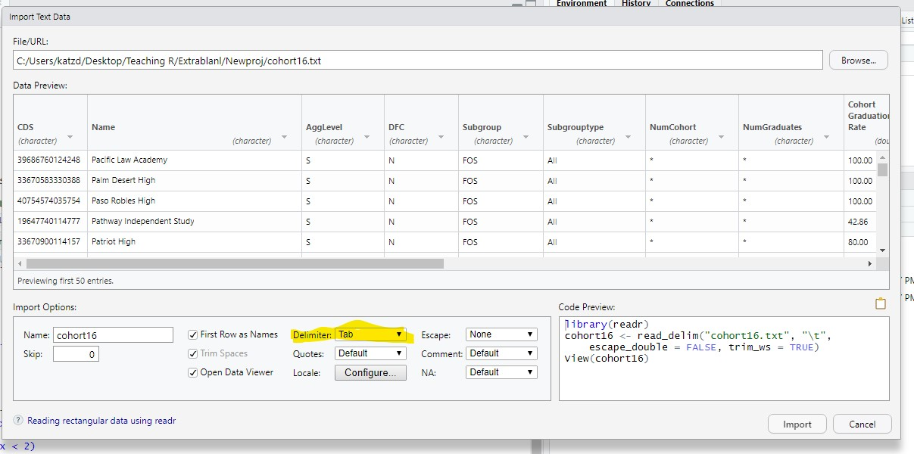

class: middle
```{r setup, include=FALSE}
options(htmltools.dir.version = FALSE)
```
```{r xaringan-themer, include = FALSE}
library(xaringanthemer)
mono_light(base_color = "#151B54",
  code_highlight_color = "#c0e8f5",
  link_color = "#197b9e")
```

```{r include=FALSE}
library(tidyverse)

```
# Enough Putzing about, Let's get to Data

+ The type of data structure you will mostly work with in R is the dataframe. Or, <mark>data.frame</mark> 

+ Other common types of data structures:
  + `matrix`
  + `lists`
  + `arrays`

---
## Arrays

+ An array is a general multidimensional data structure 
  + mindblowingly, a matrix that essentially has an x, y, and a z axis (or more!)
--

+ One can make lists of matrices or dataframes, and lists can be [_**IN dataframes**_](https://jennybc.github.io/purrr-tutorial/ls13_list-columns.html)
  + For instance, sometimes, you want to do the same thing to a number of dataframes [_**iteration**_](https://r4ds.had.co.nz/iteration.html).
  + If you put them in a list, you have a method for doing this very easily (we'll see later)
  
---

class: middle

## Getting data sets in to R with the `readr` package
+ The first challenge: getting data into R

+ R needs a command to read in the data

+ R needs a <mark>path</mark>, where to find the data

+ We're going to use the [_**`readr`**_](https://readr.tidyverse.org/) package to handle most file types

+ However, the `foreign` package and `haven` package can handle files from SAS, SPSS, STATA (and probably others)

+ You don't need SPSS, SAS, or STATA to read data into R

---

class: middle

## First, things first
+ Download the data!

+ The data today is a publically accessible dataset from the [_**California Department of Education**_](https://www.cde.ca.gov/ds/sd/sd/filescohort.asp)

+ Download by clicking: [**Example Data 1**](/CDRPdata/cohort16.csv)

+ I've posted it on the workshop web here: [_**CDEDATA**_](http://www.dbkatz.com/1/01/01/beginning-a-new-intro-to-r-workshop/)

+ And put it in your working directory

+ My what?

```{r}
# this will tell you the file path of your current working directory. The best thing is to put it here, since your Rproject is here. 
getwd()


```

---
## A Rare Best Practice

1. It is recommend that you create, in your working directory, folders just for the initial raw data (this data isn't to be altered)

2. Another folder in your working directory just for altered datasets (with computed variables, cleaned, or otherwise changed data)

3. Another folder just for statistical output and plots (or divide)

```{r echo=FALSE}
knitr::include_graphics("directory.jpg")

```

*(if you put it in your working directory, you'll see it straight away, if not, you'll have to find it)


---

## Read in the data, the cheating way...
+ First create a new script in R, save it, and call it `learning_tidyverse`.

+ In the top right, under the Global Environment tab, it says "Import Dataset"

+ The file we downloaded is a CSV file (make sure to use readr)

+ Select `Import Dataset` > `From Text (readr)` > `Browse` > Find the dataset*, select, and open > look at the preview

+ If it doesn't look right, you can play with the settings (probably have to change, delimiter)


# Don't import yet!

---

## The final steps
+ In the lower right, there is some code, <mark>copy it</mark> and cancel out

+ Paste the code into your new script at the top; write a note about what it is

+ Eventually, you'll want to do this manually, I promise (and please promise me)

```{r echo=FALSE}


```

---
## Code for Reading in 
+ Run all the code...


```{r, eval=FALSE}
# Now that I've put my files in a rawdata folder 
#in the working directory, I can do this:

# Load the library
library(readr)

co16 <- read_csv("RawData/cohort16.csv")
View(co16)


#Alternatively you can save the object location (makes life easier)

# Assign a variable with a string value of the file location.
cohortdata <- "RawData/cohort16.csv"

# Put the variable in your function, `read_delim`
co16 <- read_csv(cohortdata)

# Note the View(function) - Let's you see the data
#View(cohort16)
```

---
class: middle

### Can also go searching for it with a longer path (doesn't need to be in your working directory)
```{r readin}

co16 <- read_csv("C:/Users/katzd/Desktop/Github/perswebsite2/static/CDRPdata/cohort16.csv")
```
  

---

# Introducing `dplyr`
[_**`dplyr`**_](https://dplyr.tidyverse.org/) is a package full of "verbs" that help us work on data. Some major verbs are

+ `filter()` allows us to filter rows by certain values

+ `select()` allows us to select or deselect columns by name

+ `mutate` allows us to create/compute new variables

---

## Data Sense

Let's get a sense of the data
```{r}
#get variable names

names(co16)

```
---
Get the first 10 rows
```{r}
head(co16)

```


---
## Using select to get RID of a column
We notice that the first column in the dataset is called `X1.` This column is added automatically when a dataframe is exported to csv from R. Let's get rid of it.  

We use a `-` sign before the column name. That's it. 

```{r}
co16_rem <- select(co16, -X1)

#non tidyverse solution (remember indexing!!)
co16_rem <- co16[-1]

#make sure this worked
names(co16_rem)


```

---

## Checking our work

+ Remember when we talked about `class`?

+ Well, let's make sure `CDS` which is a school ID, is of class `character`, how will we do this?

+ We don't want school ID to be a "numeric" variable of some sort - It's an ID so leading zeros matter

+ Using another R index tool, `$`, which selects column by name (auto complete should show you the name).
```{r eval= FALSE}
class(co16_rem$CDS)
```  

What about all variables?: Introducing `str()`

```{r eval=FALSE}
str(co16_rem)

```
Easy!
---

class: middle 

## Explaining the data set (this is especially good for the tidyverse)

+ The variable `CDS` is a code for county, district, and schools.

+ This data contains information from state level, to county level, to district level, to school level.

+ It also contains information about demographics. Each demographic group per school, gets its own row and the numeric variables have to do with that particular subgroup in that school.

+ For instance, `AggLevel` denotes whether that row refers to `State`, `County`, `District` or `School`  
---

class: middle

+ If for instance, we take the first row, and first six columns
```{r echo=FALSE}
knitr::kable(xtable::xtable(co16_rem[1, c(1:6)]),  format = "html", scalebox='0.75')

```

+ We note, that the data for this row represents district totals, (so it's at the school level). 

+ It refers to the totals relevant to the state-identified `Subgroup`, `All`.  
(codebook, here: [_**California Department of Education**_](https://www.cde.ca.gov/ds/sd/sd/filescohort.asp), that's an aggregation of those particular subgroups)
  
+ However, `Subgrouptype` is 9, which refers to: `9 – Two or more races, not Hispanic`

+ So that row refers to district total for that district for all students who have been identified as `Two or more races, not Hispanic` (you really get to see how the state of CA thinks)

+ Let's make this make sense, with `filter`
---
## Introducing `filter()` and pipe operators `%>%`

+ Let's say, we want to know about average graduation rate
  + For the entire state
  + But just for non-charter schools
  + And for standard school districts

+ I know that in the `Name` column, there's school names and a value called `Statewide`

+ `filter` literally filters rows that meet a certain rule, such as equaling a value

+ `filter(df_name, rule)`
```{r}
stateco16 <- filter(co16_rem, Name=="Statewide")
```
---
## Check for understanding, filter.

+ Let's say we only want to look at `district totals` data, not school level data. 

+ Use filter, on AggLevel such that we only select the category `D = Local educational agency totals (includes districts and direct funded charter schools)`

+ You'll have to start with `co16_rem` again  
--
## solution
```{r}
distr <- filter(co16_rem, AggLevel == "D")

# Did it work?
table(distr$AggLevel)

#vs.

table(co16_rem$AggLevel)
```

## Piping Operators

+ However, we don't want to create a new object in R every time you perform an operation (we often perform a lot of operations and this gets confusing)

+ The `%>%` operator, helps - read it as `and then`

```{r}
distr <- co16_rem %>% 
  filter(AggLevel == "D")

# table gives you counts on column (remember $ indexes)
table(distr$AggLevel)
```

*What about filtering on more than one variable? That sounds like a challenge!*
---

.pull-left[We notice that even after filtering for District, individual charter schools are left in the dataset. 

1. The variable, <mark>DFC</mark> contains information as to whether a school is a charter school or not. 
  + Y = Charter School
  + N = Not a charter school

2. The variable <mark>AggLevel</mark> has information on level of analysis where
  + D = Local educational agency totals (includes districts and direct funded charter schools)
  + O = County totals
  + S = School totals
  + T = State totals]

.pull-right[1. Starting with the dataframe, `co16_rem`, create a new dataframe called `filtdf` by...

2. using `filter` so we only keep districts but remove charter schools.

3. Use filter and/or pipes so you only need to create one dataframe 

3. If you need the codebook, it is here: [_**California Department of Education**_](https://www.cde.ca.gov/ds/sd/sd/filescohort.asp)

*Hint* You can do this with one pipe or two. ]

---
# Solutions

```{r}
# Either one will work, I prefer method1
filtdf <- co16_rem %>% filter(DFC == "N", AggLevel == "D")

# or...

filtdf <- co16_rem %>% filter(DFC=="N") %>% filter(AggLevel=="D")


```
---
# Challenge
1.After filtering, what categories are still left in the variable, `Agglevel`, in your new dataframe, filtdf?

2. Without creating a new R object, edit your script such that you keep only the category `All` from variable `Subgroup` and `All` from variable `Subgrouptype`. Make sure it is still called `filtdf`
--
## SOlutions
```{r}
table(filtdf$AggLevel)

filtdf <- co16_rem %>% filter(DFC == "N", AggLevel == "D", Subgroup=="All", Subgrouptype=="All")

head(filtdf)

```
---
## Remember our logical operators?

1. Now, using a pipe and assigning a new variable called `filtdf1000` (for exercise, not necessary, though), start with filtdf such that filtdf1000 only has districts with _at least_ 1000 students in its cohort (you'll need the variable . 

--
## Solutions
```{r}
table(filtdf$AggLevel)

filtdf1000 <- filtdf %>%
  filter(NumCohort >= 1000)

range(filtdf$NumCohort)

nrow(filtdf)


```

---

class: middle
# Non-tidyverse solutions to filtering rows

+ If I want to select particular rows, say, row 1, along with the first four columns, `newdf <- co16_rem[1, 1:4]` (where the first element represents row number, after the comma, the column (just like a matrix))

+ If I want to select rows according to rule (say, 1000), `newdf <- co16_rem[co16_rem$numcohort >= "1000", ]`

+ For non-tidyverse solutions for selecting columns:
  + Indexing: co16_rem[1:4] (note, don't need commas) but same as co16_rem[, 1:4]
  + Naming `co16_rem$AggLevel`

---
class: middle

## tidyverse solution to selecting columns

+ Re-introducing `select()`

+ `select()` takes a dataframe name and the name of the columns you wish to select.

+ Typical use involves taking a very large dataset and selecting only the columns you need. 

+ You can also use `select()` to reorder columns, remove columns, and even rename columns

---
class: middle

# Example use:


```{r}

state16 <- co16_rem %>% 
  select(CDS, Name, NumCohort, NumGraduates)

# without a pipe operator
state16 <- select(co16_rem , CDS, Name, NumCohort, NumGraduates)


names(state16)

#or
View(state16)


```
---
# Check for understanding select():

1. Starting with co16_rem, edit the code from the previous slide so that you use a pipe operator, and select:
  + CDS
  + Name
  + AggLevel
  + DFC
  + Subgroup
  + Subgrouptype
  + NumCohort
  + NumGraduates
--
# Solutions
```{r}
state16 <- co16_rem %>% select(CDS, Name, AggLevel, DFC, 
                      Subgroup, Subgrouptype, NumCohort, 
                      NumGraduates)
names(state16)


```
---
## Adding more to pipes
  
2. Using a pipe operator, add a filter command to your code, such that you select only district level data, D, (from AggLevel), only non-charter schools  ("N", from DFC), only `All` from both `Subgroup` and `Subgrouptype`

3. What is the largest value for `Numcohort`?

```{r}
state16 <- co16_rem %>% 
  select(CDS, Name, AggLevel, DFC, 
                      Subgroup, Subgrouptype, NumCohort, 
                      NumGraduates) %>% 
  filter(AggLevel=="D", DFC=="N", Subgroup=="All", Subgrouptype=="All")


range(state16$NumCohort, na.rm=T)
max(state16$NumCohort, na.rm=T)

```


Easy! 

---
class: middle

## Getting fancy

If you want to find the district with the largest cohort via dplyr:

```{r}

state16 %>% filter(NumCohort==max(NumCohort, na.rm=T)) %>% select(Name)


```

